# Health Camera System Architecture

## 1. System Overview

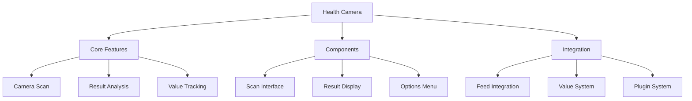

## 2. Health Camera Flow

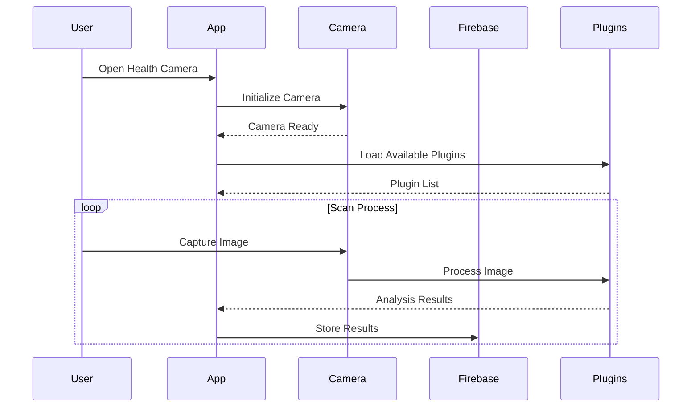

## 3. Component Structure

### 3.1 Health Camera Components
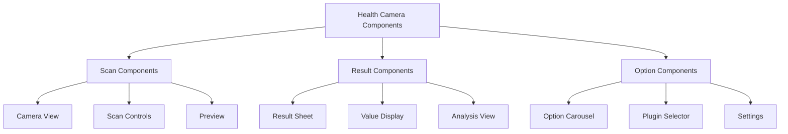

## 4. Firebase Schema

### 4.1 Health Camera Collections
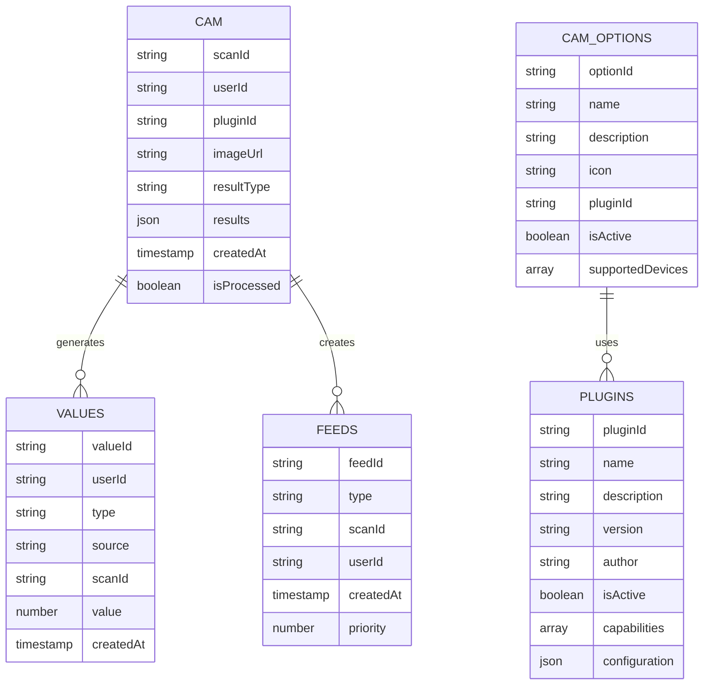

## 5. Navigation Flow

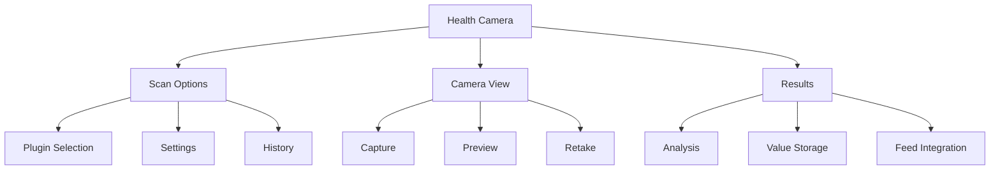

## 6. Feature Integration

### 6.1 Plugin System
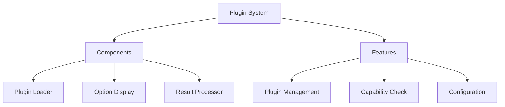

### 6.2 Scan Process
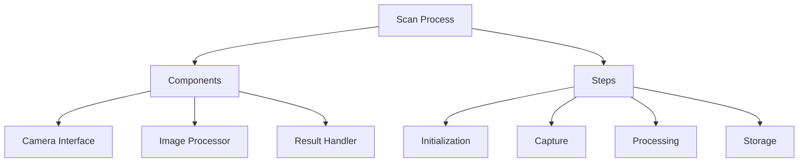

## 7. Dynamic Configurations

### 7.1 Camera Settings
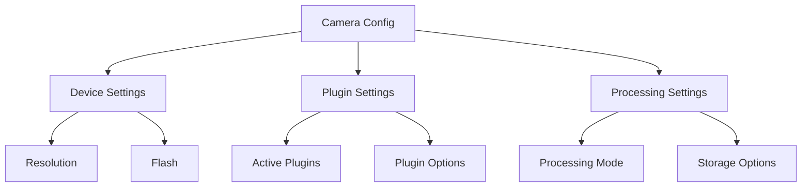

## 8. State Management

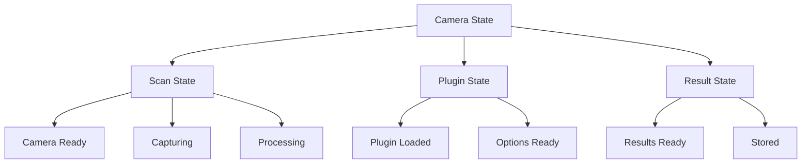

## 9. Feature Matrix

| Feature | Components | Firebase Collections | State Management |
|---------|------------|---------------------|------------------|
| Camera Scan | CameraView, ScanControls | cam | ScanState |
| Result Analysis | ResultSheet, ValueDisplay | values | ResultState |
| Plugin System | PluginLoader, OptionDisplay | plugins, cam_options | PluginState |
| Feed Integration | FeedItem, ResultTile | feeds | FeedState |

## 10. Integration Points

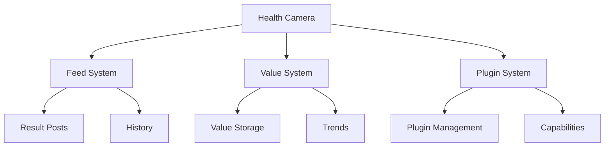

## 11. Error Handling

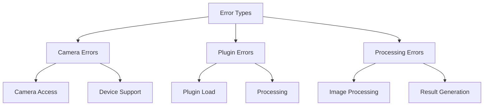

## 12. Security Implementation

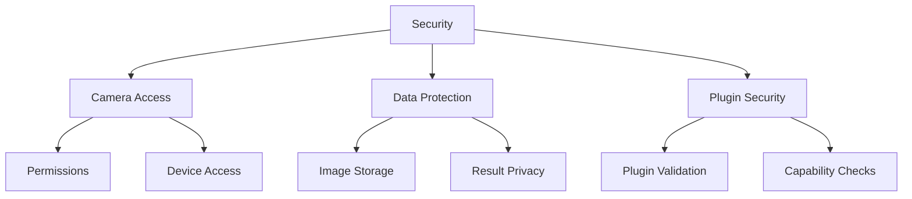

This architecture document provides a comprehensive overview of the Health Camera system and its components. Each section can be expanded with more detailed implementation specifics as needed. 
