# Examinations System Architecture

## 1. System Overview

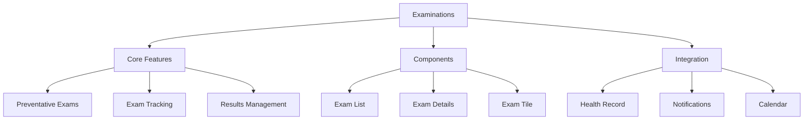

## 2. Examinations Flow

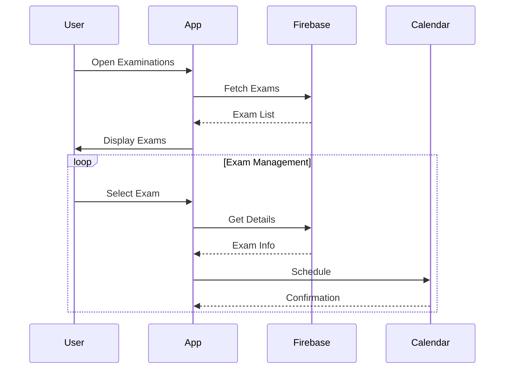

## 3. Component Structure

### 3.1 Examination Components
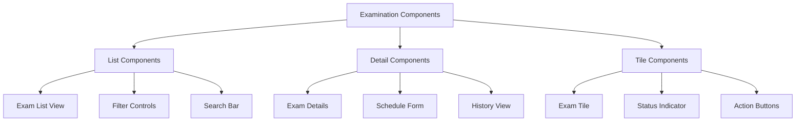

## 4. Firebase Schema

### 4.1 Examinations Collections
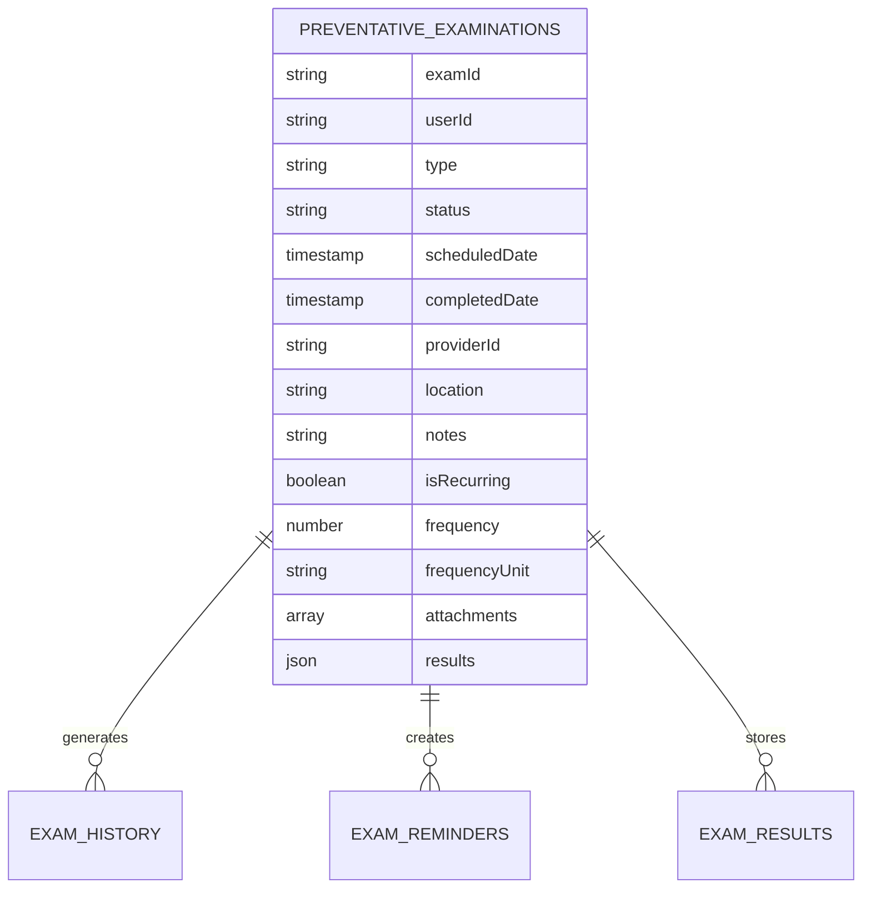

## 5. Navigation Flow

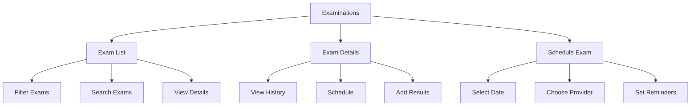

## 6. Feature Integration

### 6.1 Exam Management
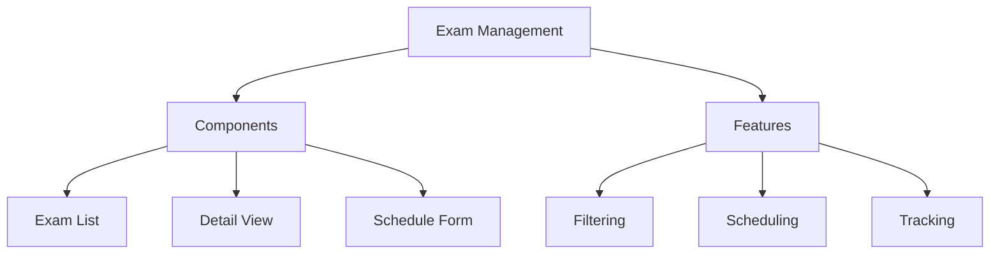

### 6.2 Exam Process
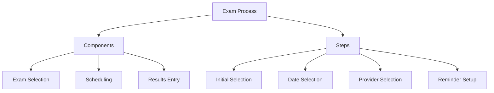

## 7. Dynamic Configurations

### 7.1 Exam Settings
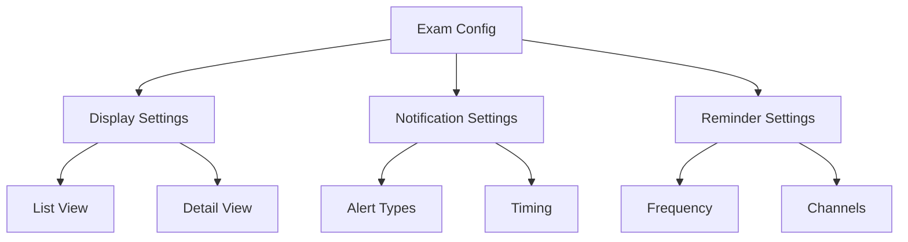

## 8. State Management

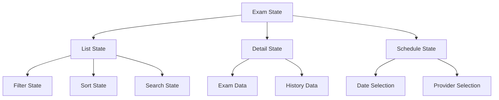

## 9. Feature Matrix

| Feature | Components | Firebase Collections | State Management |
|---------|------------|---------------------|------------------|
| Exam List | ExamListView, FilterControls | preventative_examinations | ListState |
| Exam Details | DetailView, HistoryView | exam_history | DetailState |
| Scheduling | ScheduleForm, ProviderSelector | exam_schedule | ScheduleState |
| Results | ResultsEntry, Attachments | exam_results | ResultsState |

## 10. Integration Points

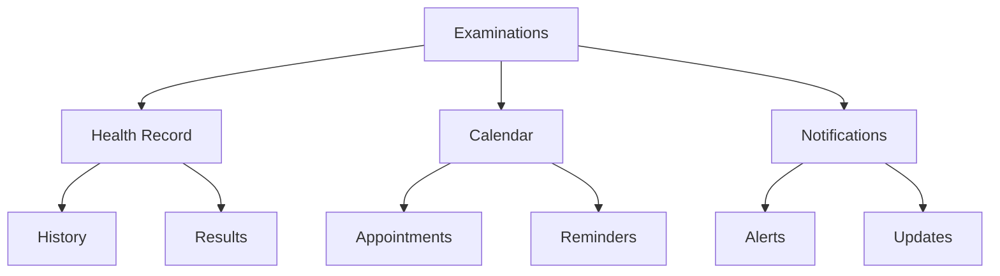

## 11. Error Handling

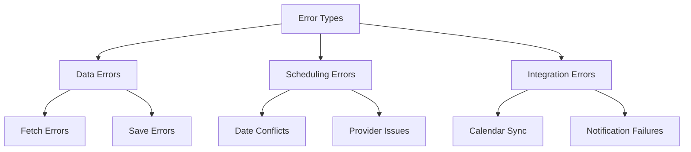

## 12. Security Implementation

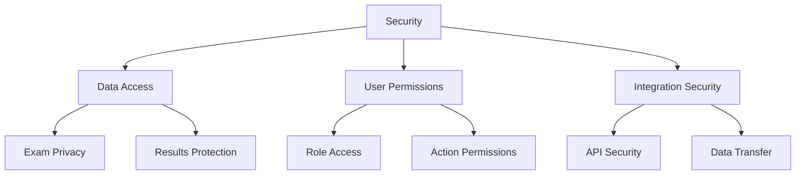

This architecture document provides a comprehensive overview of the Examinations system and its components. Each section can be expanded with more detailed implementation specifics as needed.
