# Appointment System Architecture

## 1. System Overview

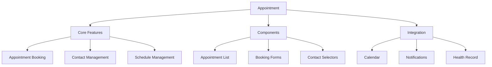

## 2. Appointment Flow

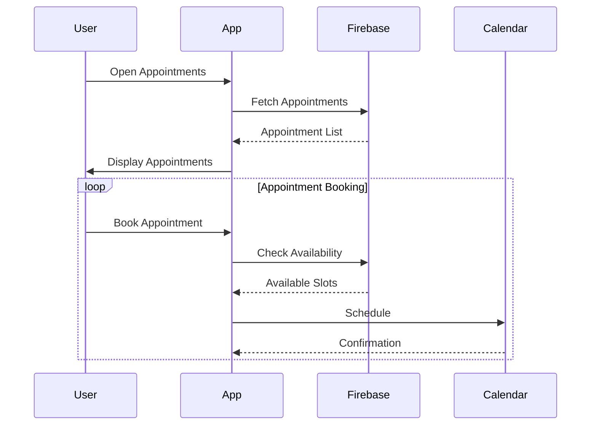

## 3. Component Structure

### 3.1 Appointment Components
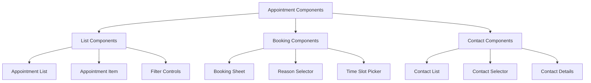

## 4. Firebase Schema

### 4.1 Appointment Collections
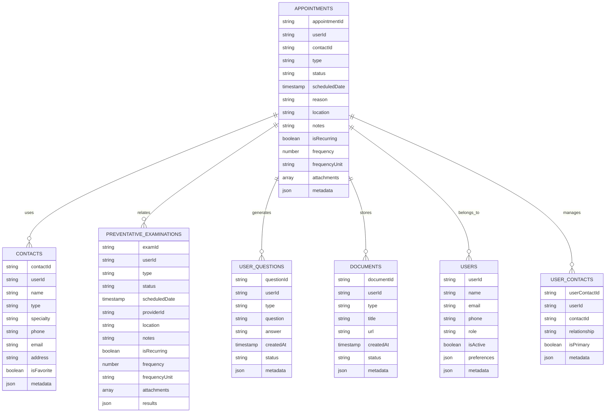

## 5. Navigation Flow

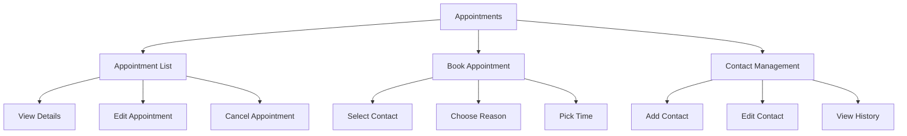

## 6. Feature Integration

### 6.1 Appointment Management
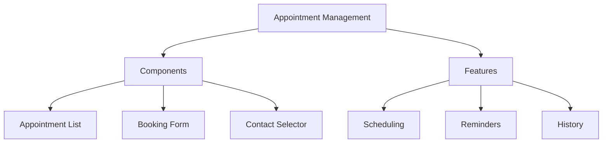

### 6.2 Booking Process
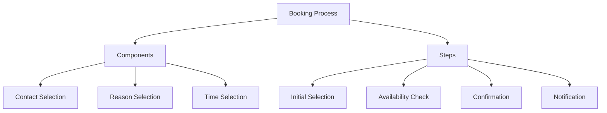

## 7. Dynamic Configurations

### 7.1 Appointment Settings
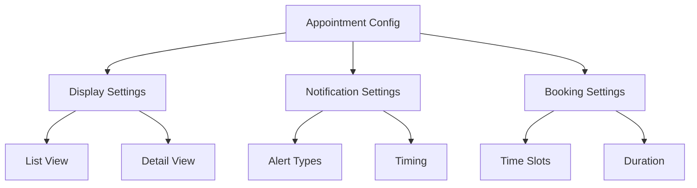

## 8. State Management

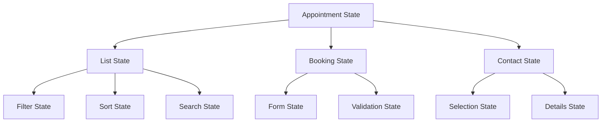

## 9. Feature Matrix

| Feature | Components | Firebase Collections | State Management |
|---------|------------|---------------------|------------------|
| Appointment List | AppointmentListView, FilterControls | appointments | ListState |
| Booking | BookingForm, TimeSlotPicker | appointments, contacts | BookingState |
| Contact Management | ContactList, ContactSelector | contacts, user_contacts | ContactState |
| Document Management | DocumentList, AttachmentView | documents | DocumentState |

## 10. Integration Points

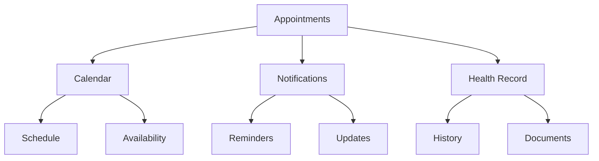

## 11. Error Handling

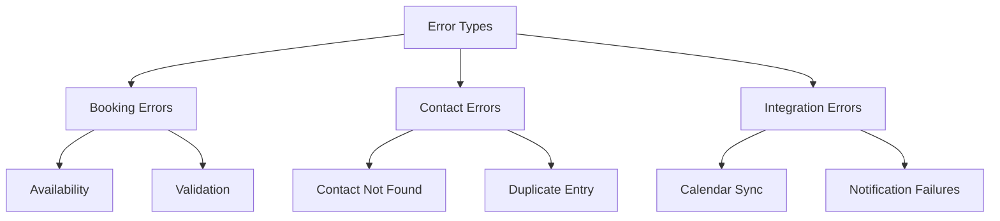

## 12. Security Implementation

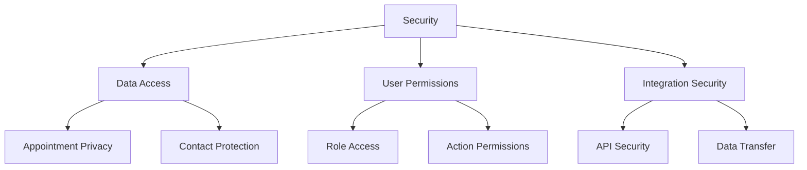

This architecture document provides a comprehensive overview of the Appointment system and its components. Each section can be expanded with more detailed implementation specifics as needed.
