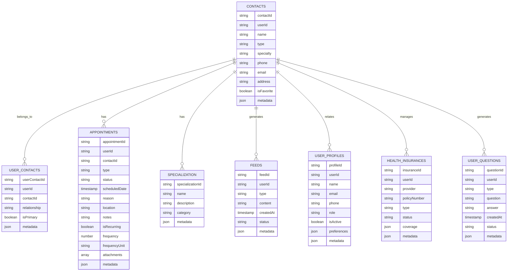

# Common Components & Contacts System Architecture

## 1. System Overview

## 2. Common Components Structure

### 2.1 UI Components

## 3. Contact System Flow

## 4. Firebase Schema

### 4.1 Contact Collections

## 5. Component Integration

### 5.1 Common Components Usage

## 6. Component Features

### 6.1 Header Components
- **Page Header**
  - Title display
  - Back navigation
  - Action buttons
  - Responsive design

- **Bottom Sheet Header**
  - Title and subtitle
  - Close button
  - Custom actions
  - Consistent styling

### 6.2 Button Components
- **Button Red**
  - Primary action button
  - Error state handling
  - Loading state
  - Disabled state

- **Button Confirm**
  - Success action button
  - Confirmation dialogs
  - Loading state
  - Disabled state

### 6.3 Input Field Components
- **Input Field Text**
  - Text validation
  - Error messages
  - Placeholder text
  - Custom styling

- **Input Field Mail**
  - Email validation
  - Error messages
  - Placeholder text
  - Custom styling

## 7. Dynamic Configurations

### 7.1 Component Settings

## 8. State Management

## 9. Feature Matrix

| Component | Usage | Features | State Management |
|-----------|-------|----------|------------------|
| Page Header | All Pages | Title, Navigation, Actions | UI State |
| Button Red | Action Pages | Primary Actions, States | Form State |
| Input Field | Forms | Validation, Error Handling | Form State |
| Bottom Sheet | Modals | Content Display, Actions | UI State |

## 10. Integration Points

## 11. Error Handling

## 12. Security Implementation

This architecture document provides a comprehensive overview of the Common components and Contact system. Each section can be expanded with more detailed implementation specifics as needed.
