# Hub System Architecture

## 1. System Overview

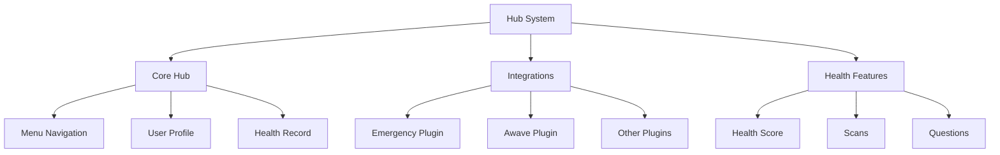

## 2. Core Hub Structure

### 2.1 Menu Navigation
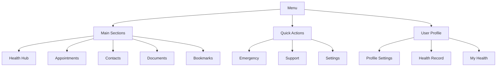

## 3. Integration System

### 3.1 Plugin Architecture
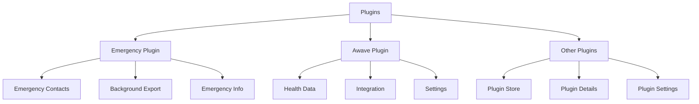

## 4. Firebase Schema Groups

### 4.1 Core Hub Schema
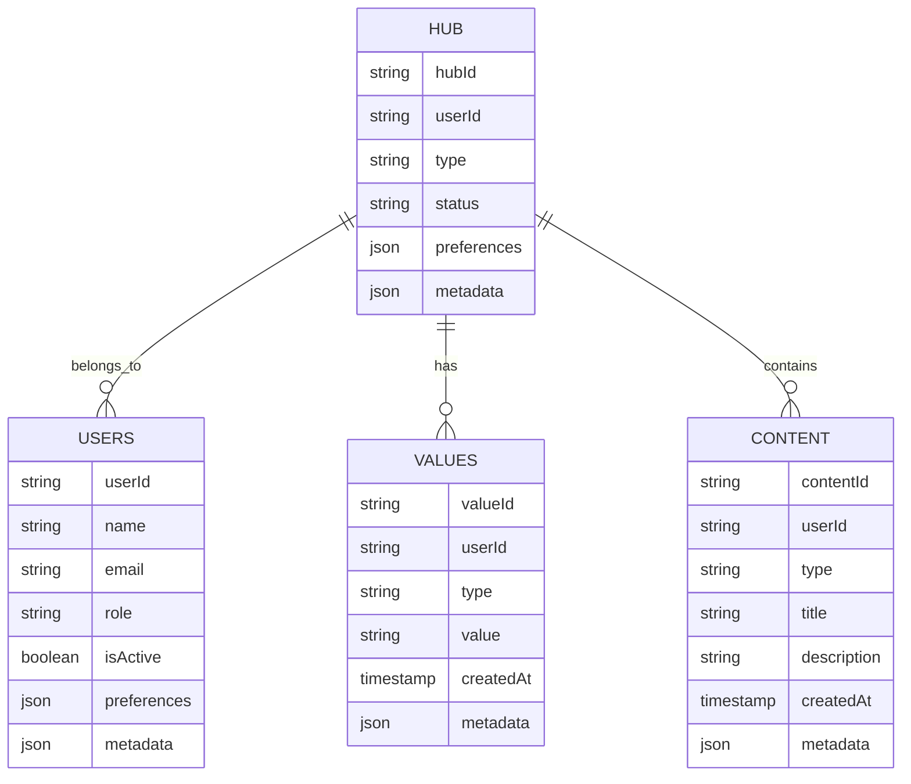

### 4.2 Integration Schema
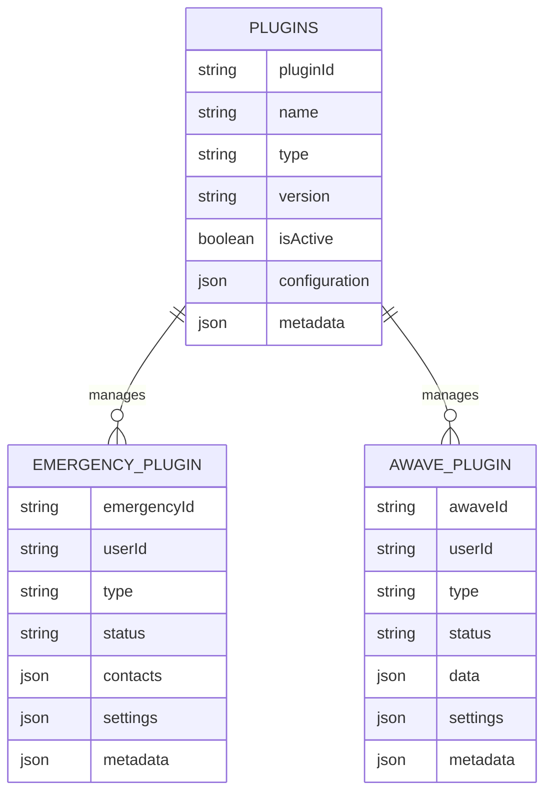

### 4.3 Health Features Schema
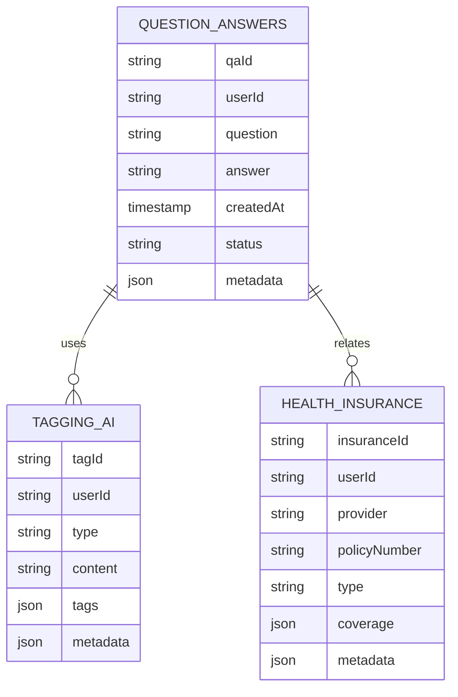

## 5. Navigation Flow

### 5.1 Core Hub Navigation
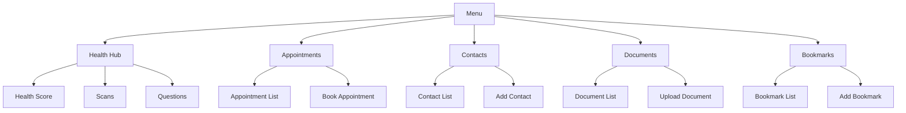

### 5.2 Integration Navigation
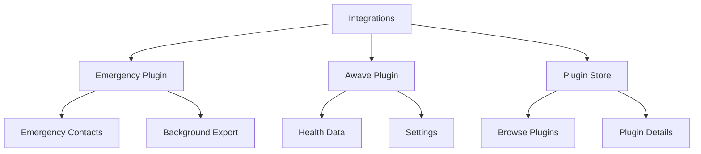

## 6. Feature Components

### 6.1 Menu Components
- **Hub Menu**
  - Navigation buttons
  - Quick actions
  - User profile section
  - Settings access

- **Health Hub**
  - Health score display
  - Scan history
  - Question history
  - Health metrics

### 6.2 Integration Components
- **Emergency Plugin**
  - Contact management
  - Emergency info
  - Background export
  - Settings

- **Awave Plugin**
  - Health data integration
  - Data visualization
  - Settings
  - Sync status

## 7. Dynamic Configurations

### 7.1 Hub Settings
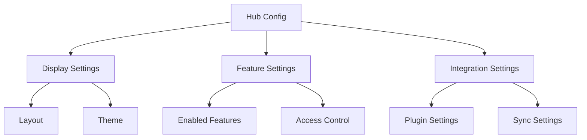

## 8. State Management

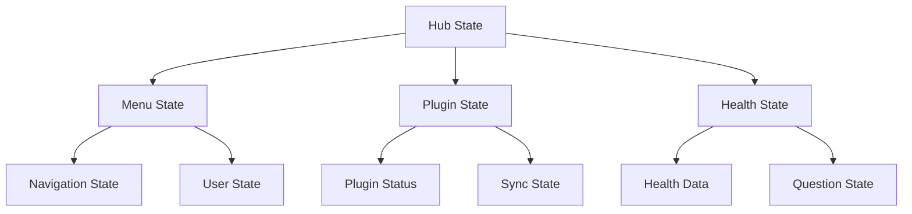

## 9. Feature Matrix

| Section | Components | Firebase Collections | State Management |
|---------|------------|---------------------|------------------|
| Core Hub | Menu, Health Hub | hub, users, values | MenuState |
| Integrations | Emergency, Awave | plugins, emergencyPlugin | PluginState |
| Health Features | Health Score, Scans | questionAnswers, taggingAI | HealthState |

## 10. Integration Points

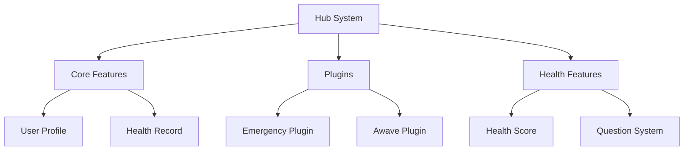

## 11. Error Handling

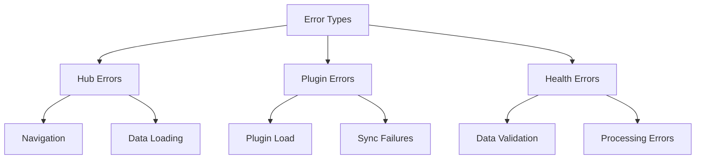

## 12. Security Implementation

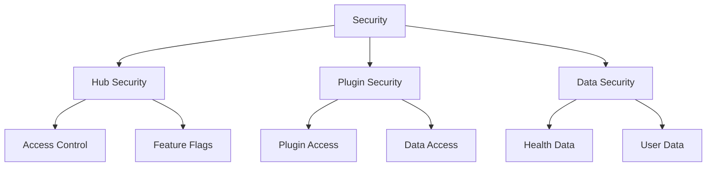

This architecture document provides a comprehensive overview of the Hub system, organized into distinct sections for Core Hub, Integrations, and Health Features.
