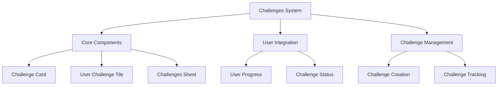
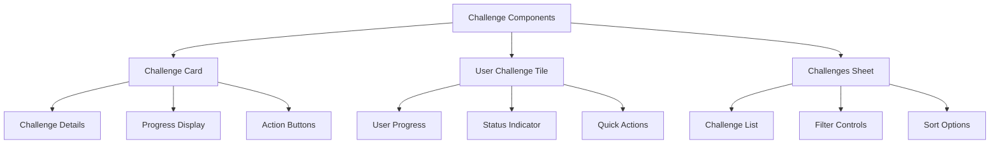
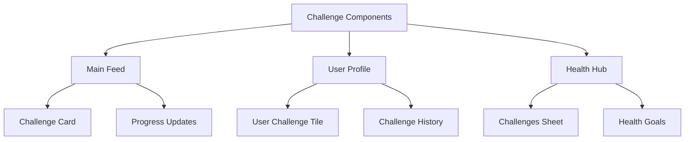
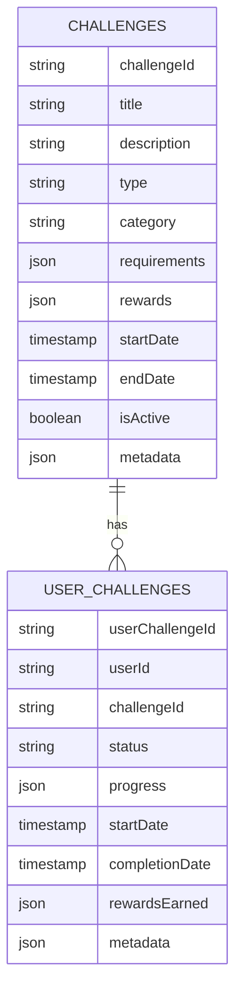
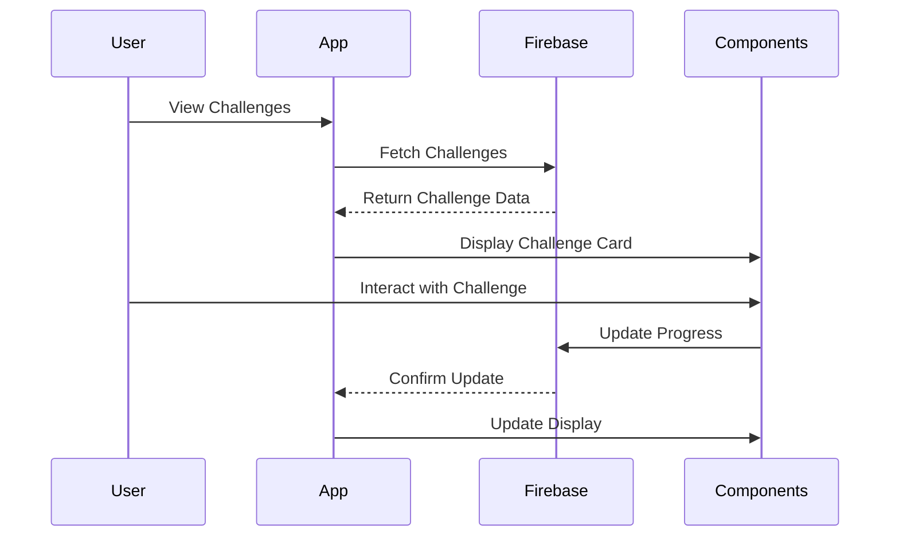
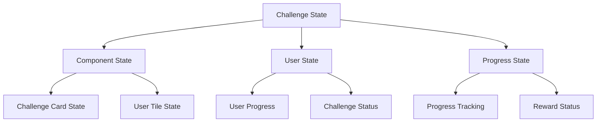
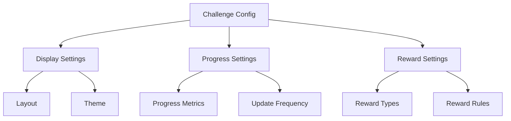
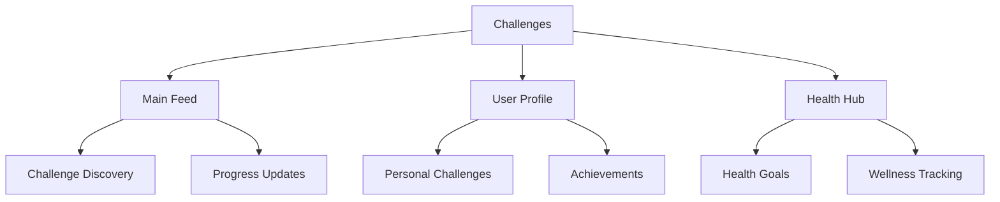
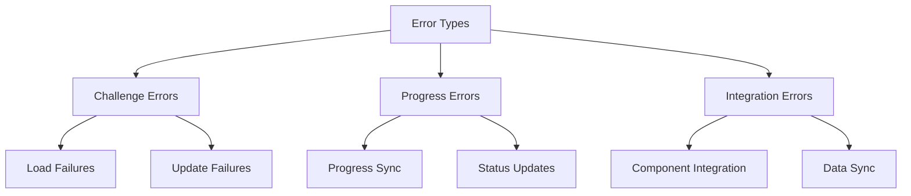
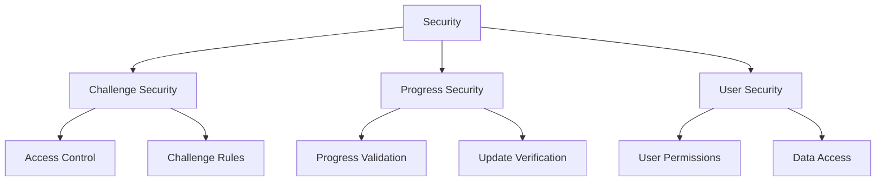

# Challenges System Architecture

## 1. System Overview

## 2. Component Structure

### 2.1 Challenge Components

## 3. Integration Points

### 3.1 Component Usage

## 4. Firebase Schema

### 4.1 Challenge Schema

## 5. Component Features

### 5.1 Challenge Card
- **Features:**
  - Challenge title and description
  - Progress visualization
  - Action buttons (Join, View Details)
  - Reward preview
  - Time remaining indicator

- **Usage:**
  - Main feed display
  - Challenge discovery
  - Quick challenge preview

### 5.2 User Challenge Tile
- **Features:**
  - Personal progress tracking
  - Status indicators
  - Quick actions
  - Reward status
  - Completion metrics

- **Usage:**
  - User profile integration
  - Challenge management
  - Progress tracking

### 5.3 Challenges Sheet
- **Features:**
  - Challenge list view
  - Filtering options
  - Sorting capabilities
  - Category navigation
  - Search functionality

- **Usage:**
  - Challenge discovery
  - Challenge management
  - Progress overview

## 6. Workflow

### 6.1 Challenge Flow

## 7. State Management

## 8. Dynamic Configurations

### 8.1 Challenge Settings

## 9. Feature Matrix

| Component | Features | Firebase Collections | State Management |
|-----------|----------|---------------------|------------------|
| Challenge Card | Display, Actions | challenges | CardState |
| User Challenge Tile | Progress, Status | userChallenges | TileState |
| Challenges Sheet | List, Filters | challenges, userChallenges | SheetState |

## 10. Integration Points

## 11. Error Handling

## 12. Security Implementation

This architecture document provides a comprehensive overview of the Challenges system, focusing on its components, integration points, and data flow. The system is designed to be modular and reusable, with components that can be integrated into various parts of the application.
