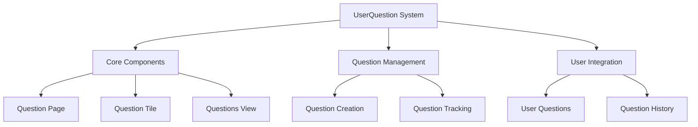
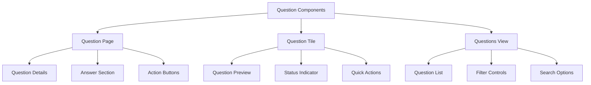
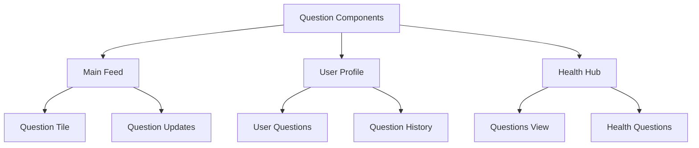
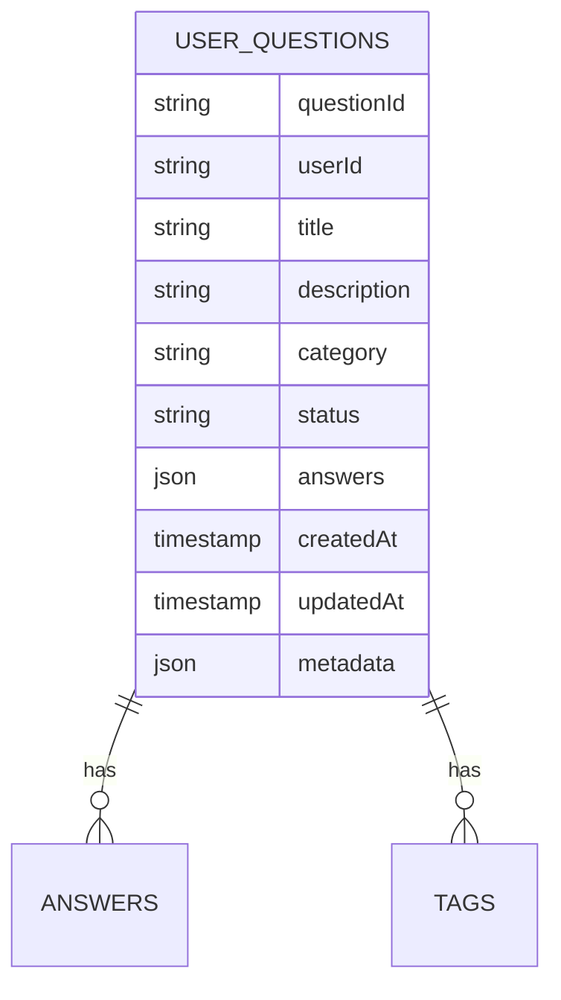
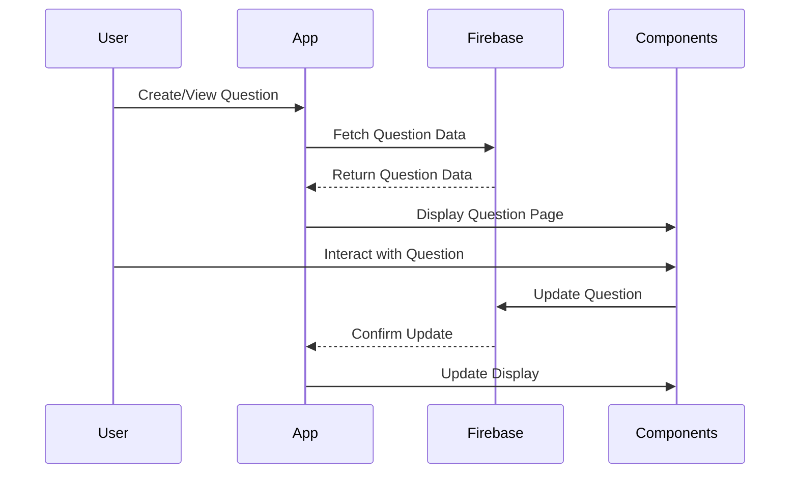
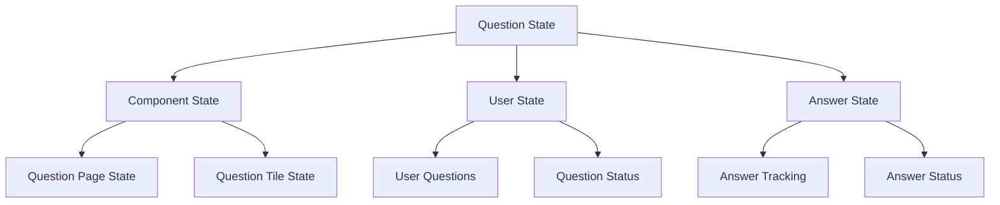
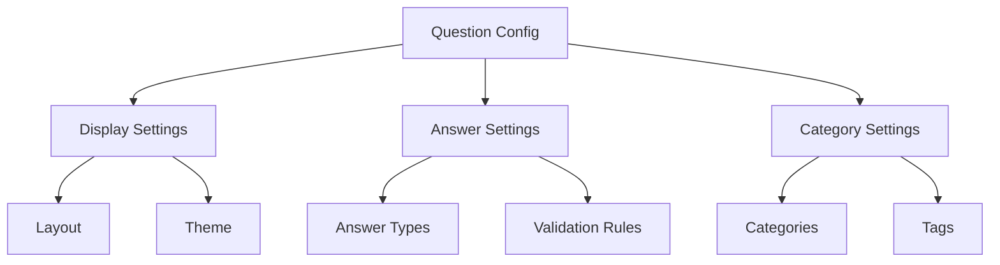
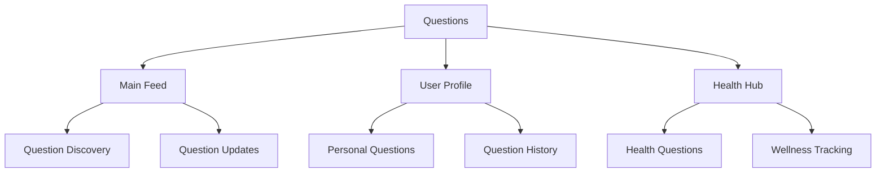
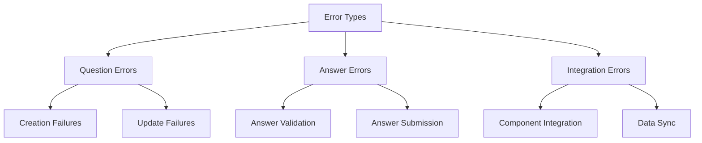
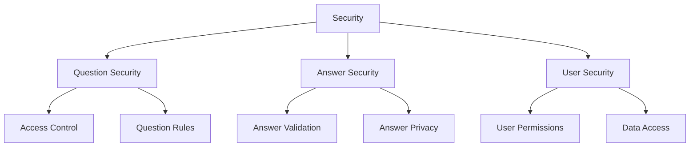

# UserQuestion System Architecture

## 1. System Overview

## 2. Component Structure

### 2.1 Question Components

## 3. Integration Points

### 3.1 Component Usage

## 4. Firebase Schema

### 4.1 Question Schema

## 5. Component Features

### 5.1 Question Page
- **Features:**
  - Question details display
  - Answer input section
  - Category selection
  - Status tracking
  - Action buttons

- **Usage:**
  - Question creation
  - Question viewing
  - Answer management

### 5.2 Question Tile
- **Features:**
  - Question preview
  - Status indicator
  - Quick actions
  - Category tag
  - Answer count

- **Usage:**
  - Question list display
  - Quick question access
  - Status overview

### 5.3 Questions View
- **Features:**
  - Question list
  - Filtering options
  - Search functionality
  - Category navigation
  - Sort controls

- **Usage:**
  - Question discovery
  - Question management
  - Category browsing

## 6. Workflow

### 6.1 Question Flow

## 7. State Management

## 8. Dynamic Configurations

### 8.1 Question Settings

## 9. Feature Matrix

| Component | Features | Firebase Collections | State Management |
|-----------|----------|---------------------|------------------|
| Question Page | Display, Actions | userQuestions | PageState |
| Question Tile | Preview, Status | userQuestions | TileState |
| Questions View | List, Filters | userQuestions | ViewState |

## 10. Integration Points

## 11. Error Handling

## 12. Security Implementation

This architecture document provides a comprehensive overview of the UserQuestion system, focusing on its components, integration points, and data flow. The system is designed to be modular and reusable, with components that can be integrated into various parts of the application.
