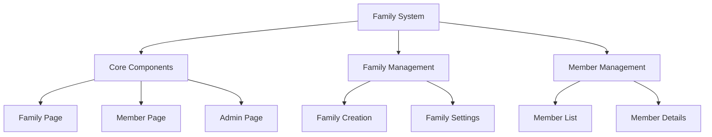
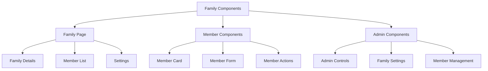
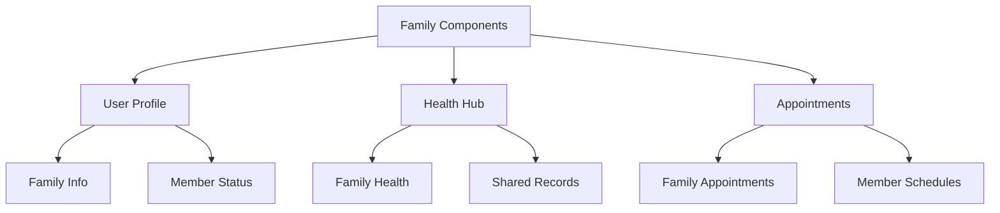
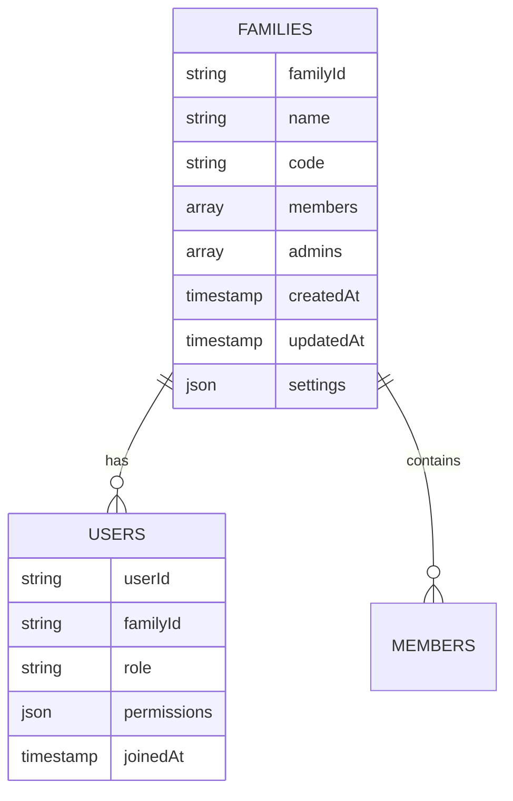
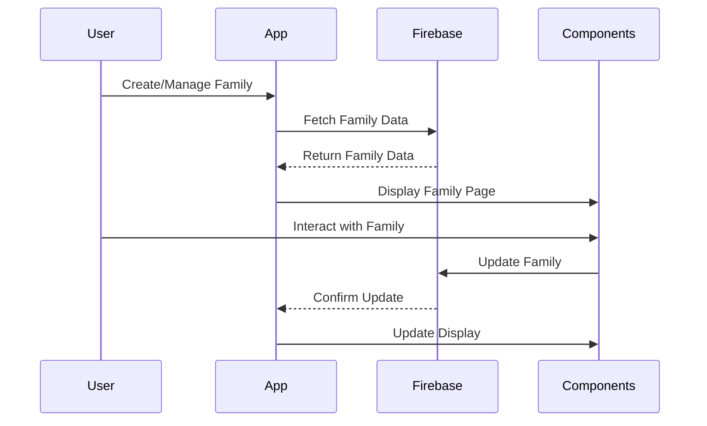
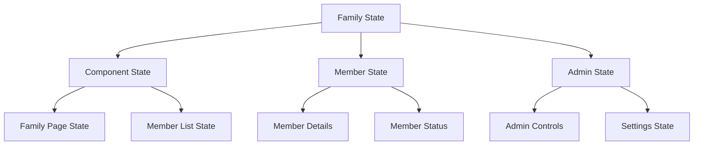
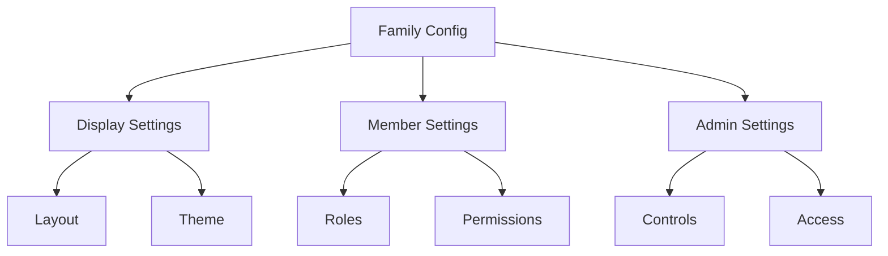
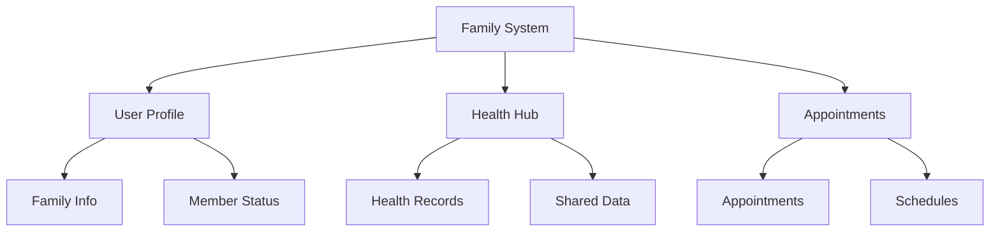
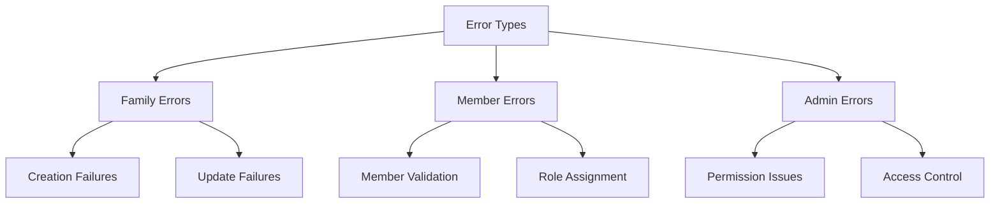
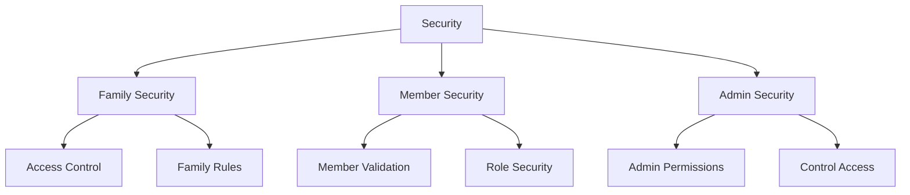

# Family System Architecture

## 1. System Overview

## 2. Component Structure

### 2.1 Family Components

## 3. Integration Points

### 3.1 Component Usage

## 4. Firebase Schema

### 4.1 Family Schema

## 5. Component Features

### 5.1 Family Page
- **Features:**
  - Family details display
  - Member list management
  - Settings configuration
  - Invite code generation
  - Admin controls

- **Usage:**
  - Family creation
  - Member management
  - Settings updates

### 5.2 Member Components
- **Features:**
  - Member card display
  - Member form input
  - Role management
  - Permission settings
  - Quick actions

- **Usage:**
  - Member addition
  - Member editing
  - Role assignment

### 5.3 Admin Components
- **Features:**
  - Family settings
  - Member management
  - Permission controls
  - Invite management
  - Activity logs

- **Usage:**
  - Family administration
  - Member oversight
  - Settings management

## 6. Workflow

### 6.1 Family Flow

## 7. State Management

## 8. Dynamic Configurations

### 8.1 Family Settings

## 9. Feature Matrix

| Component | Features | Firebase Collections | State Management |
|-----------|----------|---------------------|------------------|
| Family Page | Display, Management | families, users | PageState |
| Member Components | Member Management | users | MemberState |
| Admin Components | Admin Controls | families, users | AdminState |

## 10. Integration Points

## 11. Error Handling

## 12. Security Implementation

This architecture document provides a comprehensive overview of the Family system, focusing on its components, integration points, and data flow. The system is designed to be modular and reusable, with components that can be integrated into various parts of the application.
