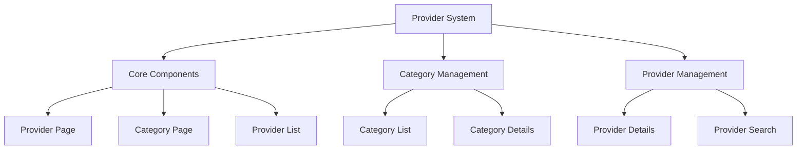
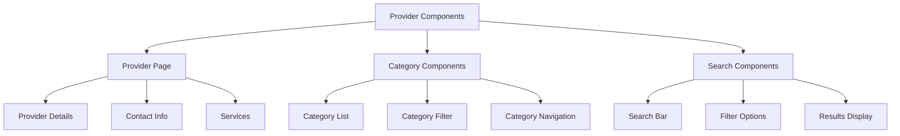
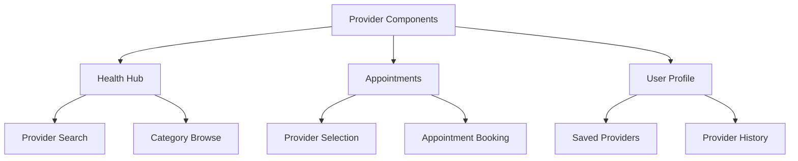
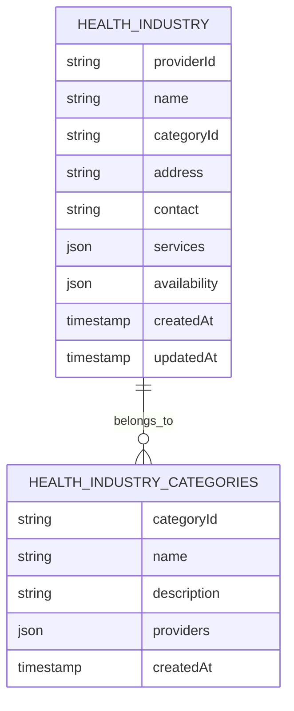
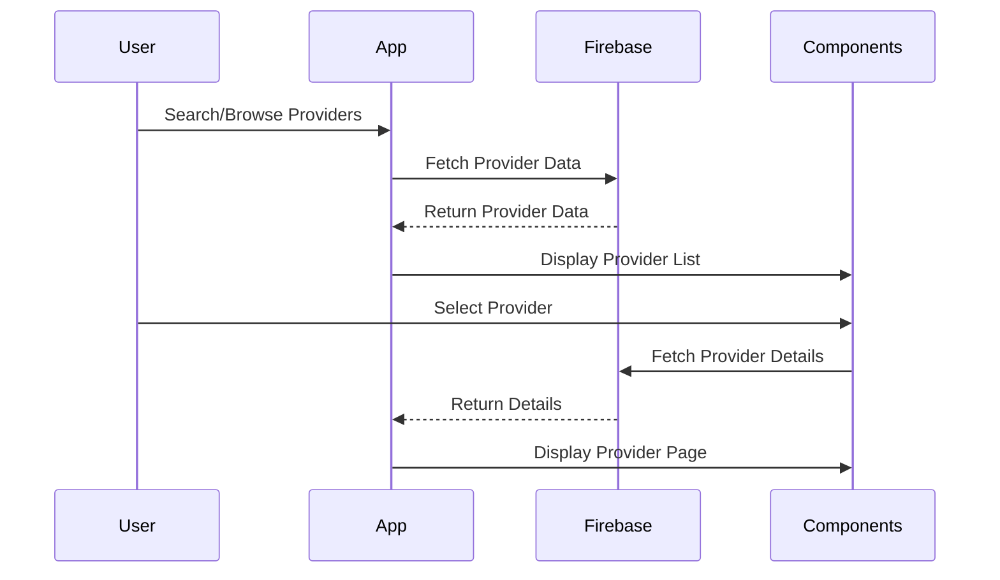
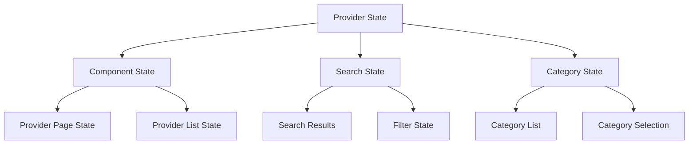
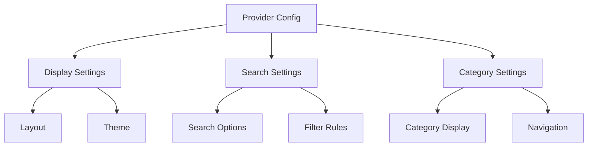
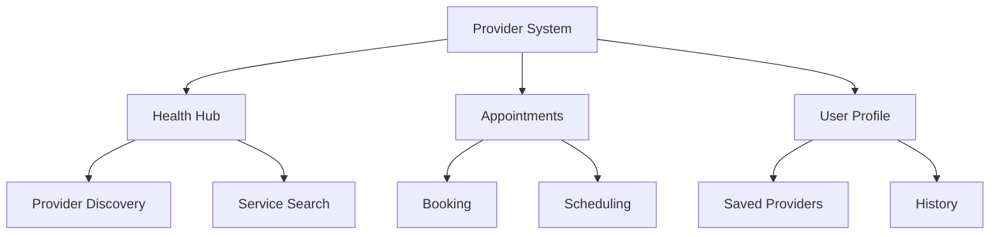
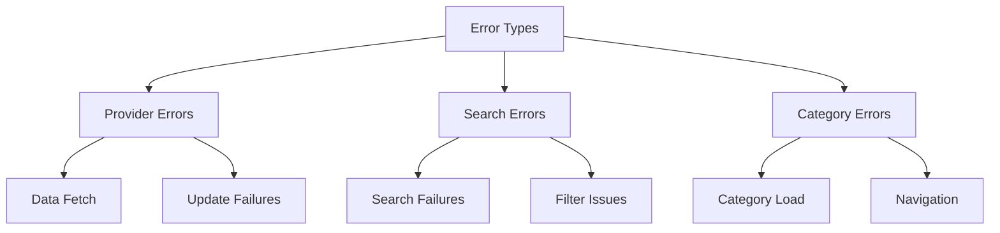
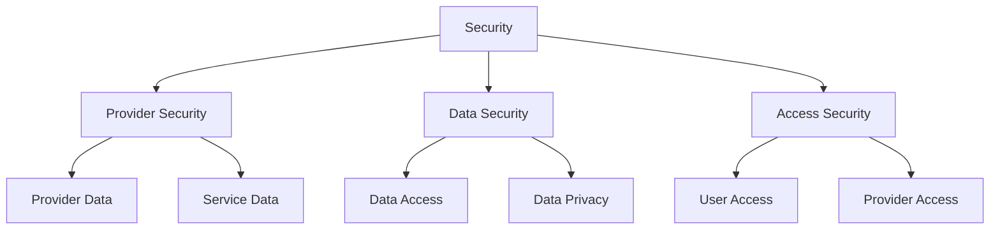

# Provider System Architecture

## 1. System Overview

## 2. Component Structure

### 2.1 Provider Components

## 3. Integration Points

### 3.1 Component Usage

## 4. Firebase Schema

### 4.1 Provider Schema

## 5. Component Features

### 5.1 Provider Page
- **Features:**
  - Provider details display
  - Contact information
  - Service offerings
  - Availability calendar
  - Booking options

- **Usage:**
  - Provider information
  - Service discovery
  - Appointment booking

### 5.2 Category Components
- **Features:**
  - Category list display
  - Category filtering
  - Provider count
  - Quick navigation
  - Search within category

- **Usage:**
  - Category browsing
  - Provider discovery
  - Service exploration

### 5.3 Search Components
- **Features:**
  - Search functionality
  - Filter options
  - Results display
  - Sorting options
  - Location-based search

- **Usage:**
  - Provider search
  - Service search
  - Location search

## 6. Workflow

### 6.1 Provider Flow

## 7. State Management

## 8. Dynamic Configurations

### 8.1 Provider Settings

## 9. Feature Matrix

| Component | Features | Firebase Collections | State Management |
|-----------|----------|---------------------|------------------|
| Provider Page | Display, Booking | healthIndustry | PageState |
| Category Components | Category Management | healthIndustryCategories | CategoryState |
| Search Components | Search, Filter | healthIndustry | SearchState |

## 10. Integration Points

## 11. Error Handling

## 12. Security Implementation

This architecture document provides a comprehensive overview of the Provider system, focusing on its components, integration points, and data flow.
