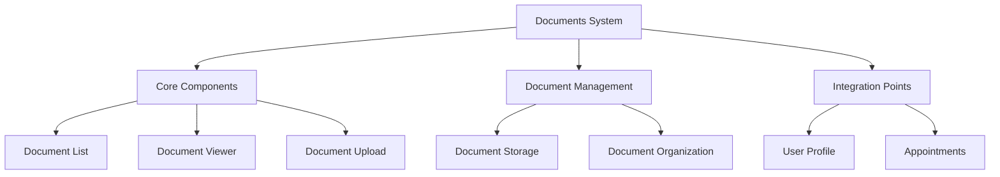
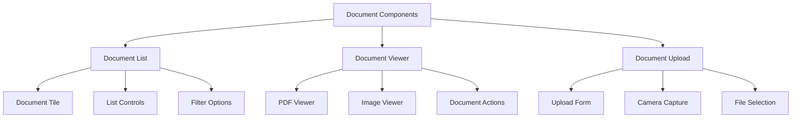
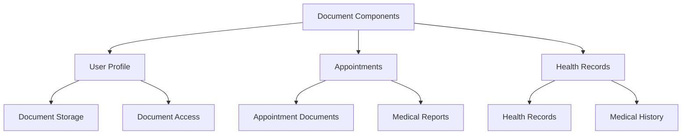
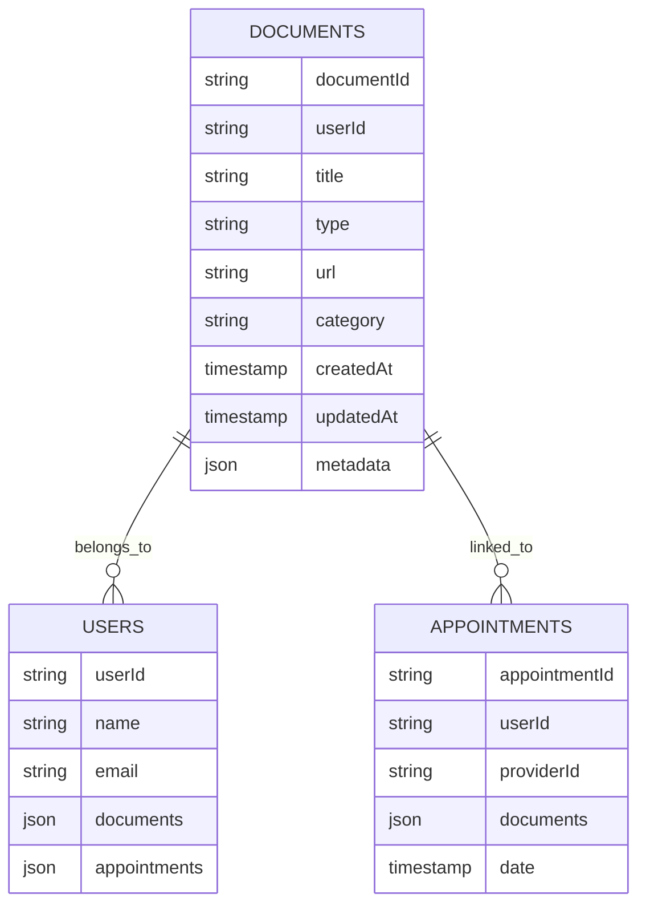
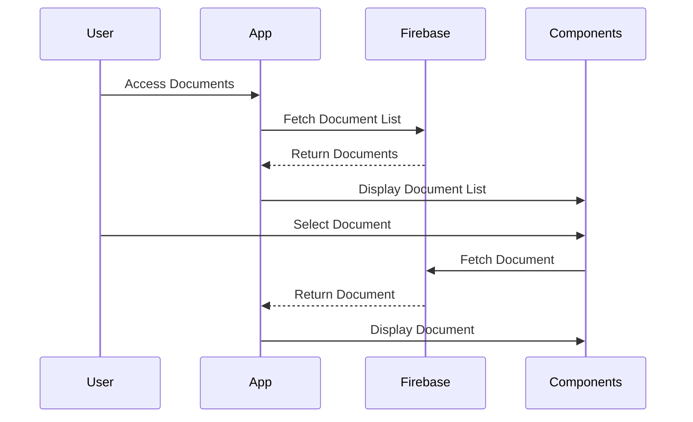
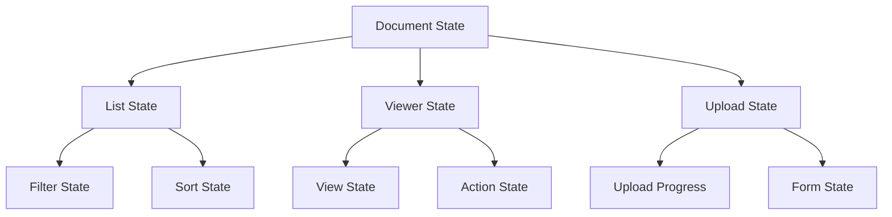
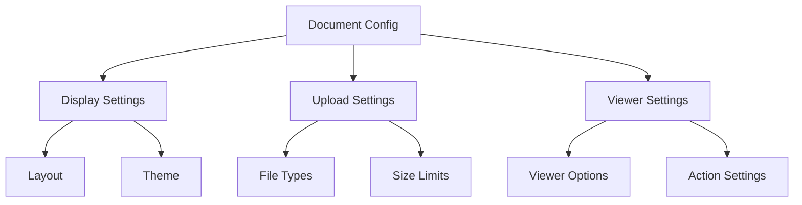
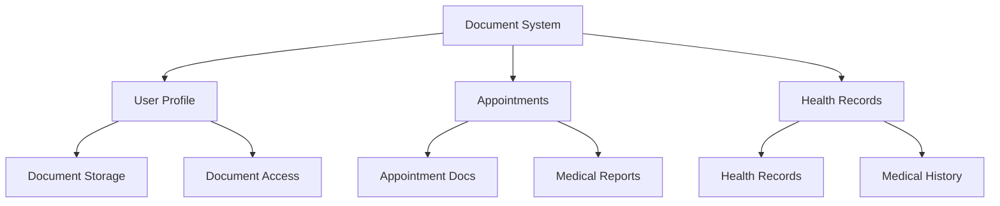
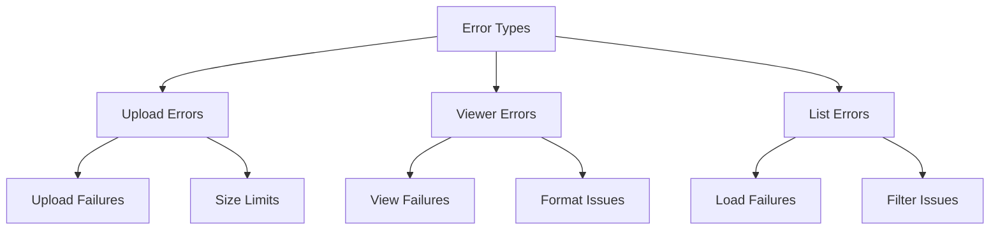
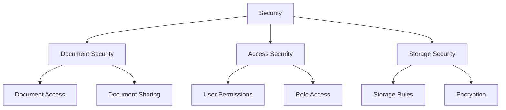

# Documents System Architecture

## 1. System Overview

## 2. Component Structure

### 2.1 Document Components

## 3. Integration Points

### 3.1 Component Usage

## 4. Firebase Schema

### 4.1 Document Schema

## 5. Component Features

### 5.1 Document List
- **Features:**
  - Document grid/list view
  - Sorting options
  - Filtering capabilities
  - Search functionality
  - Category organization

- **Usage:**
  - Document browsing
  - Document management
  - Quick access to documents

### 5.2 Document Viewer
- **Features:**
  - PDF viewing
  - Image viewing
  - Document sharing
  - Document actions
  - Zoom controls

- **Usage:**
  - Document viewing
  - Document sharing
  - Document actions

### 5.3 Document Upload
- **Features:**
  - File selection
  - Camera capture
  - Document categorization
  - Metadata input
  - Progress tracking

- **Usage:**
  - Document upload
  - Document creation
  - Document organization

## 6. Workflow

### 6.1 Document Flow

## 7. State Management

## 8. Dynamic Configurations

### 8.1 Document Settings

## 9. Feature Matrix

| Component | Features | Firebase Collections | State Management |
|-----------|----------|---------------------|------------------|
| Document List | Display, Filter | documents | ListState |
| Document Viewer | View, Share | documents | ViewerState |
| Document Upload | Upload, Categorize | documents | UploadState |

## 10. Integration Points

## 11. Error Handling

## 12. Security Implementation

This architecture document provides a comprehensive overview of the Documents system, focusing on its components, integration points, and data flow. The system is designed to be modular and reusable, with components that can be integrated into various parts of the application.
