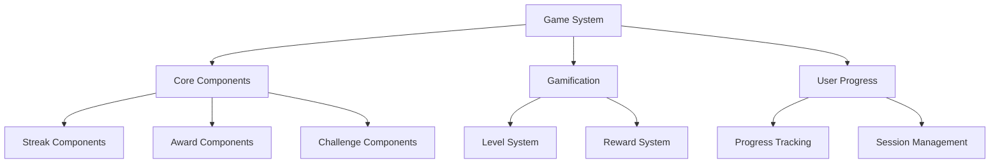
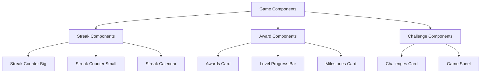
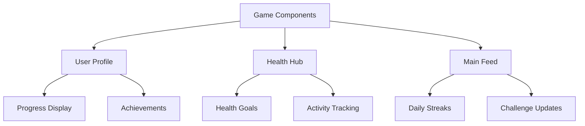
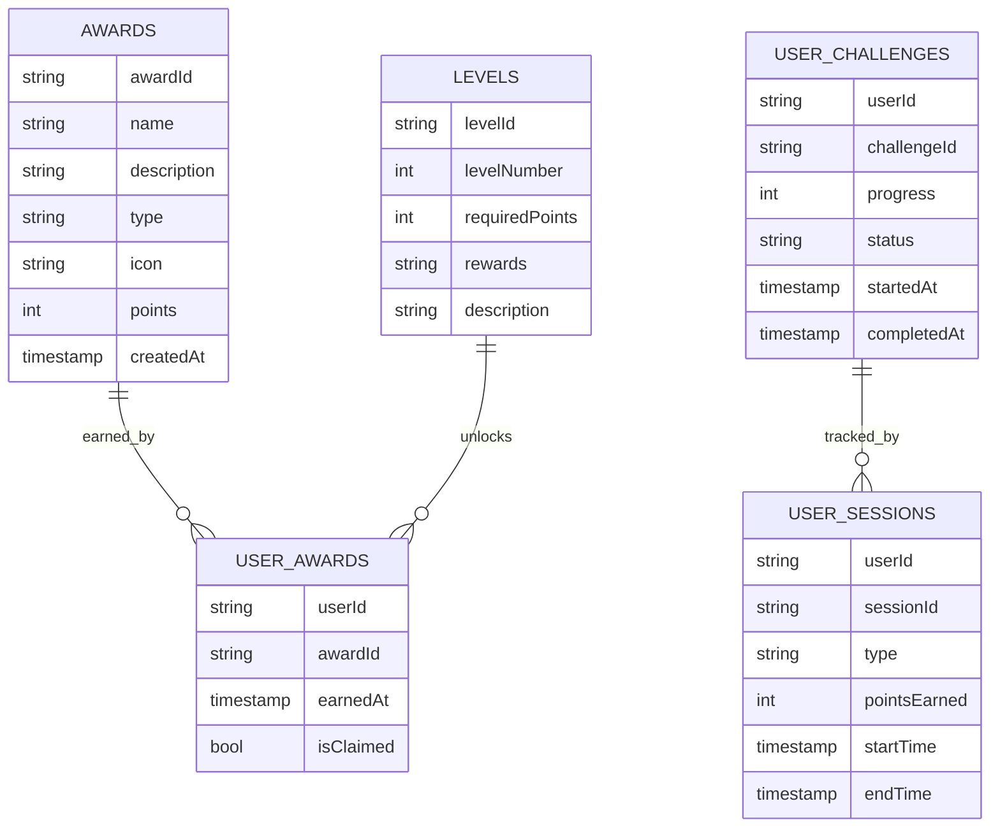
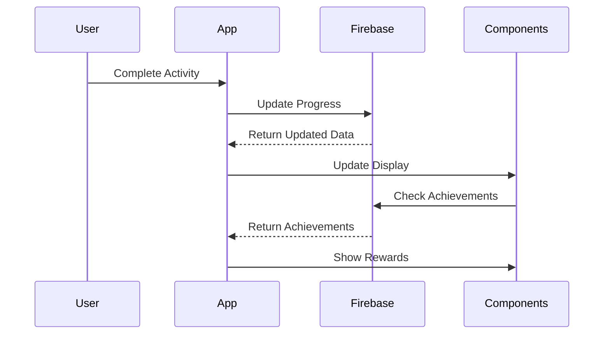
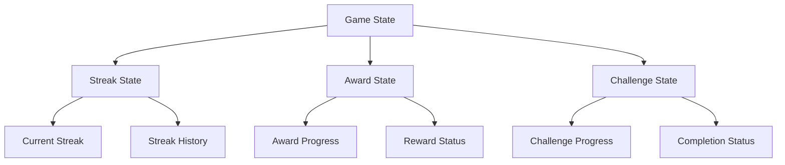
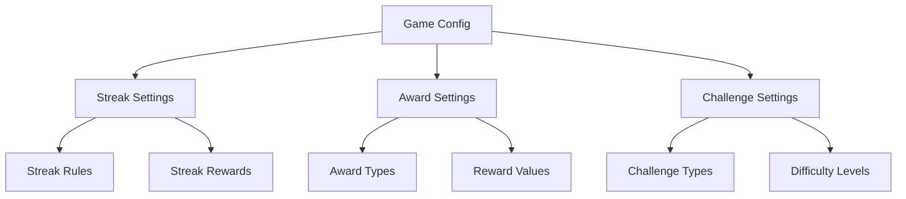
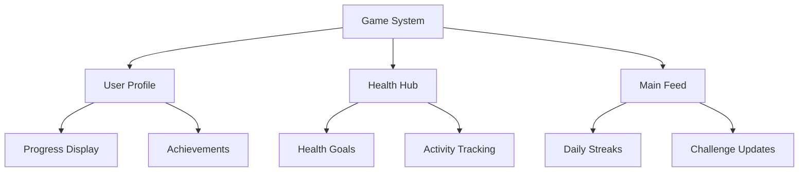
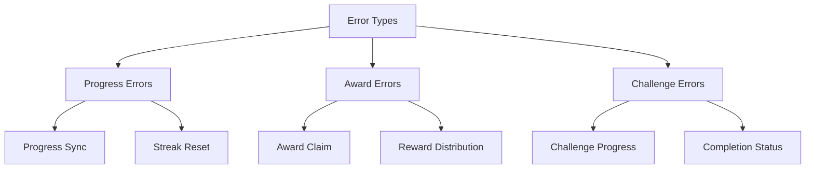
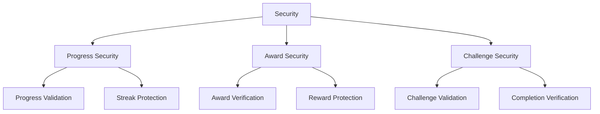

# Game System Architecture

## 1. System Overview

## 2. Component Structure

### 2.1 Game Components

## 3. Integration Points

### 3.1 Component Usage

## 4. Firebase Schema

### 4.1 Game Schema

## 5. Component Features

### 5.1 Streak Components
- **Features:**
  - Daily streak tracking
  - Streak visualization
  - Streak milestones
  - Streak rewards
  - Streak notifications

- **Usage:**
  - User engagement
  - Habit formation
  - Progress tracking

### 5.2 Award Components
- **Features:**
  - Award display
  - Achievement tracking
  - Reward claiming
  - Progress indicators
  - Milestone celebration

- **Usage:**
  - User motivation
  - Achievement recognition
  - Progress celebration

### 5.3 Challenge Components
- **Features:**
  - Challenge display
  - Progress tracking
  - Challenge completion
  - Reward distribution
  - Challenge sharing

- **Usage:**
  - User engagement
  - Goal setting
  - Community building

## 6. Workflow

### 6.1 Game Flow

## 7. State Management

## 8. Dynamic Configurations

### 8.1 Game Settings

## 9. Feature Matrix

| Component | Features | Firebase Collections | State Management |
|-----------|----------|---------------------|------------------|
| Streak Components | Tracking, Display | userSessions | StreakState |
| Award Components | Achievement, Rewards | awards, userAwards | AwardState |
| Challenge Components | Progress, Completion | userChallenges | ChallengeState |

## 10. Integration Points

## 11. Error Handling

## 12. Security Implementation

This architecture document provides a comprehensive overview of the Game system, focusing on its components, integration points, and data flow. The system is designed to be modular and reusable, with components that can be integrated into various parts of the application.
