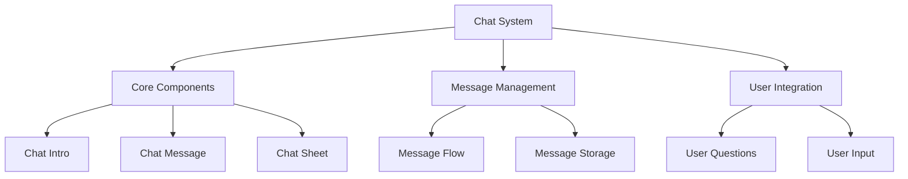
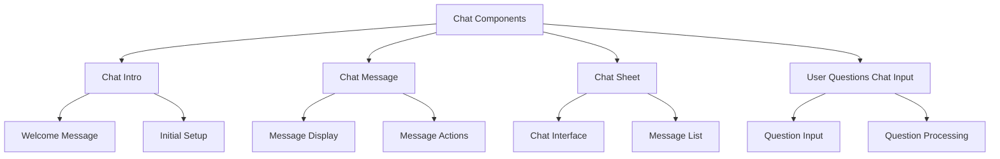
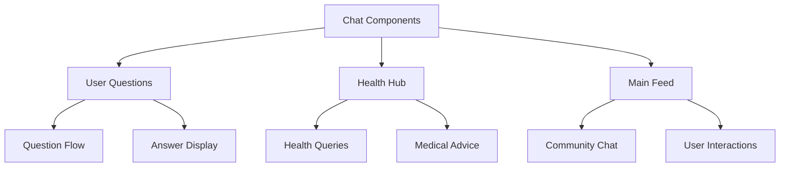
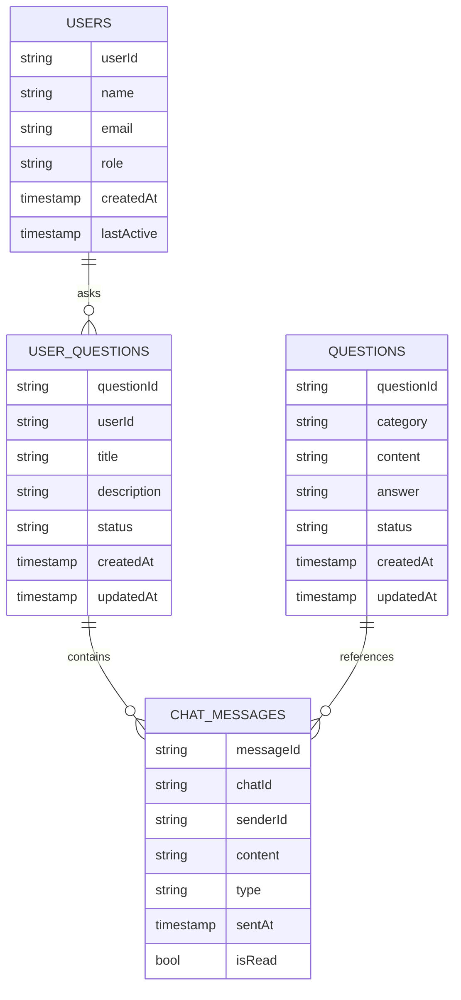
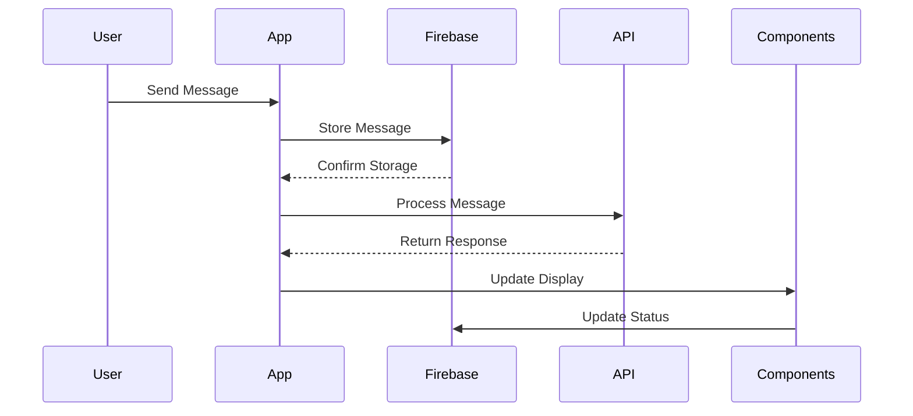
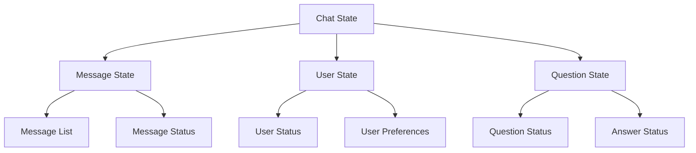
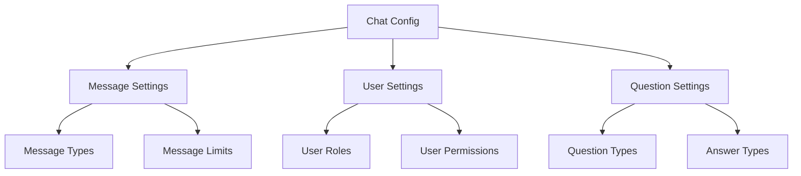
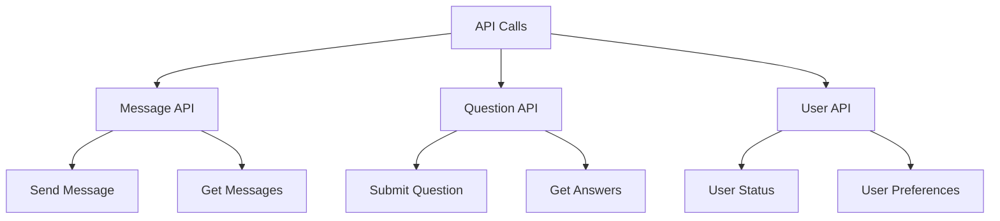
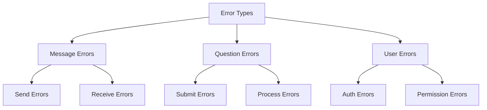
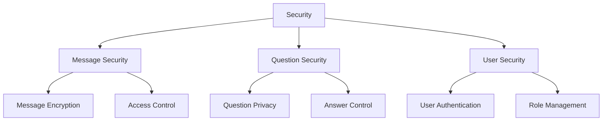

# Chat System Architecture

## 1. System Overview

## 2. Component Structure

### 2.1 Chat Components

## 3. Integration Points

### 3.1 Component Usage

## 4. Firebase Schema

### 4.1 Chat Schema

## 5. Component Features

### 5.1 Chat Intro
- **Features:**
  - Welcome message display
  - User onboarding
  - Initial setup guidance
  - Feature introduction
  - Quick start options

- **Usage:**
  - First-time user experience
  - Feature discovery
  - User guidance

### 5.2 Chat Message
- **Features:**
  - Message display
  - Message actions
  - Timestamp display
  - Read status
  - Message types (text, media)

- **Usage:**
  - Real-time communication
  - Message history
  - User interaction

### 5.3 Chat Sheet
- **Features:**
  - Chat interface
  - Message list
  - Input field
  - Send button
  - Attachment options

- **Usage:**
  - Main chat interface
  - Message composition
  - File sharing

### 5.4 User Questions Chat Input
- **Features:**
  - Question input
  - Question processing
  - Auto-suggestions
  - Category selection
  - Priority setting

- **Usage:**
  - Question submission
  - Query management
  - User support

## 6. Workflow

### 6.1 Chat Flow

## 7. State Management

## 8. Dynamic Configurations

### 8.1 Chat Settings

## 9. Feature Matrix

| Component | Features | Firebase Collections | State Management |
|-----------|----------|---------------------|------------------|
| Chat Intro | Welcome, Setup | users | UserState |
| Chat Message | Display, Actions | chat_messages | MessageState |
| Chat Sheet | Interface, Input | chat_messages | ChatState |
| User Questions | Input, Processing | userquestions | QuestionState |

## 10. API Integration

### 10.1 API Endpoints

## 11. Error Handling

## 12. Security Implementation

This architecture document provides a comprehensive overview of the Chat system, focusing on its components, integration points, and data flow. The system is designed to be modular and reusable, with components that can be integrated into various parts of the application.
