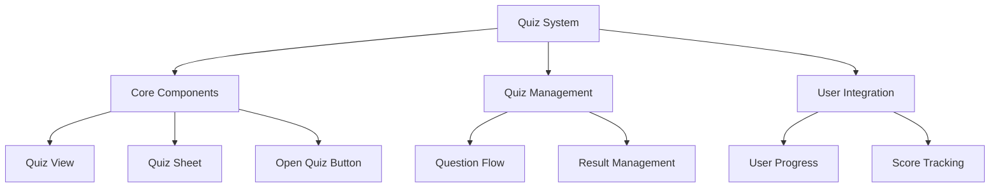
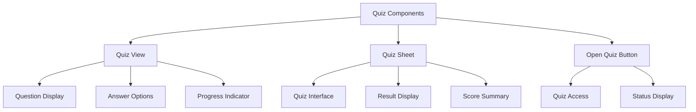
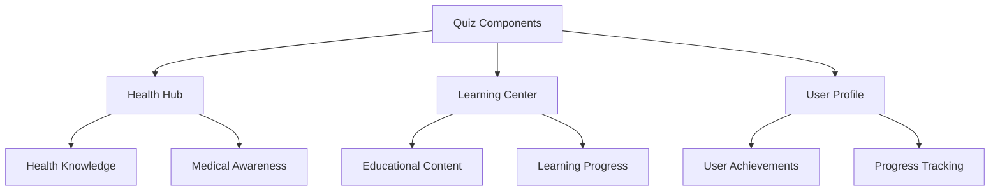
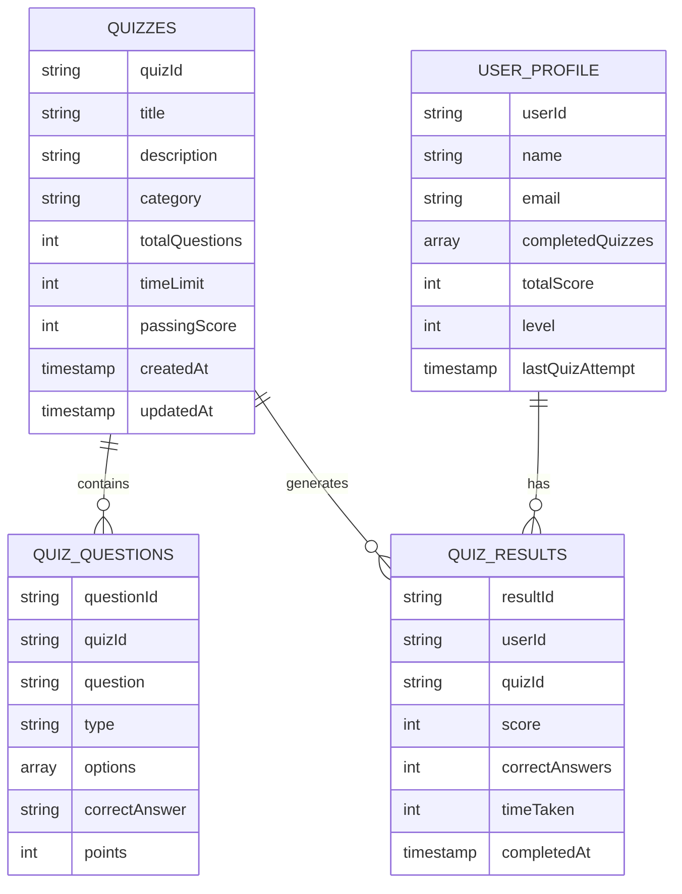
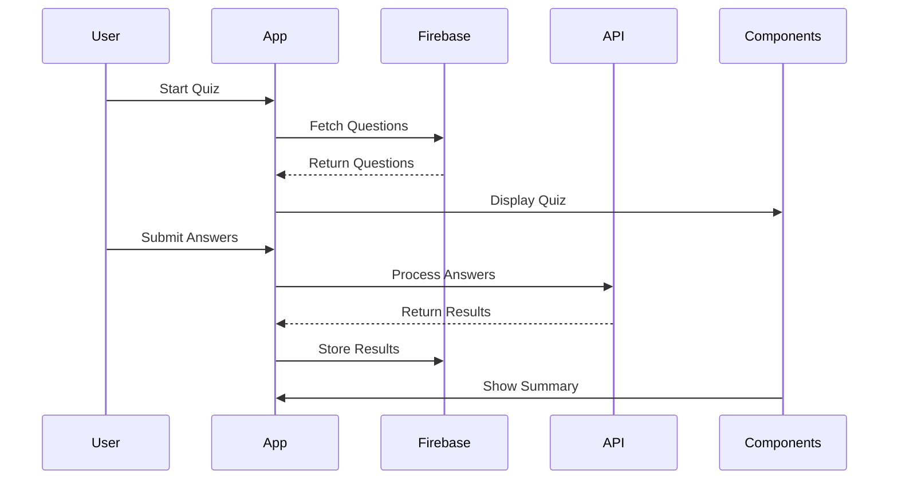
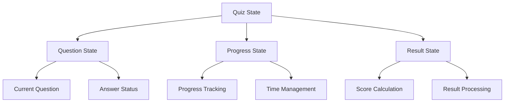
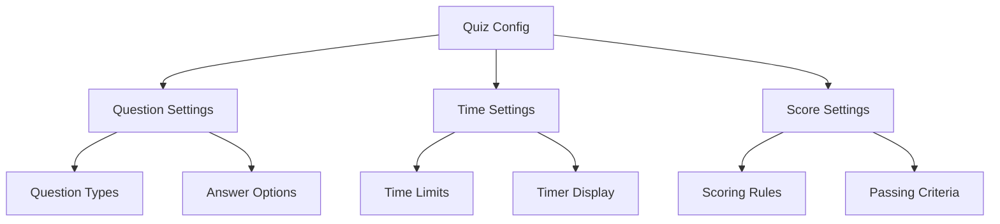
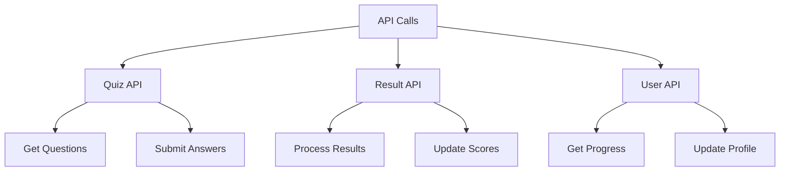
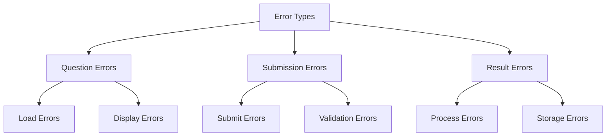
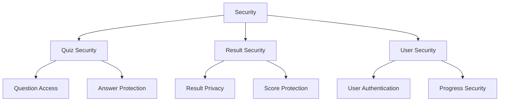

# Quiz System Architecture

## 1. System Overview

## 2. Component Structure

### 2.1 Quiz Components

## 3. Integration Points

### 3.1 Component Usage

## 4. Firebase Schema

### 4.1 Quiz Schema

## 5. Component Features

### 5.1 Quiz View
- **Features:**
  - Question display
  - Answer options
  - Progress tracking
  - Timer display
  - Navigation controls

- **Usage:**
  - Quiz taking
  - Progress monitoring
  - User interaction

### 5.2 Quiz Sheet
- **Features:**
  - Quiz interface
  - Result display
  - Score summary
  - Feedback section
  - Share options

- **Usage:**
  - Quiz completion
  - Result presentation
  - Progress tracking

### 5.3 Open Quiz Button
- **Features:**
  - Quiz access
  - Status display
  - Progress indicator
  - Quick start
  - Category filter

- **Usage:**
  - Quiz initiation
  - Status monitoring
  - Quick access

## 6. Workflow

### 6.1 Quiz Flow

## 7. State Management

## 8. Dynamic Configurations

### 8.1 Quiz Settings

## 9. Feature Matrix

| Component | Features | Firebase Collections | State Management |
|-----------|----------|---------------------|------------------|
| Quiz View | Questions, Answers | quizzes, quiz_questions | QuestionState |
| Quiz Sheet | Results, Summary | quiz_results | ResultState |
| Open Quiz Button | Access, Status | userProfile | ProgressState |

## 10. API Integration

### 10.1 API Endpoints

## 11. Error Handling

## 12. Security Implementation

This architecture document provides a comprehensive overview of the Quiz system, focusing on its components, integration points, and data flow. The system is designed to be modular and reusable, with components that can be integrated into various parts of the application.
