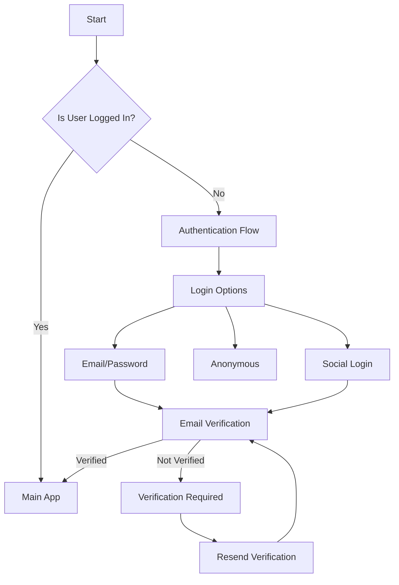
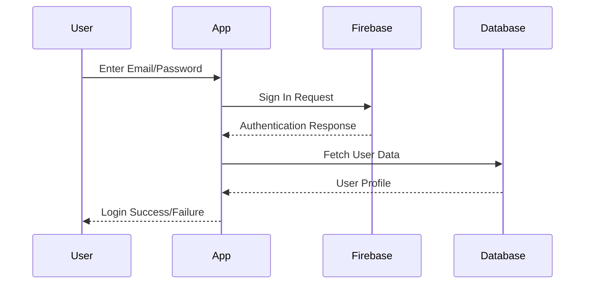
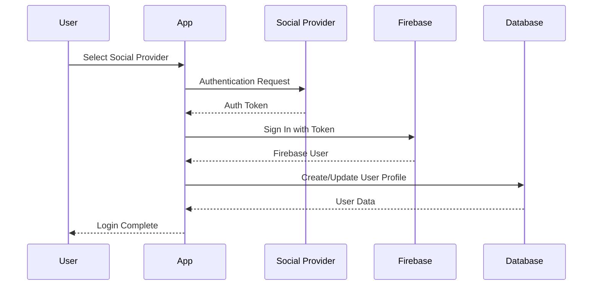
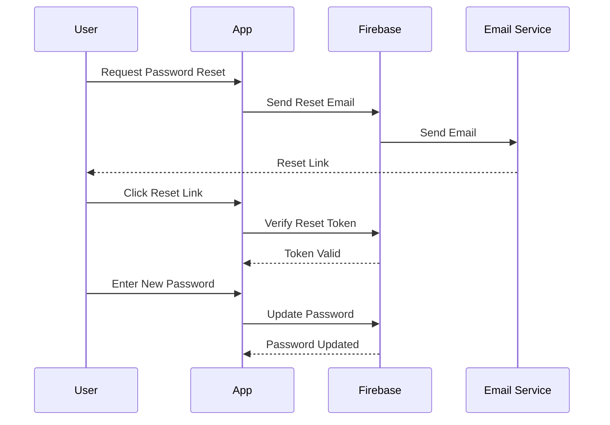
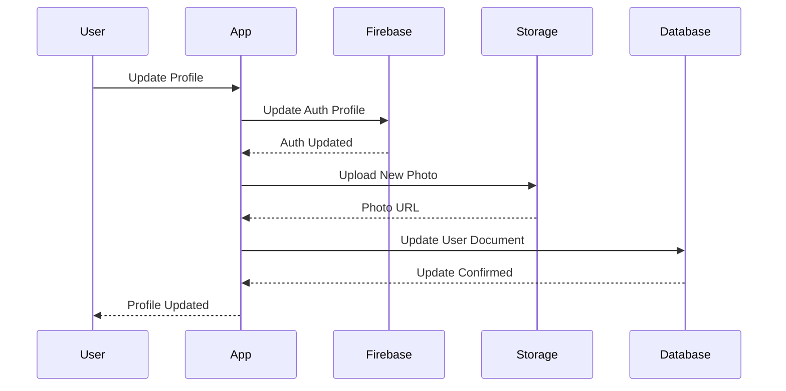

# Authentication System Architecture

## 1. Authentication Flow Diagram



## 2. Authentication Components Structure

```
auth/
├── firebase_auth/         # Firebase authentication implementation
├── login/                 # Login page components
│   ├── login_model.dart   # Login state management
│   └── login_widget.dart  # Login UI components
├── sign_up/              # Sign up components
│   ├── sign_up_model.dart
│   └── sign_up_widget.dart
├── password_reset/       # Password reset flow
├── profile/             # Profile management
├── update_email/        # Email update functionality
├── update_username/     # Username update functionality
└── auth_manager.dart    # Authentication manager interface
```

## 3. Authentication State Management

### 3.1 AuthManager Interface
```dart
abstract class AuthManager {
  Future signOut();
  Future deleteUser();
  Future updateEmail();
  Future resetPassword();
  Future sendEmailVerification();
  Future refreshUser();
}
```

### 3.2 Authentication Mixins
```dart
mixin EmailSignInManager
mixin AnonymousSignInManager
mixin AppleSignInManager
mixin GoogleSignInManager
mixin JwtSignInManager
mixin PhoneSignInManager
mixin FacebookSignInManager
mixin MicrosoftSignInManager
mixin GithubSignInManager
```

## 4. Firebase Authentication Schema

### 4.1 User Document Structure
```json
{
  "users": {
    "userId": {
      "email": "string",
      "emailVerified": "boolean",
      "displayName": "string",
      "photoURL": "string",
      "phoneNumber": "string",
      "providerData": [
        {
          "providerId": "string",
          "uid": "string",
          "displayName": "string",
          "email": "string",
          "phoneNumber": "string",
          "photoURL": "string"
        }
      ],
      "metadata": {
        "creationTime": "timestamp",
        "lastSignInTime": "timestamp"
      },
      "customClaims": {
        "role": "string",
        "permissions": ["string"]
      }
    }
  }
}
```

## 5. Authentication Flows

### 5.1 Email/Password Authentication


### 5.2 Social Login Flow


### 5.3 Password Reset Flow


## 6. Security Implementation

### 6.1 Firebase Security Rules
```javascript
rules_version = '2';
service cloud.firestore {
  match /databases/{database}/documents {
    match /users/{userId} {
      allow read: if request.auth != null;
      allow write: if request.auth.uid == userId;
      
      match /private/{document=**} {
        allow read, write: if request.auth.uid == userId;
      }
    }
  }
}
```

### 6.2 Token Management
- JWT token validation
- Token refresh mechanism
- Session management
- Secure token storage

## 7. Error Handling

### 7.1 Authentication Errors
```dart
enum AuthError {
  invalidEmail,
  userDisabled,
  userNotFound,
  wrongPassword,
  emailAlreadyInUse,
  weakPassword,
  operationNotAllowed,
  accountExistsWithDifferentCredential,
  invalidCredential,
  invalidVerificationCode,
  invalidVerificationId,
  missingVerificationCode,
  missingVerificationId,
  quotaExceeded,
  retryLimitExceeded,
  invalidPhoneNumber,
  missingPhoneNumber,
  missingAndroidPackageName,
  missingContinueUri,
  missingIosBundleId,
  invalidContinueUri,
  unauthorizedContinueUri,
  userMismatch,
  credentialAlreadyInUse,
  requiresRecentLogin,
  providerAlreadyLinked,
  noSuchProvider,
  invalidActionCode,
  expiredActionCode,
  invalidMessagePayload,
  invalidSender,
  invalidRecipientEmail,
  missingEmail,
  missingIosBundleId,
  missingAndroidPackageName,
  unauthorizedDomain,
  invalidDynamicLinkDomain,
  cancelled,
  invalidApiKey,
  appNotAuthorized,
  expiredApiKey,
  invalidUserToken,
  userTokenExpired,
  nullUser,
  appNotVerified,
  captchaCheckFailed,
  invalidAppCredential,
  invalidClientType,
  invalidAppId,
  apiNotAvailable,
  webContextAlreadyPresent,
  webContextCancelled,
  appVerificationUserInteractionFailure,
  invalidClientId,
  webNetworkRequestFailed,
  webInternalError,
  webSignInUserInteractionFailure,
  localPlayerNotAuthenticated,
  nullClientId,
  gameKitNotLinked,
  invalidConfirmationCode,
  missingConfirmationCode,
  invalidGameCenterCredentials,
  gameCenterNotLinked,
  invalidServerClientId,
  unauthorizedClient,
  invalidOAuthClientId,
  invalidOAuthProvider,
  invalidOAuthProviderId,
  invalidOAuthAccessToken,
  invalidOAuthIdToken,
  invalidOAuthScope,
  invalidOAuthRequest,
  invalidOAuthResponse,
  invalidOAuthResponseType,
  invalidOAuthState,
  invalidOAuthNonce,
  invalidOAuthCode,
  invalidOAuthCodeVerifier,
  invalidOAuthCodeChallenge,
  invalidOAuthCodeChallengeMethod,
  invalidOAuthRedirectUri,
  invalidOAuthPostBody,
  invalidOAuthTokenResponse,
  invalidOAuthTokenResponseType,
  invalidOAuthTokenResponseAccessToken,
  invalidOAuthTokenResponseIdToken,
  invalidOAuthTokenResponseRefreshToken,
  invalidOAuthTokenResponseTokenType,
  invalidOAuthTokenResponseExpiresIn,
  invalidOAuthTokenResponseScope,
  invalidOAuthTokenResponseError,
  invalidOAuthTokenResponseErrorDescription,
  invalidOAuthTokenResponseErrorUri,
  invalidOAuthTokenResponseState,
  invalidOAuthTokenResponseNonce,
  invalidOAuthTokenResponseCode,
  invalidOAuthTokenResponseCodeVerifier,
  invalidOAuthTokenResponseCodeChallenge,
  invalidOAuthTokenResponseCodeChallengeMethod,
  invalidOAuthTokenResponseRedirectUri,
  invalidOAuthTokenResponsePostBody,
  invalidOAuthTokenResponseToken,
  invalidOAuthTokenResponseTokenType,
  invalidOAuthTokenResponseExpiresIn,
  invalidOAuthTokenResponseScope,
  invalidOAuthTokenResponseError,
  invalidOAuthTokenResponseErrorDescription,
  invalidOAuthTokenResponseErrorUri,
  invalidOAuthTokenResponseState,
  invalidOAuthTokenResponseNonce,
  invalidOAuthTokenResponseCode,
  invalidOAuthTokenResponseCodeVerifier,
  invalidOAuthTokenResponseCodeChallenge,
  invalidOAuthTokenResponseCodeChallengeMethod,
  invalidOAuthTokenResponseRedirectUri,
  invalidOAuthTokenResponsePostBody
}
```

## 8. Profile Management

### 8.1 Profile Update Flow


### 8.2 Profile Data Structure
```json
{
  "profiles": {
    "userId": {
      "basicInfo": {
        "name": "string",
        "email": "string",
        "phone": "string",
        "photoUrl": "string"
      },
      "preferences": {
        "language": "string",
        "theme": "string",
        "notifications": "boolean"
      },
      "security": {
        "twoFactorEnabled": "boolean",
        "lastPasswordChange": "timestamp"
      },
      "activity": {
        "lastLogin": "timestamp",
        "loginCount": "number"
      }
    }
  }
}
```

This authentication system provides a robust and secure way to handle user authentication with multiple providers, profile management, and security features. The architecture is designed to be scalable and maintainable, with clear separation of concerns and proper error handling.
