# Feed System Architecture

## 1. System Overview

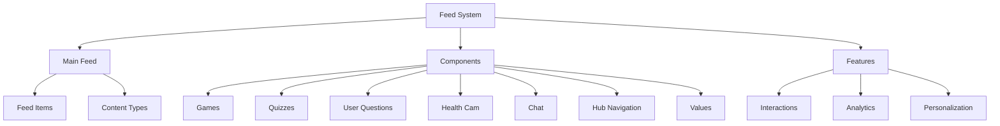

## 2. Feed Flow

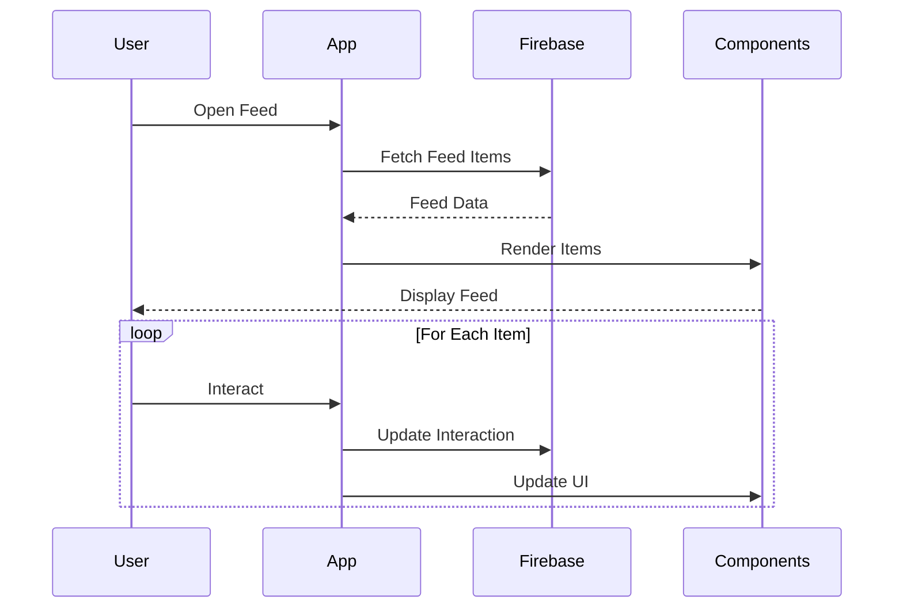

## 3. Component Structure

### 3.1 Feed Components
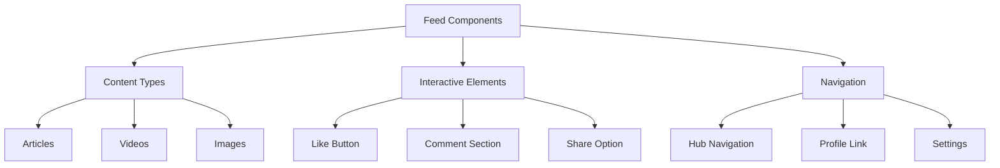

## 4. Firebase Schema

### 4.1 Feed Collections
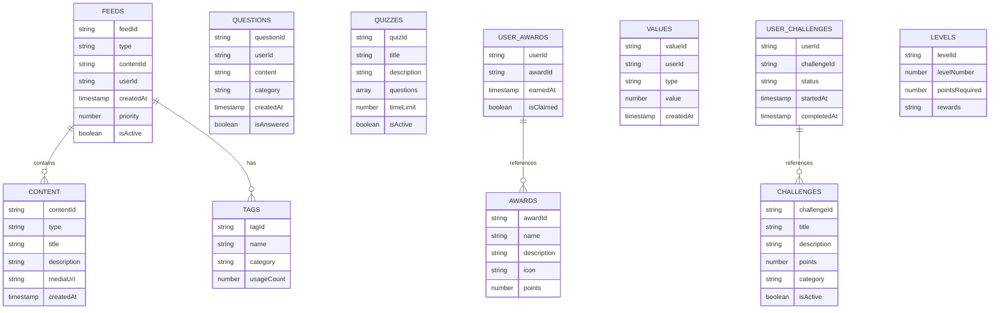

## 5. Navigation Flow

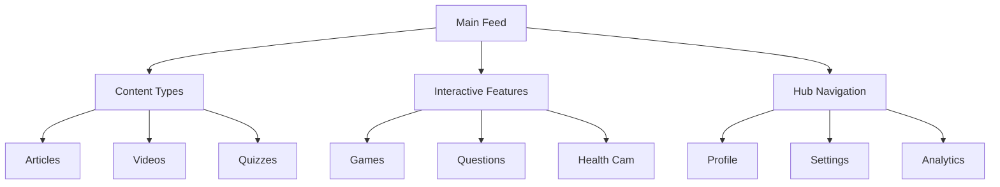

## 6. Feature Integration

### 6.1 Game System
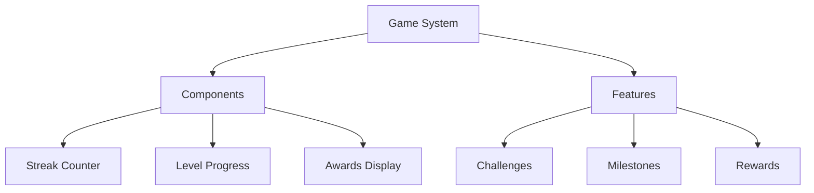

### 6.2 Quiz System
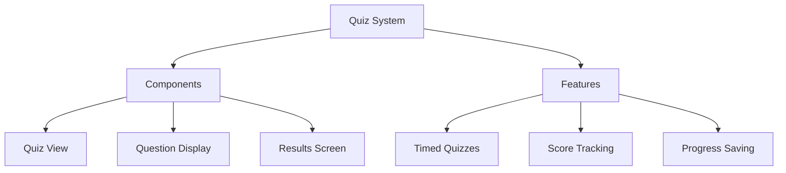

## 7. Dynamic Configurations

### 7.1 Feed Settings
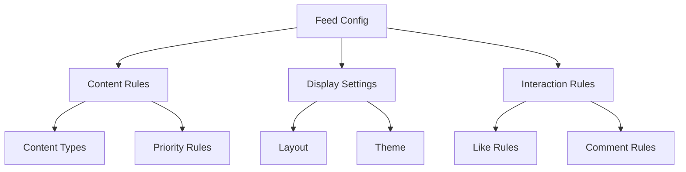

## 8. State Management

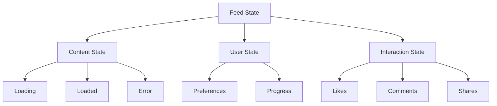

## 9. Feature Matrix

| Feature | Components | Firebase Collections | State Management |
|---------|------------|---------------------|------------------|
| Main Feed | FeedItem, ContentCard | feeds, content | FeedState |
| Games | StreakCounter, LevelProgress | user_challenges, challenges | GameState |
| Quizzes | QuizView, QuestionDisplay | quizzes, user_awards | QuizState |
| Questions | QuestionTile, AnswerForm | questions | QuestionState |
| Health Cam | ScanView, ResultsDisplay | values | HealthState |
| Chat | ChatButton, MessageList | messages | ChatState |
| Hub | NavigationMenu, UserCard | user_profiles | HubState |
| Values | ValueInput, HistoryView | values | ValueState |

## 10. Integration Points

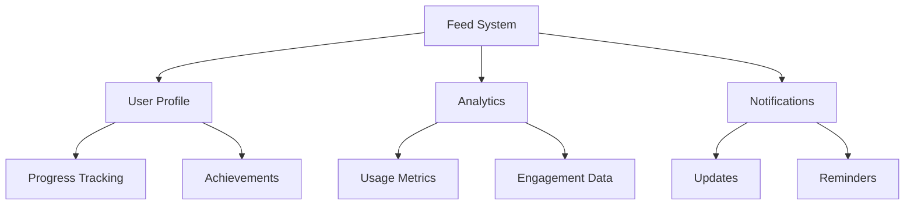

## 11. Error Handling

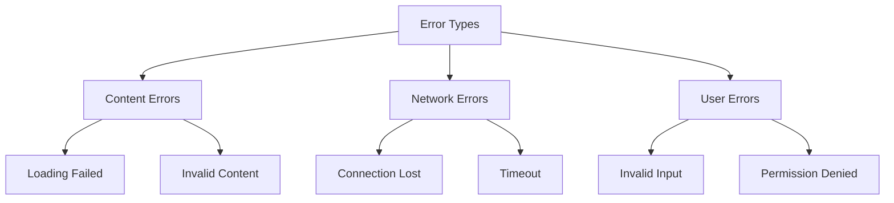

This architecture document provides a comprehensive overview of the Feed system and its components. Each section can be expanded with more detailed implementation specifics as needed.
