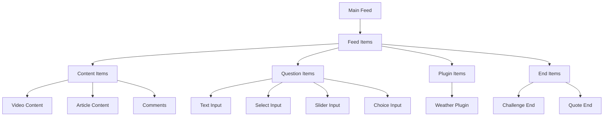
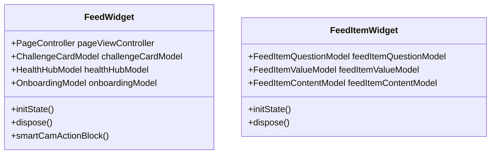
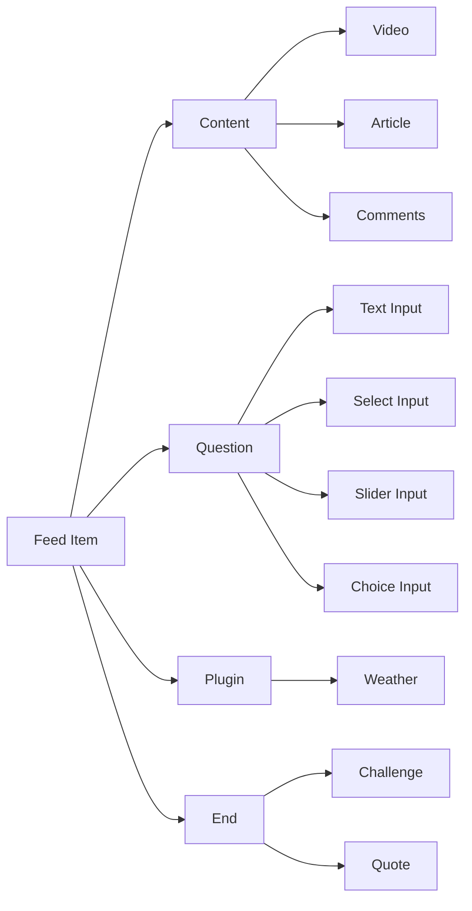
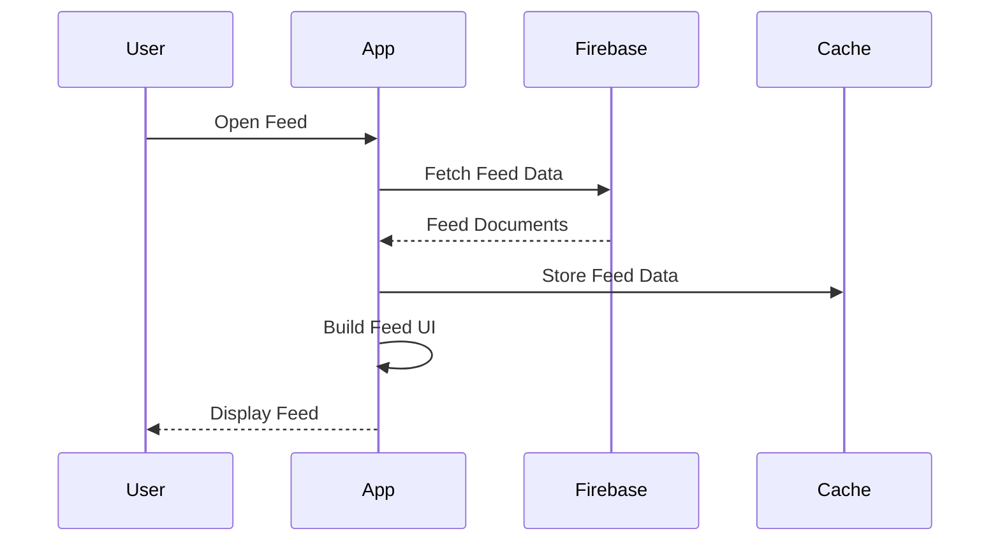
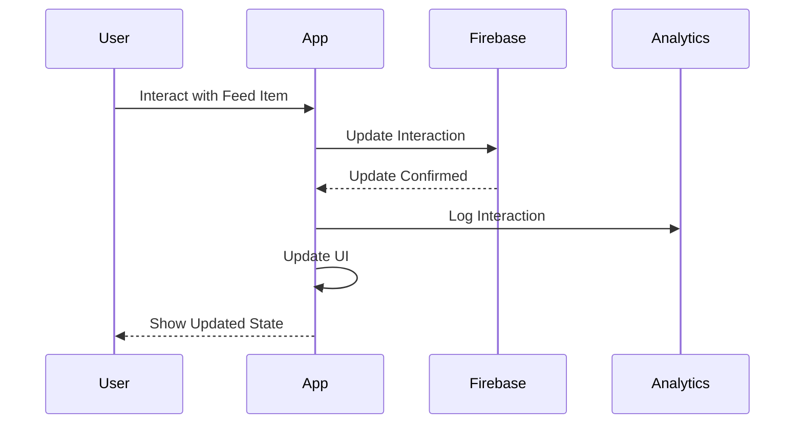

# Main Feed Architecture

## 1. Main Feed Structure

```
main_feed/
├── feed/                    # Main feed container
│   ├── feed_model.dart      # Feed state management
│   └── feed_widget.dart     # Feed UI components
├── feed_item/              # Individual feed items
│   ├── content/            # Content display components
│   │   ├── video/
│   │   ├── actions/
│   │   ├── comments/
│   │   └── article/
│   ├── question/           # Question components
│   │   ├── input_text/
│   │   ├── input_select/
│   │   ├── input_slider/
│   │   └── input_choice/
│   ├── plugins/            # Plugin components
│   │   └── weather/
│   └── ende/              # End components
│       ├── challenge/
│       └── quote/
└── feed_item_tile/        # Feed item display components
```

## 2. Feed Flow Diagram



## 3. Firebase Schema

### 3.1 Feed Collection
```json
{
  "feeds": {
    "feedId": {
      "type": "string",
      "title": "string",
      "description": "string",
      "createdAt": "timestamp",
      "updatedAt": "timestamp",
      "author": "userId",
      "content": {
        "type": "string",
        "data": "object"
      },
      "interactions": {
        "likes": ["userId"],
        "comments": [{
          "userId": "string",
          "text": "string",
          "timestamp": "timestamp"
        }]
      },
      "metadata": {
        "views": "number",
        "shares": "number"
      }
    }
  }
}
```

### 3.2 Feed Items Collection
```json
{
  "feed_items": {
    "itemId": {
      "feedId": "string",
      "type": "string",
      "order": "number",
      "content": {
        "type": "string",
        "data": "object"
      },
      "interactions": {
        "responses": [{
          "userId": "string",
          "response": "object",
          "timestamp": "timestamp"
        }]
      }
    }
  }
}
```

## 4. Component Architecture

### 4.1 Feed Container


### 4.2 Feed Item Types


## 5. State Management

### 5.1 Feed State
```dart
class FeedModel {
  int page;
  UsersRecord? userDoc;
  InstantTimer? UpdateUserSessionTimer;
  UserSessionsRecord? newUserSession;
  PageController? pageViewController;
  
  // Component Models
  ChallengeCardModel challengeCardModel;
  HealthHubModel healthHubModel;
  OnboardingModel onboardingModel;
}
```

### 5.2 Feed Item State
```dart
class FeedItemModel {
  ValuesRecord? newValue;
  QuestionAnswersRecord? newQuestionAnswer;
  
  // Component Models
  FeedItemQuestionModel feedItemQuestionModel;
  FeedItemValueModel feedItemValueModel;
  FeedItemContentModel feedItemContentModel;
  FeedItemProfileModel feedItemProfileModel;
  FeedItemWeatherModel feedItemWeatherModel;
}
```

## 6. Data Flow

### 6.1 Feed Loading Flow


### 6.2 Feed Item Interaction Flow


## 7. Dynamic Configurations

### 7.1 Feed Configuration
```json
{
  "feed_config": {
    "pagination": {
      "itemsPerPage": "number",
      "loadMoreThreshold": "number"
    },
    "contentTypes": {
      "enabled": ["string"],
      "order": ["string"]
    },
    "interactions": {
      "enabled": ["string"],
      "limits": {
        "likes": "number",
        "comments": "number"
      }
    }
  }
}
```

### 7.2 Feed Item Configuration
```json
{
  "feed_item_config": {
    "content": {
      "maxLength": "number",
      "allowedMedia": ["string"],
      "previewLength": "number"
    },
    "questions": {
      "maxOptions": "number",
      "required": "boolean",
      "validation": "object"
    },
    "plugins": {
      "enabled": ["string"],
      "config": "object"
    }
  }
}
```

## 8. Error Handling

### 8.1 Feed Error States
```dart
enum FeedError {
  loadFailed,
  networkError,
  invalidData,
  permissionDenied,
  rateLimited
}
```

### 8.2 Feed Item Error States
```dart
enum FeedItemError {
  loadFailed,
  interactionFailed,
  validationFailed,
  mediaError,
  pluginError
}
```

This architecture provides a robust and flexible system for managing and displaying feed content with various types of items and interactions. The modular design allows for easy extension and maintenance, while the state management ensures consistent behavior across the application.
