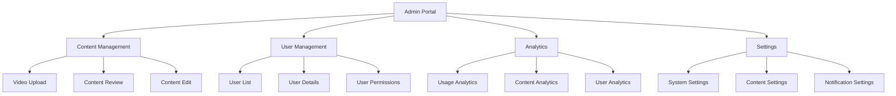
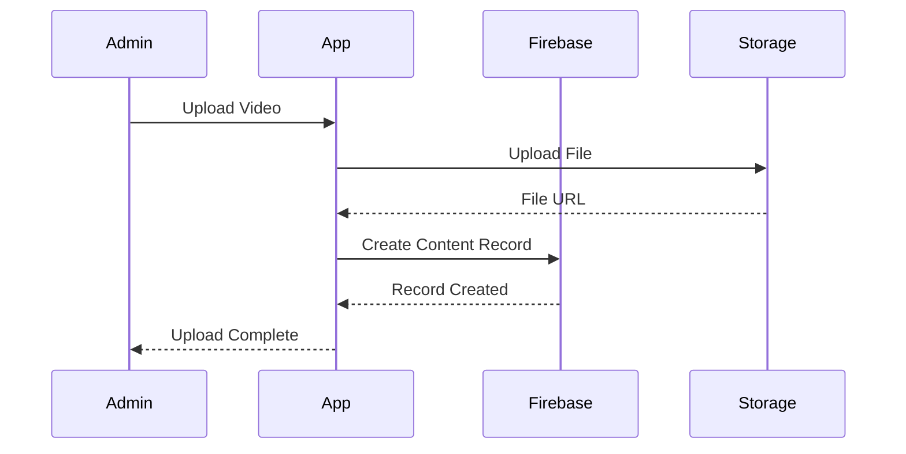
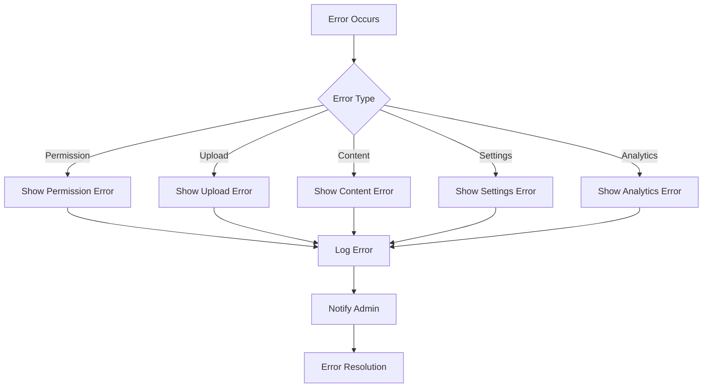

# Admin System Architecture

## 1. Admin System Structure

```
admin/
├── admin_portal/           # Main admin portal
│   ├── admin_portal_model.dart
│   └── admin_portal_widget.dart
└── video_upload/          # Video content management
    ├── video_upload_model.dart
    └── video_upload_widget.dart
```

## 2. Admin Portal Flow Diagram



## 3. Video Upload Flow



## 4. Firebase Schema

### 4.1 Content Collection
```json
{
  "content": {
    "contentId": {
      "type": "string",
      "contentTitle": "string",
      "contentText": "string",
      "video": "string",
      "createdBy": "userId",
      "creator": "userId",
      "transcript": "string",
      "createdOn": "timestamp",
      "tags": ["string"],
      "audience": ["string"],
      "status": "string",
      "metadata": {
        "views": "number",
        "duration": "number",
        "size": "number"
      }
    }
  }
}
```

### 4.2 Admin Settings Collection
```json
{
  "admin_settings": {
    "settingsId": {
      "content_approval": "boolean",
      "auto_publish": "boolean",
      "notification_settings": {
        "email_notifications": "boolean",
        "push_notifications": "boolean"
      },
      "content_restrictions": {
        "max_file_size": "number",
        "allowed_formats": ["string"],
        "max_duration": "number"
      }
    }
  }
}
```

## 5. Component Architecture

### 5.1 Admin Portal Model
```dart
class AdminPortalModel {
  HeaderPagesModel headerPagesModel;
  
  void initState(BuildContext context) {
    headerPagesModel = createModel(context, () => HeaderPagesModel());
  }
  
  void dispose() {
    headerPagesModel.dispose();
  }
}
```

### 5.2 Video Upload Model
```dart
class VideoUploadModel {
  // State fields
  String postType;
  List<String> audience;
  DocumentReference? creator;
  
  // Form controllers
  TextEditingController videotitelTextController;
  TextEditingController beschreibungstextTextController;
  TextEditingController transcriptTextController;
  TextEditingController textFieldTagsTextController;
  
  // File upload
  bool isDataUploading;
  FFUploadedFile uploadedLocalFile;
  String uploadedFileUrl;
  
  // Actions
  Future createContent(BuildContext context) async {
    // Content creation logic
  }
}
```

## 6. Admin Features

### 6.1 Content Management
- Video upload and processing
- Content metadata management
- Content approval workflow
- Content categorization and tagging
- Audience targeting

### 6.2 User Management
- User role management
- Permission settings
- User activity monitoring
- User content review

### 6.3 Analytics
- Content performance metrics
- User engagement analytics
- System usage statistics
- Error tracking and reporting

## 7. Dynamic Configurations

### 7.1 Content Configuration
```json
{
  "content_config": {
    "upload": {
      "max_file_size": "number",
      "allowed_formats": ["string"],
      "max_duration": "number"
    },
    "metadata": {
      "required_fields": ["string"],
      "optional_fields": ["string"]
    },
    "processing": {
      "auto_transcribe": "boolean",
      "auto_thumbnail": "boolean",
      "quality_presets": ["string"]
    }
  }
}
```

### 7.2 Admin Configuration
```json
{
  "admin_config": {
    "permissions": {
      "roles": ["string"],
      "capabilities": ["string"]
    },
    "workflow": {
      "approval_required": "boolean",
      "auto_publish": "boolean",
      "notification_settings": "object"
    },
    "analytics": {
      "tracking_enabled": "boolean",
      "metrics": ["string"]
    }
  }
}
```

## 8. Security Implementation

### 8.1 Firebase Security Rules
```javascript
rules_version = '2';
service cloud.firestore {
  match /databases/{database}/documents {
    match /content/{contentId} {
      allow read: if request.auth != null;
      allow write: if request.auth.token.admin == true;
      
      match /metadata/{document=**} {
        allow read: if request.auth != null;
        allow write: if request.auth.token.admin == true;
      }
    }
    
    match /admin_settings/{settingsId} {
      allow read: if request.auth.token.admin == true;
      allow write: if request.auth.token.admin == true;
    }
  }
}
```

### 8.2 Role-Based Access Control
```dart
enum AdminRole {
  superAdmin,
  contentManager,
  userManager,
  analyst
}

class AdminPermissions {
  static bool canManageContent(AdminRole role) {
    return role == AdminRole.superAdmin || role == AdminRole.contentManager;
  }
  
  static bool canManageUsers(AdminRole role) {
    return role == AdminRole.superAdmin || role == AdminRole.userManager;
  }
  
  static bool canViewAnalytics(AdminRole role) {
    return role == AdminRole.superAdmin || role == AdminRole.analyst;
  }
}
```

## 9. Error Handling

### 9.1 Admin Error States
```dart
enum AdminError {
  permissionDenied,
  uploadFailed,
  contentCreationFailed,
  settingsUpdateFailed,
  analyticsError
}
```

### 9.2 Error Handling Flow


This architecture provides a comprehensive admin system with robust content management, user management, and analytics capabilities. The modular design allows for easy extension and maintenance, while the security implementation ensures proper access control and data protection.
