# Values System Architecture

## 1. Values System Structure

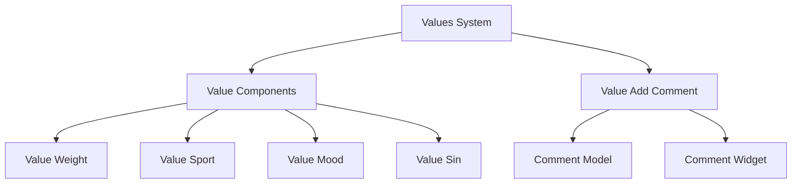

## 2. Value Types and Their Usage

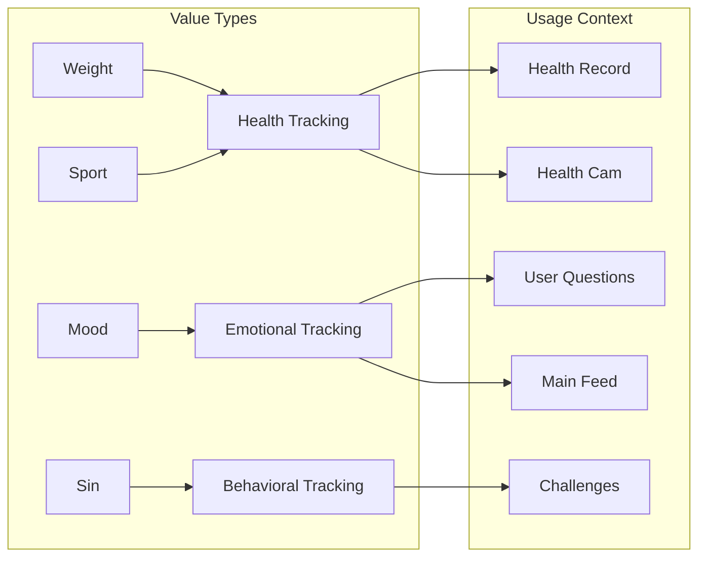

## 3. Value Component Integration

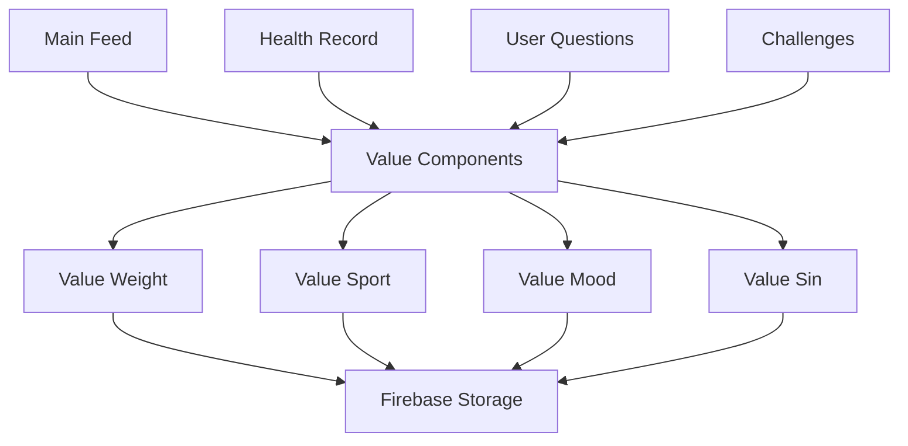

## 4. Value Data Flow

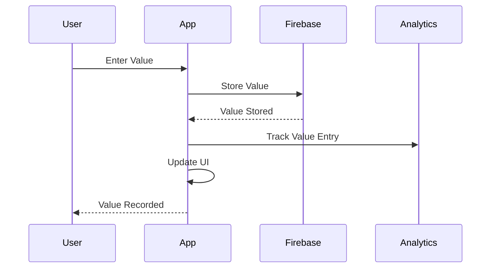

## 5. Firebase Schema

### 5.1 Values Collection
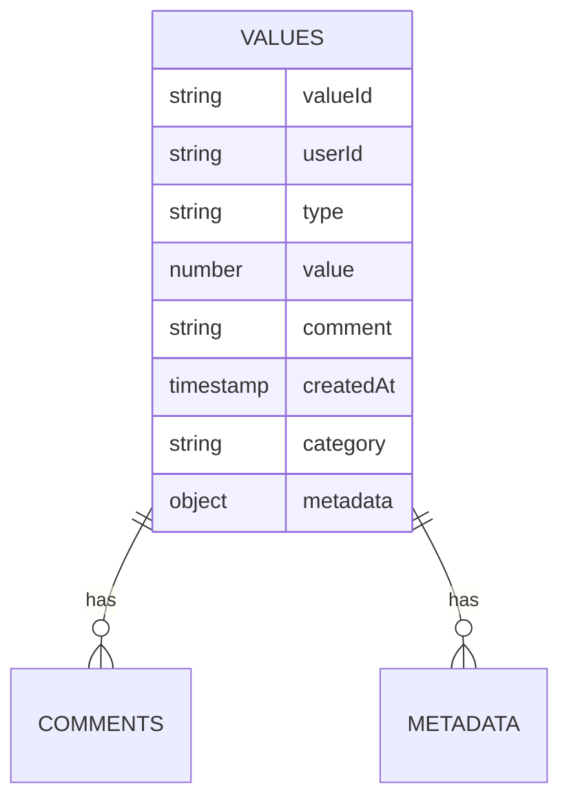

### 5.2 Value Types Schema
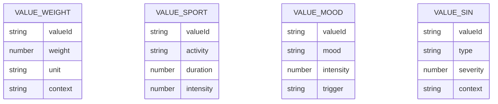

## 6. Component Integration Matrix

| Component | Used In | Purpose | Data Flow |
|-----------|---------|---------|-----------|
| Value Weight | Health Record, Health Cam | Track physical health metrics | User → App → Firebase → Analytics |
| Value Sport | Health Record, Challenges | Track physical activity | User → App → Firebase → Feed |
| Value Mood | User Questions, Main Feed | Track emotional state | User → App → Firebase → Analytics |
| Value Sin | Challenges, User Questions | Track behavioral patterns | User → App → Firebase → Analytics |

## 7. Value Processing Flow

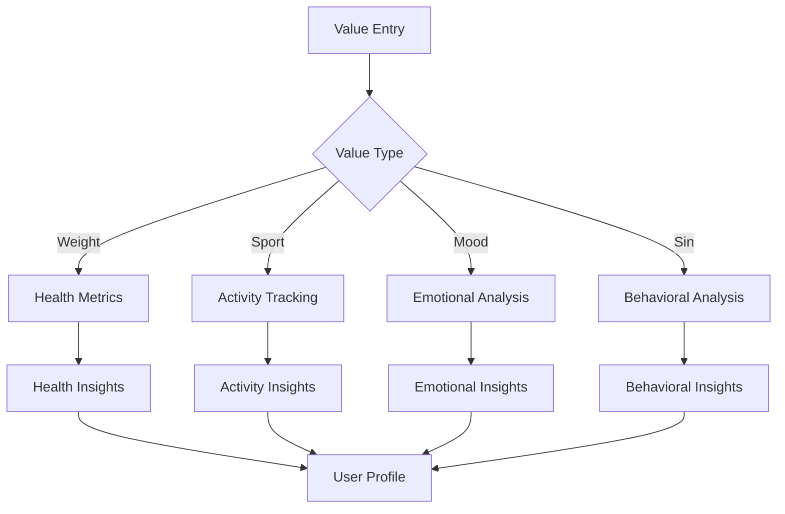

## 8. Value Configuration

### 8.1 Value Type Configuration
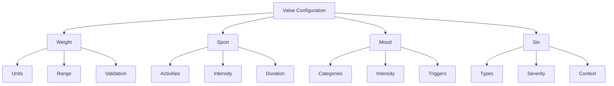

### 8.2 Value Processing Rules
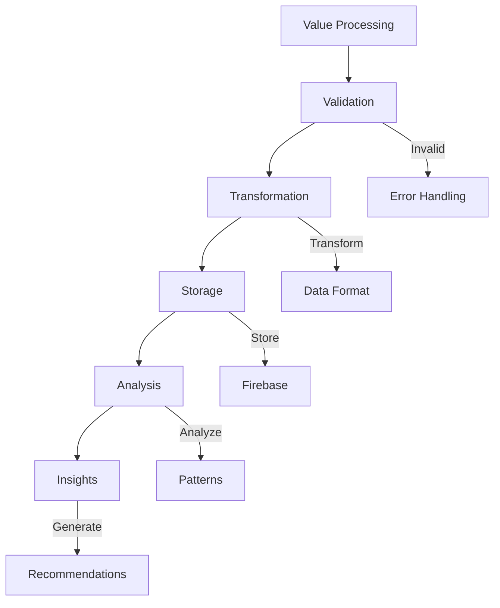

## 9. Value Component States

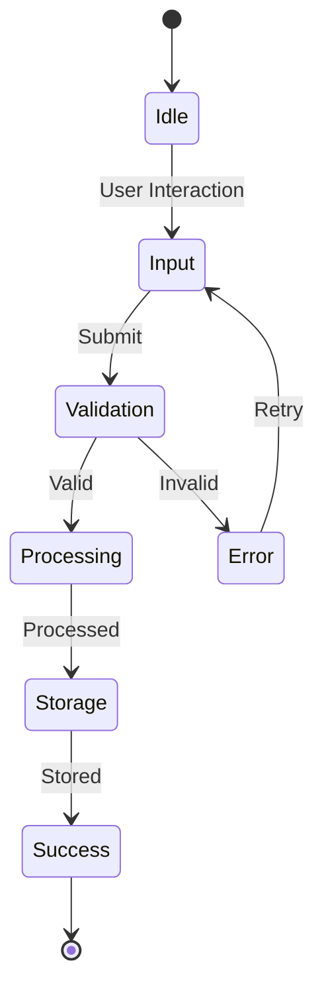

## 10. Value Analytics Integration

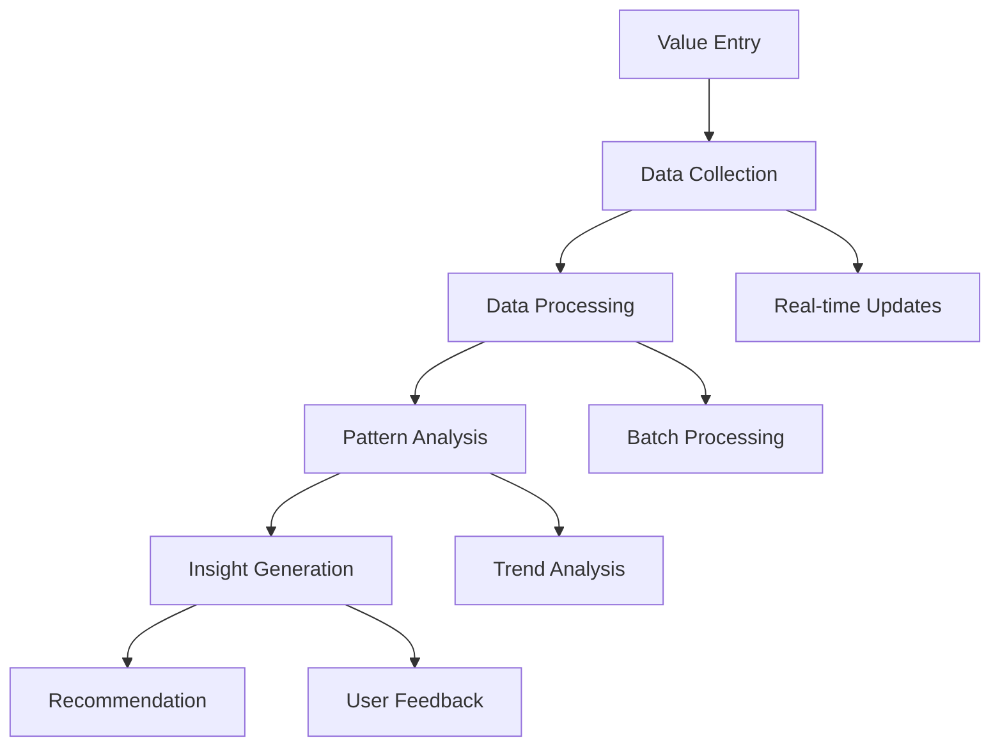

This architecture provides a comprehensive system for managing different types of values (weight, sport, mood, sin) with their respective components and integrations. The system is designed to be modular, allowing for easy extension and maintenance, while providing robust data processing and analytics capabilities.
