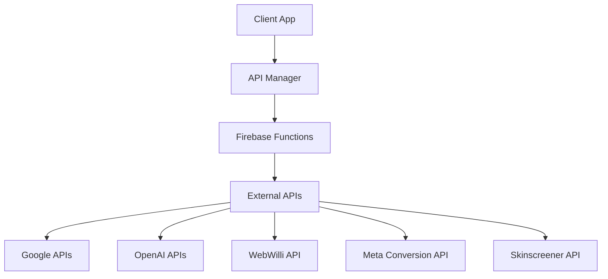
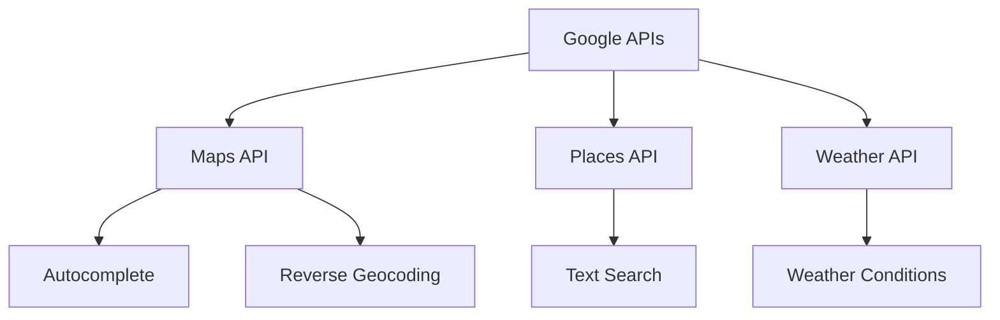
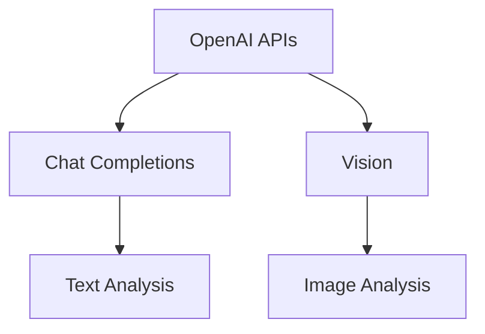
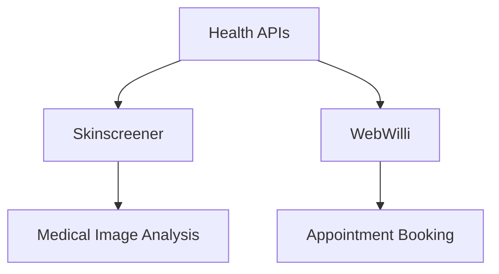
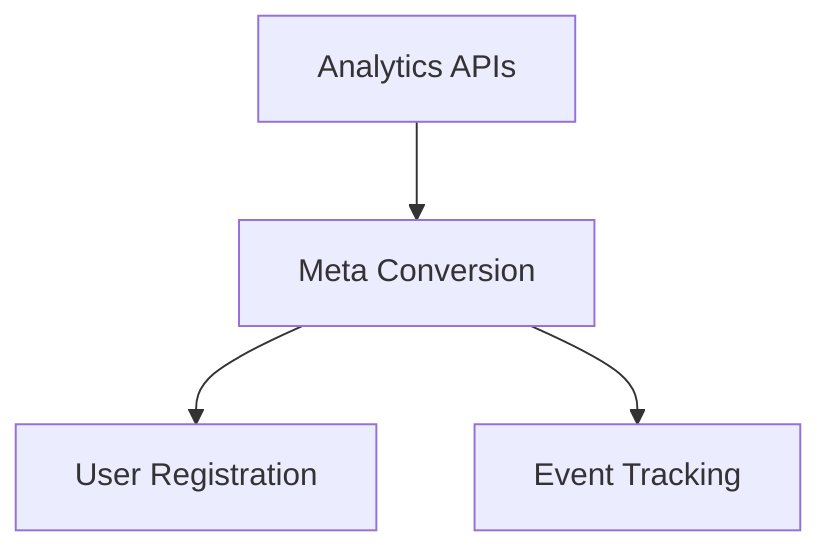
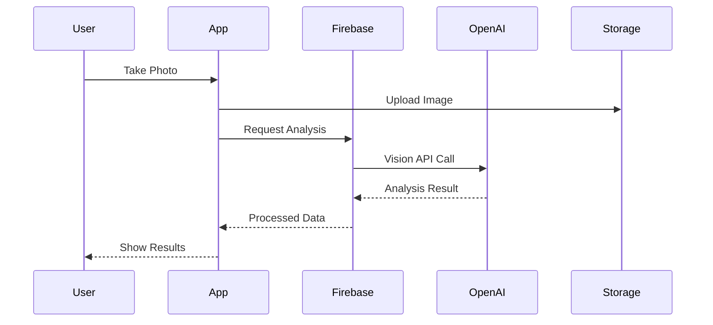
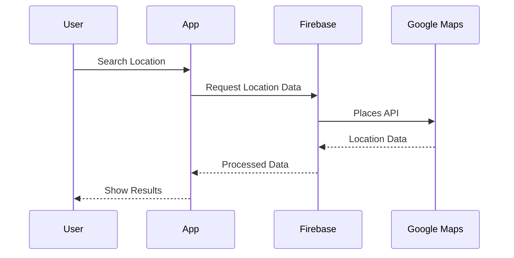
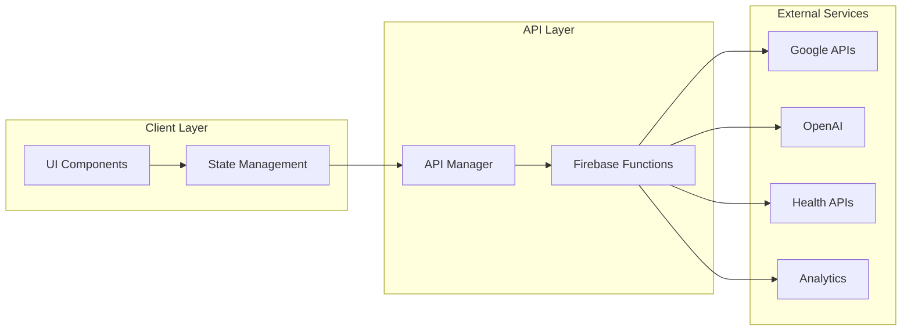
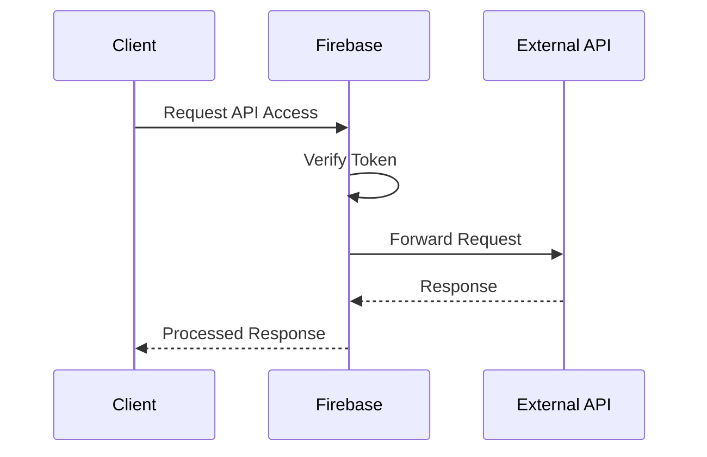
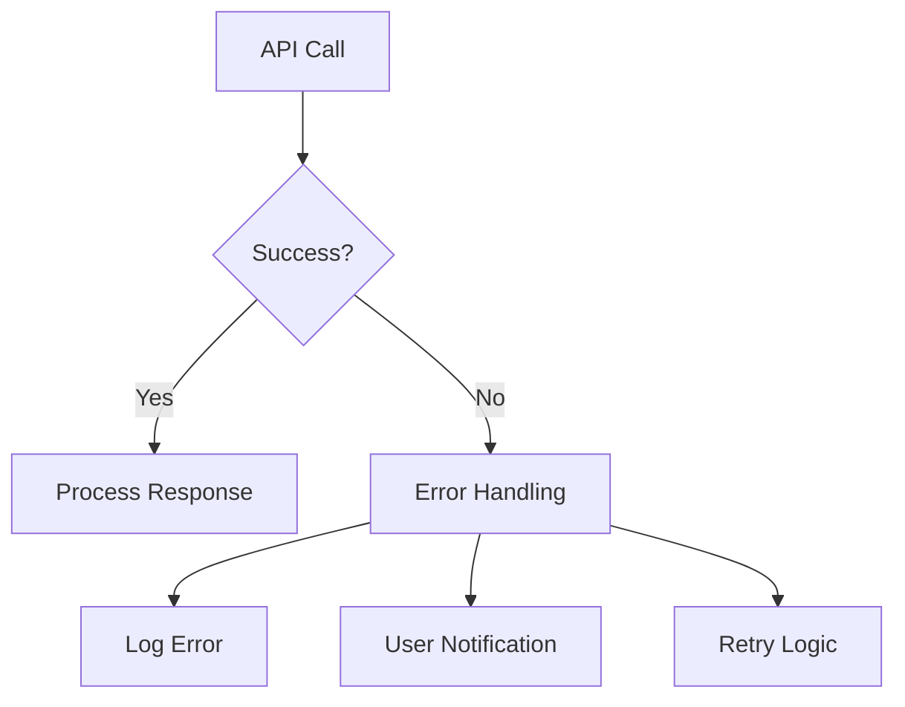

# API Documentation

This document provides a comprehensive overview of all APIs used in the MyBestes application, their purposes, and their integration points.

## Table of Contents
1. [API Architecture Overview](#api-architecture-overview)
2. [API Groups](#api-groups)
3. [API Flow Diagrams](#api-flow-diagrams)
4. [API Usage Map](#api-usage-map)
5. [API Security](#api-security)
6. [API Error Handling](#api-error-handling)

## API Architecture Overview

## API Groups

### 1. Google APIs Group

| API | Endpoint | Purpose | Authentication |
|-----|----------|---------|----------------|
| Google Maps | /place/autocomplete/json | Location search autocomplete | API Key |
| Google Maps | /geocode/json | Reverse geocoding | API Key |
| Google Places | /places:searchText | Place search | API Key |
| Google Weather | /currentConditions:lookup | Weather data | API Key |

### 2. OpenAI APIs Group

| API | Endpoint | Purpose | Authentication |
|-----|----------|---------|----------------|
| Chat Completions | /chat/completions | Text analysis | Bearer Token |
| Vision | /chat/completions | Image analysis | Bearer Token |

### 3. Health APIs Group

| API | Endpoint | Purpose | Authentication |
|-----|----------|---------|----------------|
| Skinscreener | /v1-med/images | Medical image analysis | API Key |
| WebWilli | /browse | Appointment booking | Bearer Token |

### 4. Analytics APIs Group

| API | Endpoint | Purpose | Authentication |
|-----|----------|---------|----------------|
| Meta Conversion | /events | User registration tracking | Access Token |

## API Flow Diagrams

### 1. Health Cam Processing Flow

### 2. Location Services Flow

## API Usage Map

## API Security

### Authentication Flow

### Security Measures
1. **Token-based Authentication**
   - Firebase Authentication for user verification
   - API keys for external services
   - Bearer tokens for sensitive operations

2. **Data Protection**
   - HTTPS for all API calls
   - Encrypted payloads
   - Secure token storage

## API Error Handling

### Error Flow

### Error Categories
| Error Type | Handling Strategy | User Feedback |
|------------|-------------------|---------------|
| Authentication | Token refresh | Login prompt |
| Network | Retry mechanism | Connection error |
| API Limit | Rate limiting | Service unavailable |
| Validation | Input correction | Invalid input |
| Server | Fallback data | Service error |

## Best Practices

1. **API Call Management**
   - Implement caching where appropriate
   - Use retry mechanisms for failed calls
   - Monitor API usage and limits

2. **Performance Optimization**
   - Batch requests when possible
   - Implement request queuing
   - Use streaming for large data

3. **Error Handling**
   - Implement comprehensive error logging
   - Provide meaningful error messages
   - Handle edge cases gracefully

4. **Security**
   - Regular token rotation
   - Secure API key storage
   - Input validation
