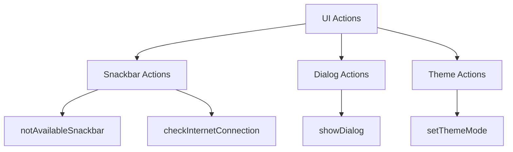
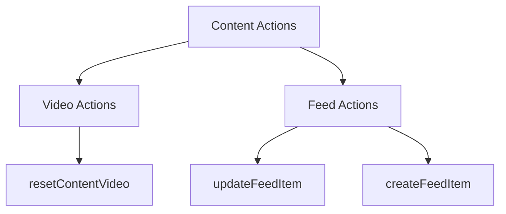
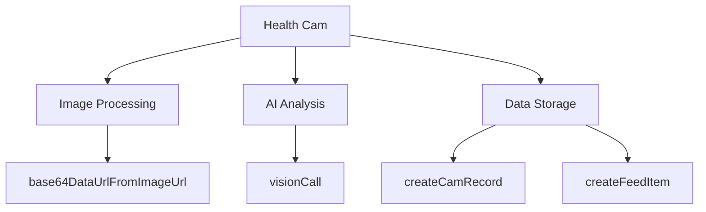
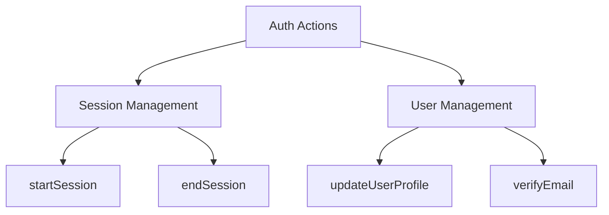
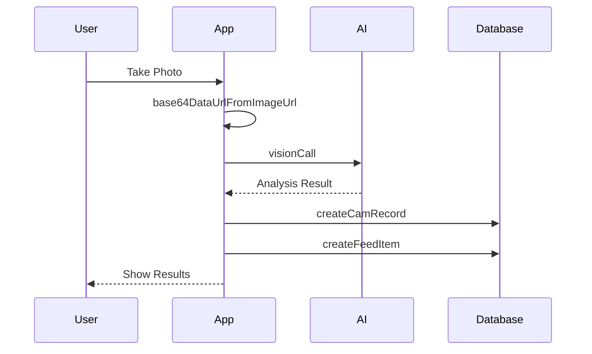
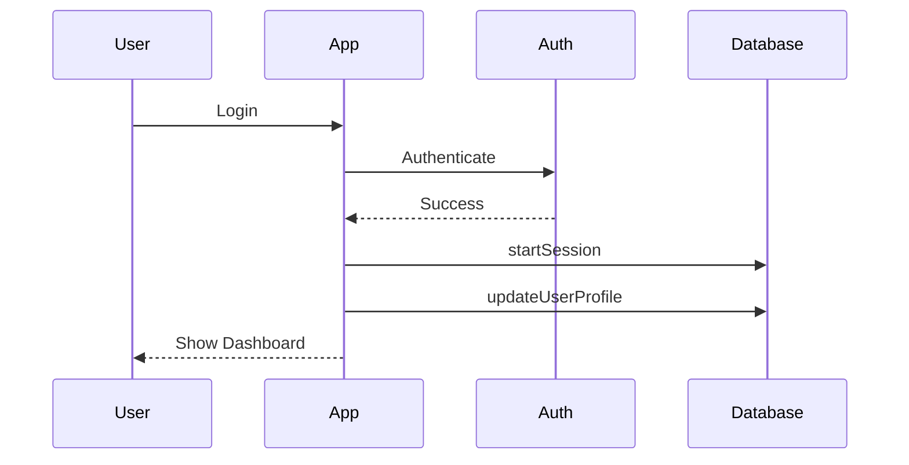
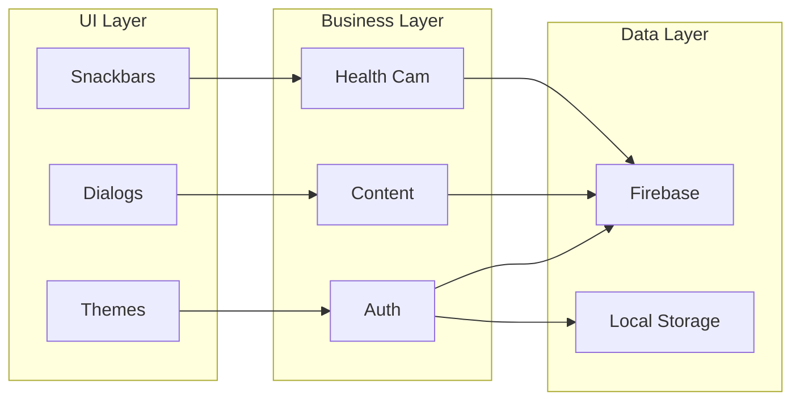
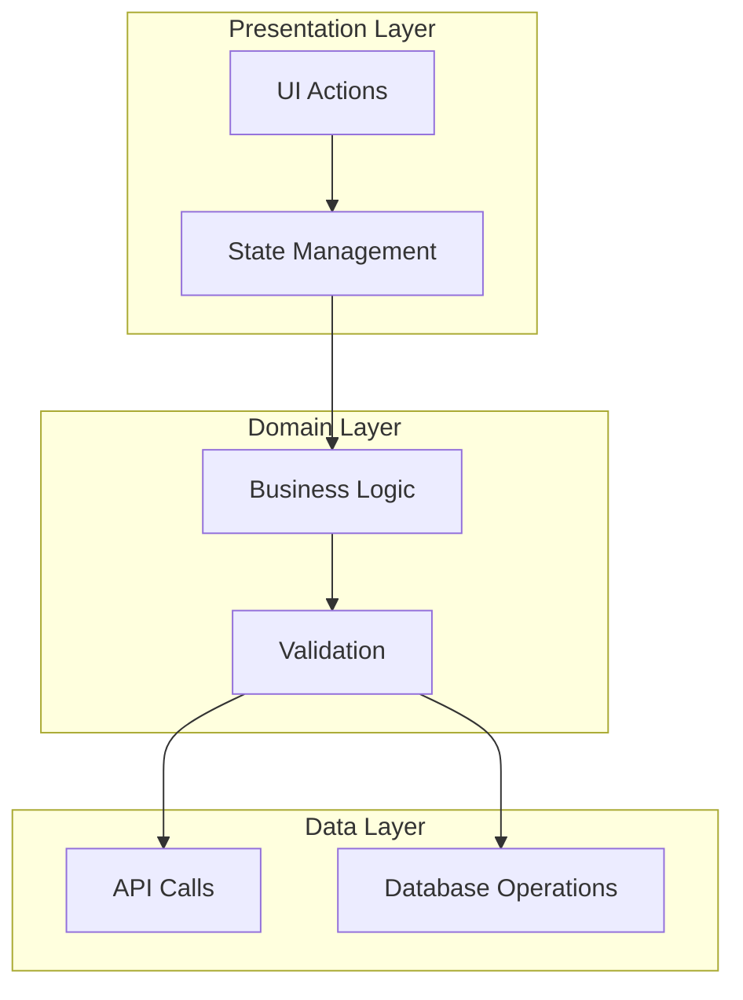
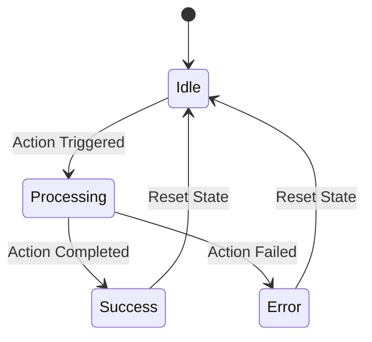

# Actions Documentation

This document provides a detailed overview of all actions used in the MyBestes application, their purposes, and their relationships within the application architecture.

## Table of Contents
1. [Action Categories](#action-categories)
2. [Action Flow Diagrams](#action-flow-diagrams)
3. [Action Dependencies](#action-dependencies)
4. [Action Usage Map](#action-usage-map)
5. [Action Architecture](#action-architecture)

## Action Categories

### 1. User Interface Actions

### 2. Content Management Actions

### 3. Health Cam Actions

### 4. Authentication Actions

## Action Flow Diagrams

### 1. Health Cam Processing Flow

### 2. User Session Flow

## Action Dependencies

| Action | Dependencies | Used By |
|--------|-------------|---------|
| notAvailableSnackbar | FlutterFlowTheme, BuildContext | UI Components |
| resetContentVideo | FFAppState | Video Player |
| checkInternetConnection | Internet Connection Service | Network Operations |
| runHealthCam | OpenAI API, Firebase | Health Cam Feature |
| startSession | Firebase Auth | Authentication System |

## Action Usage Map

## Action Architecture

### 1. Layer Architecture

### 2. Action Categories and Their Responsibilities

| Category | Responsibilities | Example Actions |
|----------|-----------------|----------------|
| UI Actions | Handle user interface interactions | notAvailableSnackbar, showDialog |
| Content Actions | Manage content display and updates | resetContentVideo, updateFeedItem |
| Health Actions | Process health-related data | runHealthCam, processHealthData |
| Auth Actions | Handle authentication and sessions | startSession, verifyEmail |

### 3. Action State Management

## Best Practices

1. **Action Naming Conventions**
   - Use clear, descriptive names
   - Follow camelCase convention
   - Include action category in name (e.g., `showSnackbar`, `updateUserProfile`)

2. **Error Handling**
   - Always implement error handling
   - Provide user feedback
   - Log errors appropriately

3. **State Management**
   - Use FFAppState for global state
   - Implement proper state cleanup
   - Handle state persistence

4. **Performance Considerations**
   - Minimize API calls
   - Implement caching where appropriate
   - Use background processing for heavy operations

## Security Considerations

1. **Authentication**
   - Always verify user authentication
   - Implement proper session management
   - Use secure storage for sensitive data

2. **Data Protection**
   - Encrypt sensitive data
   - Implement proper access control
   - Follow data protection regulations

## Future Improvements

1. **Action Optimization**
   - Implement action caching
   - Add retry mechanisms
   - Improve error recovery

2. **New Features**
   - Add offline support
   - Implement action queuing
   - Add action analytics

3. **Documentation**
   - Add more detailed flow diagrams
   - Include performance metrics
   - Document edge cases
