# Admin System Architecture

## 1. System Overview

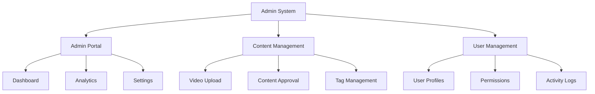

## 2. Admin Flow

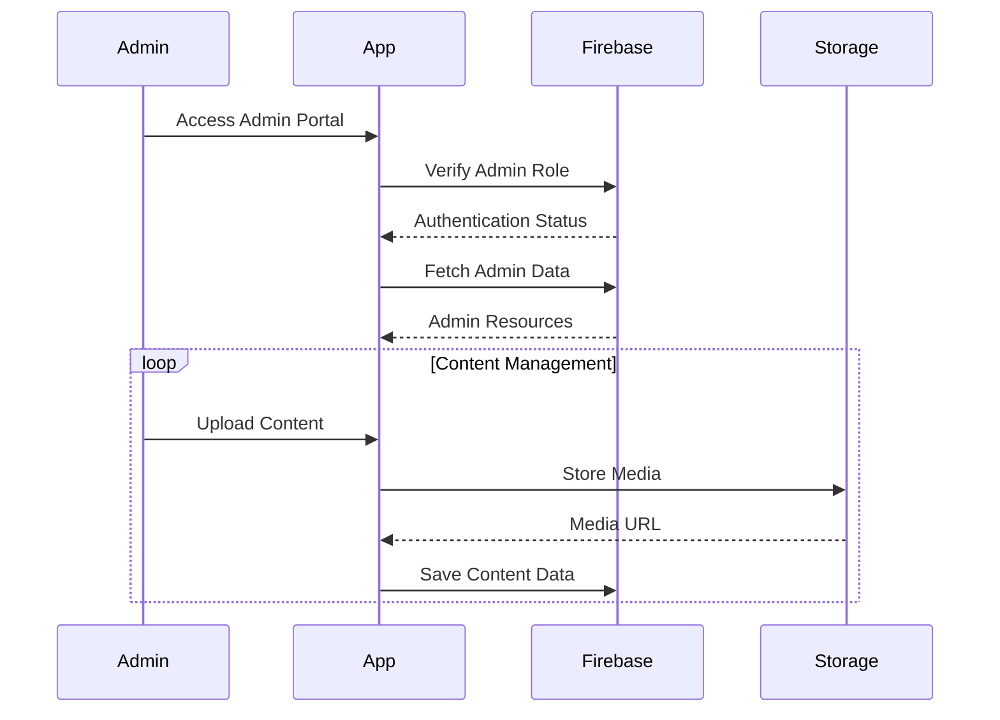

## 3. Component Structure

### 3.1 Admin Components
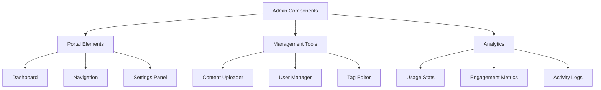

## 4. Firebase Schema

### 4.1 Admin Collections
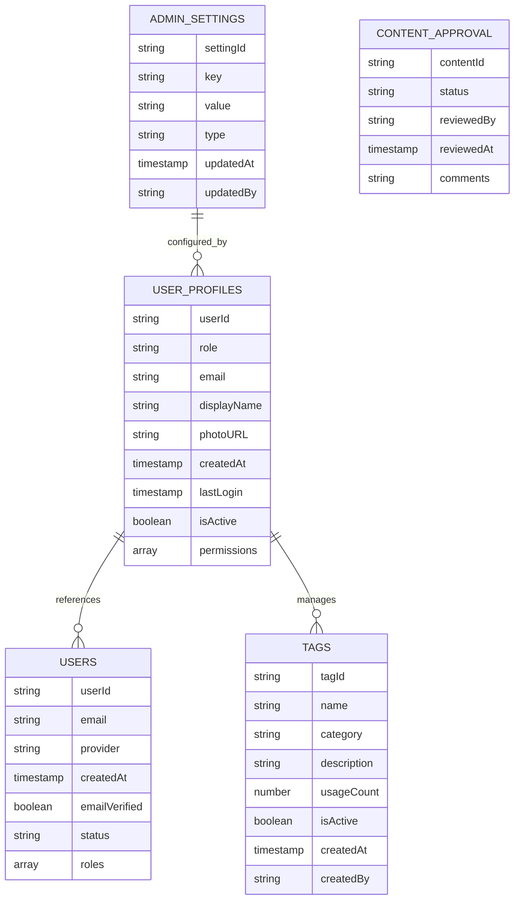

## 5. Navigation Flow

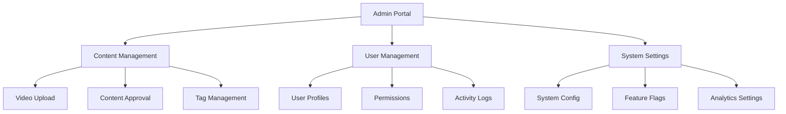

## 6. Feature Integration

### 6.1 Video Upload System
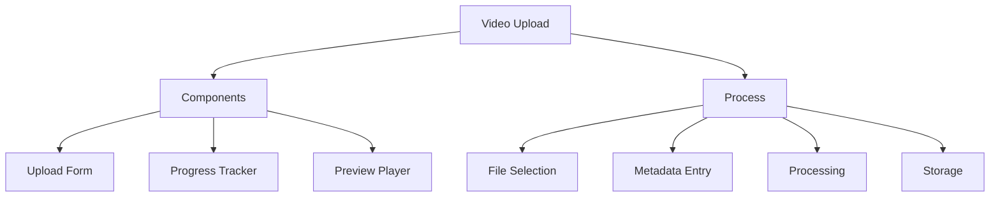

### 6.2 User Management
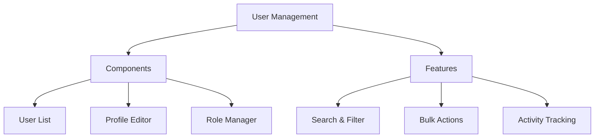

## 7. Dynamic Configurations

### 7.1 Admin Settings
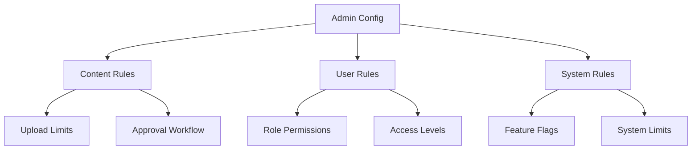

## 8. State Management

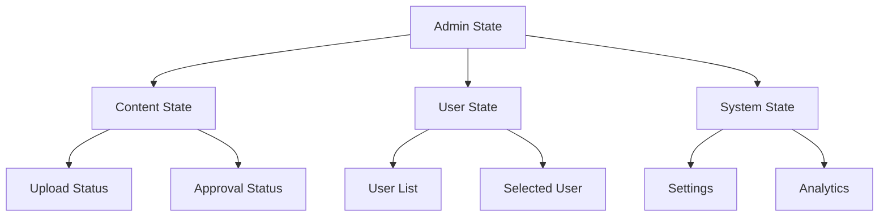

## 9. Feature Matrix

| Feature | Components | Firebase Collections | State Management |
|---------|------------|---------------------|------------------|
| Admin Portal | Dashboard, Navigation | admin_settings | AdminState |
| Video Upload | UploadForm, ProgressTracker | content_approval | ContentState |
| User Management | UserList, ProfileEditor | user_profiles, users | UserState |
| Tag Management | TagEditor, TagList | tags | TagState |
| Analytics | UsageStats, ActivityLogs | admin_analytics | AnalyticsState |

## 10. Integration Points

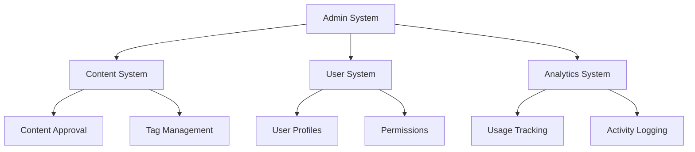

## 11. Error Handling

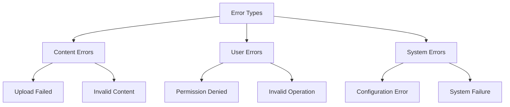

## 12. Security Implementation

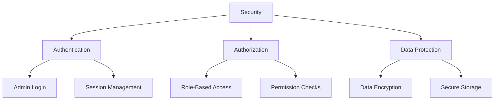

This architecture document provides a comprehensive overview of the Admin system and its components. Each section can be expanded with more detailed implementation specifics as needed. 
