# Authentication & Onboarding System Architecture

## 1. System Overview

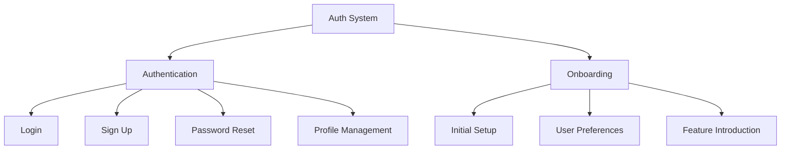

## 2. Authentication Flow

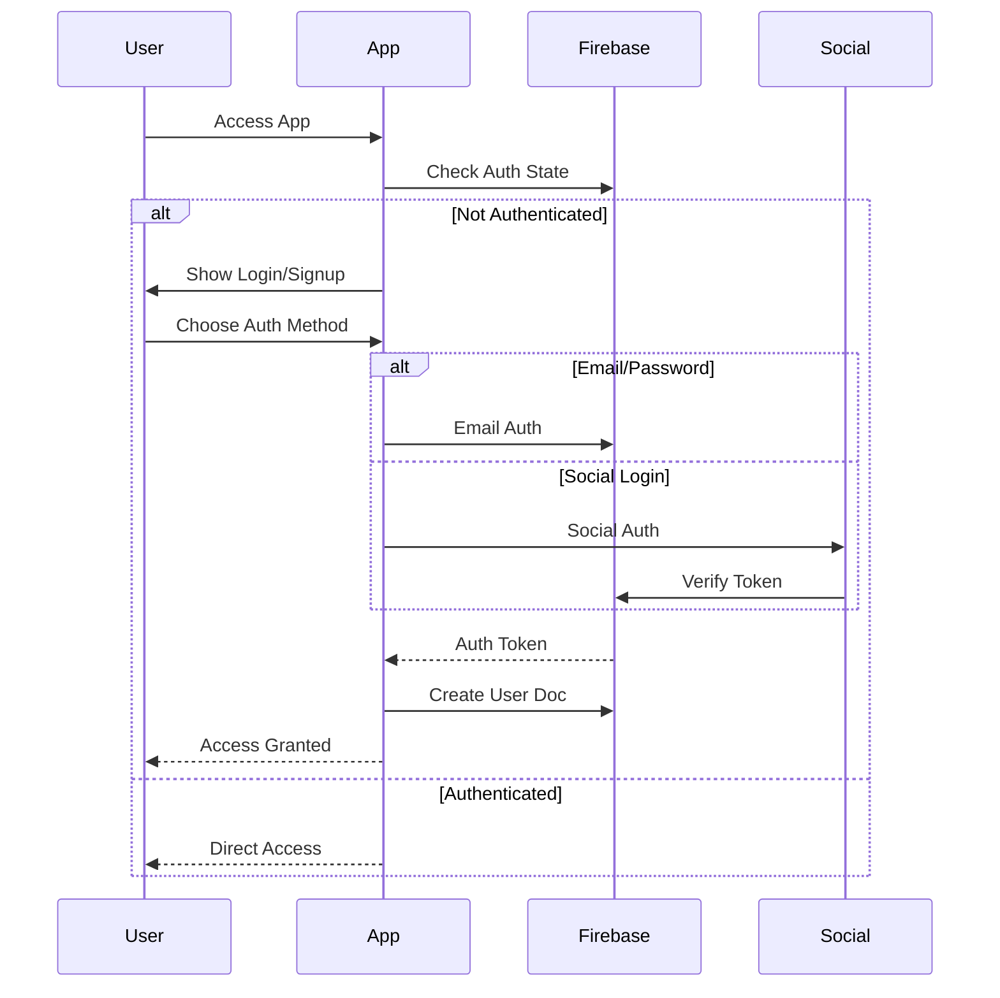

## 3. Component Structure

### 3.1 Authentication Components
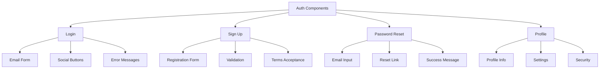

### 3.2 Onboarding Components
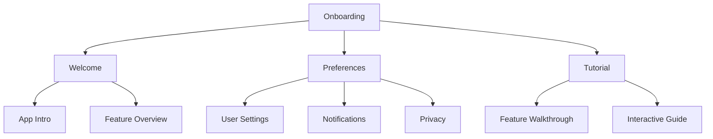

## 4. Firebase Schema

### 4.1 Authentication Collections
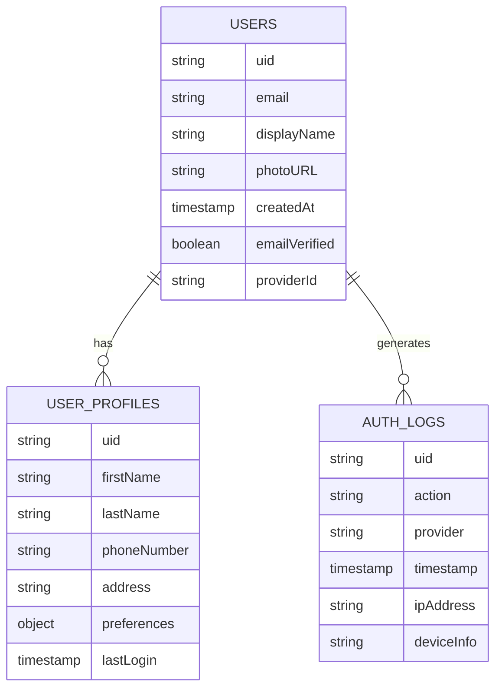

## 5. Navigation Flow

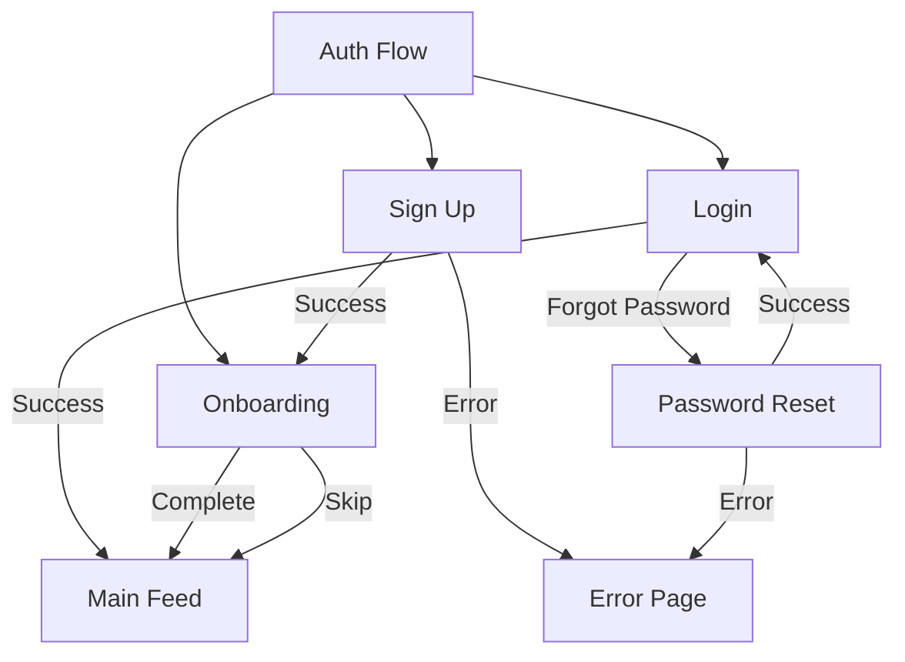

## 6. Security Implementation

### 6.1 Authentication Rules
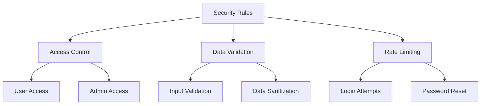

## 7. Dynamic Configurations

### 7.1 Auth Settings
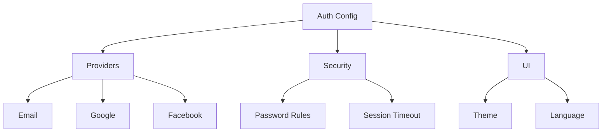

## 8. Error Handling

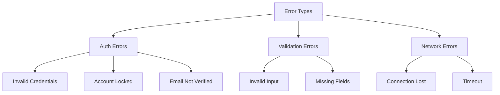

## 9. Feature Matrix

| Feature | Components | Firebase Collections | Security Rules |
|---------|------------|---------------------|----------------|
| Email Login | LoginForm, ErrorHandler | users, auth_logs | emailVerified, rateLimit |
| Social Login | SocialButtons, TokenHandler | users, auth_logs | providerValidation |
| Password Reset | ResetForm, EmailService | users, auth_logs | rateLimit, tokenExpiry |
| Profile Management | ProfileForm, SettingsPanel | user_profiles | userOwnership |
| Onboarding | WelcomeScreen, Tutorial | user_profiles | firstLoginCheck |

## 10. State Management

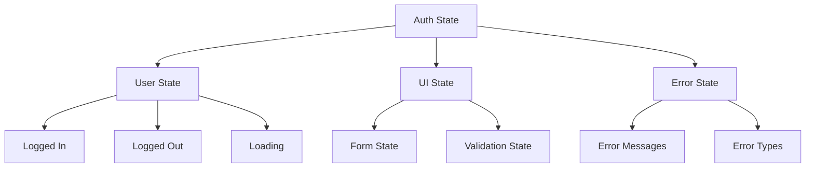

## 11. Integration Points

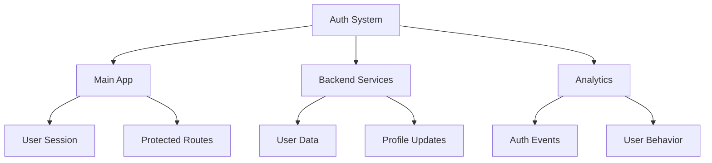

This architecture document provides a comprehensive overview of the Authentication and Onboarding systems. Each section can be expanded with more detailed implementation specifics as needed. 
