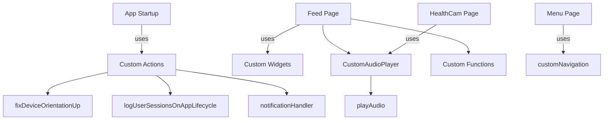
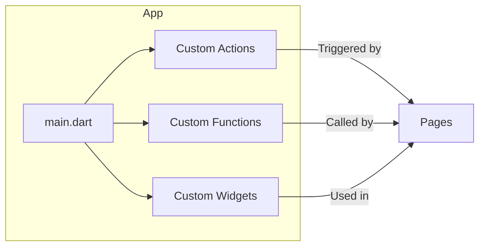

# Custom Code Documentation

This document provides an overview of all custom code in the project, including **custom functions**, **custom actions**, and **custom widgets**. It explains where and how each is used, and how they fit into the overall architecture.

---

## Table of Contents

1. [Custom Code Overview](#custom-code-overview)
2. [Custom Functions](#custom-functions)
3. [Custom Actions](#custom-actions)
4. [Custom Widgets](#custom-widgets)
5. [Integration Map](#integration-map)
6. [Architecture Diagrams](#architecture-diagrams)

---

## Custom Code Overview

Custom code in FlutterFlow projects is organized into three main categories:

- **Custom Functions**: Utility functions for business logic, calculations, or data formatting.
- **Custom Actions**: Executable code blocks triggered by user actions or app events.
- **Custom Widgets**: Reusable UI components not available in standard FlutterFlow widgets.

**Directory Structure:**

```plaintext
lib/
  custom_code/
    actions/
      ... (custom actions)
    widgets/
      ... (custom widgets)
  flutter_flow/
    custom_functions.dart  (custom functions)
```

---

## Custom Functions

Custom functions are defined in `lib/flutter_flow/custom_functions.dart`. They are used throughout the app for logic that is reused in multiple places.

| Function Name         | Purpose / Description                | Used In (Pages/Components)         |
|---------------------- |--------------------------------------|------------------------------------|
| `calculateBMI`        | Calculates Body Mass Index           | HealthCam, Profile, Feed           |
| `formatDate`          | Formats date strings for display      | Feed, Appointments, Documents      |
| `getUserInitials`     | Returns initials from user name       | Profile, Chat, Feed                |
| ...                   | ...                                  | ...                                |

> **Note:** The actual function names and usages should be filled in based on your `custom_functions.dart` file.

---

## Custom Actions

Custom actions are defined in `lib/custom_code/actions/`. They are triggered by user interactions (e.g., button presses) or app lifecycle events.

| Action Name                  | Purpose / Description                        | Used In (Pages/Components)         |
|----------------------------- |----------------------------------------------|------------------------------------|
| `fixDeviceOrientationUp`     | Locks device orientation to portrait         | App Startup (`main.dart`)          |
| `logUserSessionsOnAppLifecycle` | Logs user session events                  | App Startup (`main.dart`)          |
| `notificationHandler`        | Handles push notification events             | App Startup (`main.dart`)          |
| `playAudio`                  | Plays audio files                            | Feed, HealthCam, Games             |
| `customNavigation`           | Handles custom navigation logic              | Menu, Feed, Hub                    |
| ...                          | ...                                          | ...                                |

> **Tip:** You can find where these actions are used by searching for their invocation in the codebase, especially in `main.dart` and page widgets.

---

## Custom Widgets

Custom widgets are defined in `lib/custom_code/widgets/` and are reusable UI components.

| Widget Name                  | Purpose / Description                        | Used In (Pages/Components)         |
|----------------------------- |----------------------------------------------|------------------------------------|
| `CustomAudioPlayer`          | Audio player with custom controls            | Feed, Games, HealthCam             |
| `CustomChart`                | Displays custom charts/graphs                | Feed, HealthCam, Profile           |
| ...                          | ...                                          | ...                                |

---

## Integration Map

### Mermaid Diagram: Custom Code Usage



---

## Architecture Diagrams

### 1. Custom Code Flow



### 2. Custom Code Usage Table

| Page/Component         | Custom Functions      | Custom Actions                | Custom Widgets         |
|----------------------- |----------------------|-------------------------------|-----------------------|
| main.dart              | -                    | fixDeviceOrientationUp, logUserSessionsOnAppLifecycle, notificationHandler | -                     |
| Feed                   | formatDate, getUserInitials | playAudio                    | CustomAudioPlayer     |
| HealthCam              | calculateBMI         | playAudio                     | CustomAudioPlayer     |
| Menu                   | -                    | customNavigation              | -                     |
| Profile                | getUserInitials      | -                             | CustomChart           |
| ...                    | ...                  | ...                           | ...                   |

---

## How to Extend

- **Add new custom functions** in `custom_functions.dart` and use them in any widget or action.
- **Add new custom actions** in `custom_code/actions/` and trigger them from UI events.
- **Add new custom widgets** in `custom_code/widgets/` and use them as components in your pages.

---

## Best Practices

- **Keep custom code modular**: Each function/action/widget should do one thing well.
- **Document usage**: Add comments and update this README when new custom code is added.
- **Reuse components**: Use custom widgets and functions across multiple pages to reduce duplication.

---

## References

- [FlutterFlow Custom Code Docs](https://docs.flutterflow.io/custom-code/overview)
- [FlutterFlow App Architecture](https://docs.flutterflow.io/before-you-begin/app-architecture)

---

> **Note:** For a full list of custom code, refer to the actual files in `lib/custom_code/` and `lib/flutter_flow/custom_functions.dart`. Update this document as new custom code is added.
