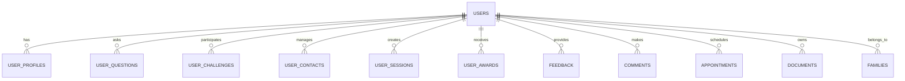
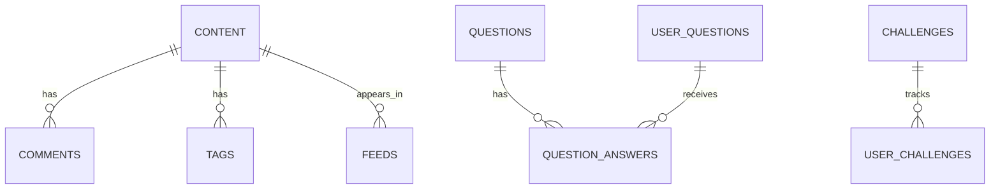
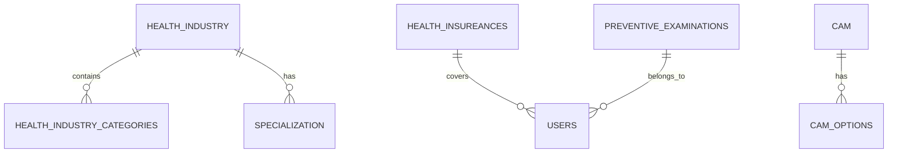
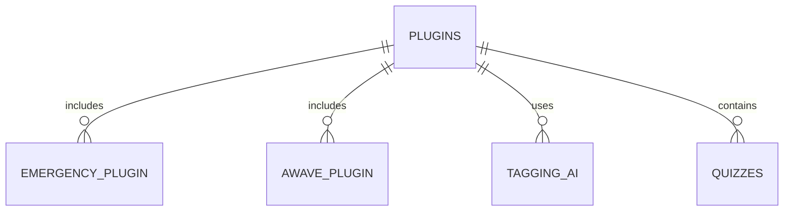
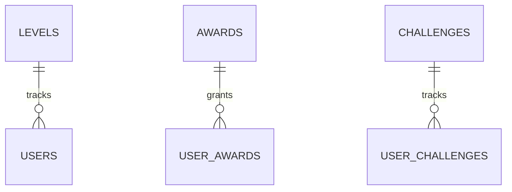
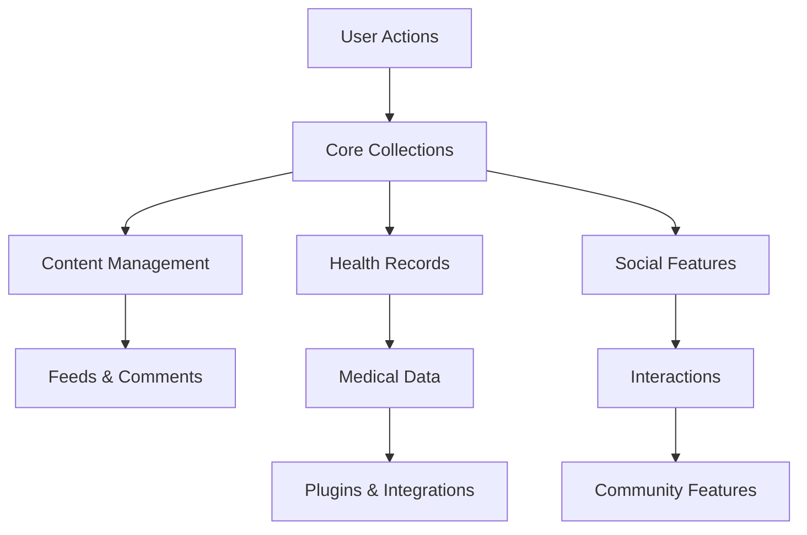
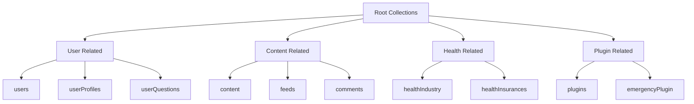
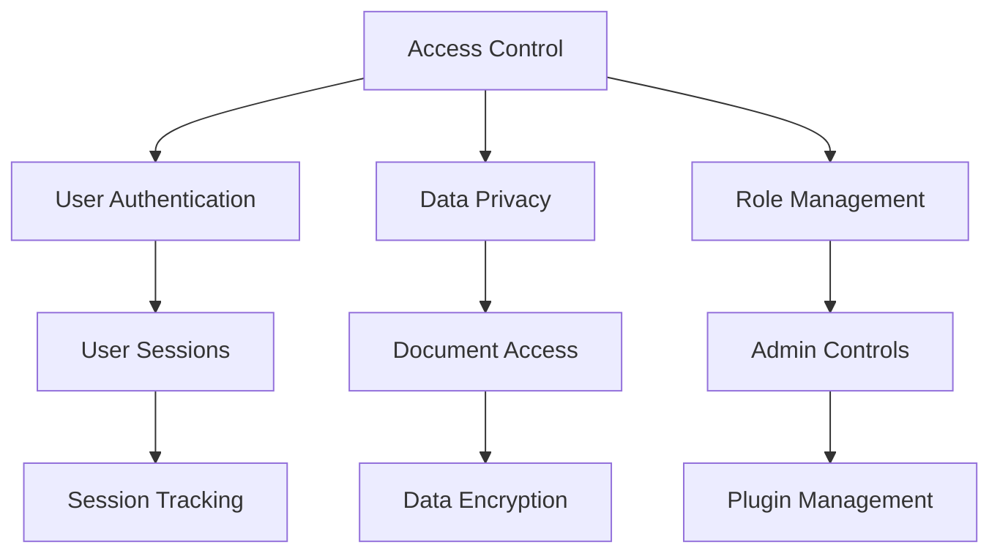

# Firebase Collections Documentation

This document provides a detailed overview of all Firebase collections used in the application, their relationships, and field definitions.

1. First, let's look at the core user-related collections and their relationships:



2. Content and Social Interaction Collections:



3. Health and Medical Collections:



4. Plugin and Integration Collections:



5. Achievement and Progress Collections:



Now, let's create a detailed table showing the key relationships and foreign keys:

| Collection | Related Collections | Foreign Key Field | Description |
|------------|---------------------|-------------------|-------------|
| users | userProfiles | userId | User's profile information |
| users | userQuestions | userId | Questions asked by user |
| users | userChallenges | userId | Challenges participated in |
| users | userContacts | userId | User's contact list |
| users | userSessions | userId | User's active sessions |
| users | userAwards | userId | Awards received by user |
| users | feedback | userId | Feedback provided by user |
| users | comments | userId | Comments made by user |
| users | appointments | userId | Appointments scheduled |
| users | documents | userId | Documents owned by user |
| users | families | userId | Family memberships |
| content | comments | contentId | Comments on content |
| content | tags | contentId | Tags associated with content |
| content | feeds | contentId | Content in feeds |
| questions | questionAnswers | questionId | Answers to questions |
| userQuestions | questionAnswers | questionId | Answers to user questions |
| challenges | userChallenges | challengeId | User participation in challenges |
| healthIndustry | healthIndustryCategories | industryId | Categories within health industry |
| healthIndustry | specialization | industryId | Specializations in industry |
| healthInsurances | users | insuranceId | Insurance coverage for users |
| preventiveExaminations | users | examinationId | User's preventive examinations |
| cam | camOptions | camId | Options for CAM |
| plugins | emergencyPlugin | pluginId | Emergency plugin features |
| plugins | awavePlugin | pluginId | Awave plugin features |
| plugins | taggingAI | pluginId | AI tagging features |
| plugins | quizzes | pluginId | Quiz features |
| levels | users | levelId | User's progress levels |
| awards | userAwards | awardId | Awards granted to users |

6. Data Flow Diagram:



7. Collection Hierarchy:



8. Security and Access Control:



This architecture provides:
1. Clear separation of concerns between different types of data
2. Scalable relationships between collections
3. Efficient querying through proper indexing
4. Secure access control through Firebase rules
5. Flexible plugin system for extending functionality


## Table of Contents
1. [Core Collections](#core-collections)
2. [User-Related Collections](#user-related-collections)
3. [Content Collections](#content-collections)
4. [Health-Related Collections](#health-related-collections)
5. [Plugin Collections](#plugin-collections)
6. [Challenge Collections](#challenge-collections)
7. [Document Collections](#document-collections)

## Core Collections

### users
```sql
CREATE TABLE users (
    id VARCHAR(255) PRIMARY KEY,
    email VARCHAR(255),
    display_name VARCHAR(255),
    uid VARCHAR(255),
    created_time TIMESTAMP,
    phone_number VARCHAR(255),
    first_name VARCHAR(255),
    last_name VARCHAR(255),
    is_admin BOOLEAN,
    user_name VARCHAR(255),
    photo_url VARCHAR(255),
    user_profile_id VARCHAR(255) REFERENCES user_profiles(id),
    has_built_initial_feed BOOLEAN,
    current_feed_index INTEGER,
    last_active_at TIMESTAMP,
    has_proposed_challenge BOOLEAN,
    has_active_challenge BOOLEAN,
    points INTEGER,
    is_processing_cam BOOLEAN,
    recent_cam_feed_item_id VARCHAR(255) REFERENCES feeds(id),
    show_feed_item_id VARCHAR(255) REFERENCES feeds(id),
    show_next_item INTEGER,
    health_insurance_id VARCHAR(255) REFERENCES health_insurances(id),
    birthdate TIMESTAMP,
    ort VARCHAR(255),
    is_anonymous BOOLEAN,
    family_id VARCHAR(255) REFERENCES families(id),
    gender VARCHAR(255),
    height VARCHAR(255),
    weight DOUBLE,
    health_insurance_number VARCHAR(255),
    organ_donor VARCHAR(255),
    health_score DOUBLE,
    streak_start_at TIMESTAMP,
    likes INTEGER,
    comments INTEGER,
    questions INTEGER,
    daily_checks INTEGER,
    is_email_verified BOOLEAN,
    health_score_reason VARCHAR(255),
    has_seen_onboarding_feed BOOLEAN,
    has_seen_onboarding_hub BOOLEAN
);
```

### feeds
```sql
CREATE TABLE feeds (
    id VARCHAR(255) PRIMARY KEY,
    uid VARCHAR(255),
    visible_from TIMESTAMP,
    viewed_at TIMESTAMP,
    completed_at TIMESTAMP,
    question_id VARCHAR(255) REFERENCES questions(id),
    content_id VARCHAR(255) REFERENCES content(id),
    has_completed BOOLEAN,
    value_type VARCHAR(255),
    value_id VARCHAR(255) REFERENCES values(id),
    input_title VARCHAR(255),
    has_viewed BOOLEAN,
    question_answer_id VARCHAR(255) REFERENCES question_answers(id),
    cam_id VARCHAR(255) REFERENCES cam(id),
    visible BOOLEAN,
    challenge_id VARCHAR(255) REFERENCES challenges(id),
    client_error VARCHAR(255),
    is_bookmarked BOOLEAN,
    is_health_record_relevant BOOLEAN,
    response VARCHAR(255),
    tags TEXT[],
    profile_item_id VARCHAR(255) REFERENCES profile_items(id),
    flagged BOOLEAN,
    user_question_id VARCHAR(255) REFERENCES user_questions(id),
    user_email VARCHAR(255),
    ignore_for_tagging BOOLEAN,
    installed_my_weather BOOLEAN
);
```

## User-Related Collections

### user_profiles
```sql
CREATE TABLE user_profiles (
    id VARCHAR(255) PRIMARY KEY,
    user_id VARCHAR(255) REFERENCES users(id),
    created_at TIMESTAMP,
    updated_at TIMESTAMP,
    health_score DOUBLE,
    health_score_reason VARCHAR(255),
    tags TEXT[],
    exam_tags TEXT[],
    health_insurance_id VARCHAR(255) REFERENCES health_insurances(id),
    family_id VARCHAR(255) REFERENCES families(id)
);
```

### user_questions
```sql
CREATE TABLE user_questions (
    id VARCHAR(255) PRIMARY KEY,
    user_id VARCHAR(255) REFERENCES users(id),
    user_question TEXT,
    user_question_time TIMESTAMP,
    user_question_id VARCHAR(255),
    response TEXT,
    user_question_summary TEXT,
    doctor_specialization VARCHAR(255),
    is_hidden BOOLEAN,
    family_id VARCHAR(255) REFERENCES families(id),
    messages JSONB
);
```

### user_contacts
```sql
CREATE TABLE user_contacts (
    id VARCHAR(255) PRIMARY KEY,
    user_id VARCHAR(255) REFERENCES users(id),
    contact_id VARCHAR(255) REFERENCES contacts(id),
    created_at TIMESTAMP,
    updated_at TIMESTAMP,
    notes TEXT,
    tags TEXT[],
    is_favorite BOOLEAN
);
```

## Content Collections

### content
```sql
CREATE TABLE content (
    id VARCHAR(255) PRIMARY KEY,
    created_on TIMESTAMP,
    created_by_id VARCHAR(255) REFERENCES users(id),
    content_text TEXT,
    liked_by TEXT[],
    video VARCHAR(255),
    type VARCHAR(255),
    tags TEXT[],
    content_title VARCHAR(255),
    content_snippet TEXT,
    audience TEXT[],
    channel VARCHAR(255),
    channel_order INTEGER,
    creator_id VARCHAR(255) REFERENCES users(id),
    my_bestes_explains BOOLEAN,
    cover_image JSONB,
    transcript TEXT
);
```

### questions
```sql
CREATE TABLE questions (
    id VARCHAR(255) PRIMARY KEY,
    type VARCHAR(255),
    text TEXT,
    options JSONB,
    background_image_url VARCHAR(255),
    min INTEGER,
    max INTEGER,
    default_number INTEGER
);
```

### question_answers
```sql
CREATE TABLE question_answers (
    id VARCHAR(255) PRIMARY KEY,
    question_id VARCHAR(255) REFERENCES questions(id),
    user_id VARCHAR(255) REFERENCES users(id),
    answer TEXT,
    created_at TIMESTAMP,
    updated_at TIMESTAMP,
    tags TEXT[]
);
```

## Health-Related Collections

### health_insurances
```sql
CREATE TABLE health_insurances (
    id VARCHAR(255) PRIMARY KEY,
    name VARCHAR(255),
    description TEXT,
    created_at TIMESTAMP,
    updated_at TIMESTAMP
);
```

### health_industry
```sql
CREATE TABLE health_industry (
    id VARCHAR(255) PRIMARY KEY,
    name VARCHAR(255),
    description TEXT,
    category_id VARCHAR(255) REFERENCES health_industry_categories(id),
    created_at TIMESTAMP,
    updated_at TIMESTAMP,
    tags TEXT[]
);
```

### health_industry_categories
```sql
CREATE TABLE health_industry_categories (
    id VARCHAR(255) PRIMARY KEY,
    name VARCHAR(255),
    description TEXT,
    created_at TIMESTAMP,
    updated_at TIMESTAMP
);
```

## Plugin Collections

### plugins
```sql
CREATE TABLE plugins (
    id VARCHAR(255) PRIMARY KEY,
    title VARCHAR(255),
    subtitle VARCHAR(255),
    profile_image VARCHAR(255),
    cover_image VARCHAR(255),
    description TEXT,
    tags TEXT[],
    price VARCHAR(255),
    provider VARCHAR(255),
    company_url VARCHAR(255),
    live_now BOOLEAN,
    active_users TEXT[],
    profile_image_bg_color VARCHAR(255),
    navigation BOOLEAN
);
```

### emergency_plugin
```sql
CREATE TABLE emergency_plugin (
    id VARCHAR(255) PRIMARY KEY,
    title VARCHAR(255),
    description TEXT,
    created_at TIMESTAMP,
    updated_at TIMESTAMP,
    active BOOLEAN,
    tags TEXT[]
);
```

### awave_plugin
```sql
CREATE TABLE awave_plugin (
    id VARCHAR(255) PRIMARY KEY,
    title VARCHAR(255),
    description TEXT,
    created_at TIMESTAMP,
    updated_at TIMESTAMP,
    active BOOLEAN,
    tags TEXT[]
);
```

## Challenge Collections

### challenges
```sql
CREATE TABLE challenges (
    id VARCHAR(255) PRIMARY KEY,
    name VARCHAR(255),
    title VARCHAR(255),
    description TEXT,
    category VARCHAR(255),
    duration DOUBLE,
    audience TEXT[],
    reward INTEGER
);
```

### user_challenges
```sql
CREATE TABLE user_challenges (
    id VARCHAR(255) PRIMARY KEY,
    user_id VARCHAR(255) REFERENCES users(id),
    challenge_id VARCHAR(255) REFERENCES challenges(id),
    created_at TIMESTAMP,
    updated_at TIMESTAMP,
    status VARCHAR(255),
    progress DOUBLE,
    completed_at TIMESTAMP
);
```

## Document Collections

### documents
```sql
CREATE TABLE documents (
    id VARCHAR(255) PRIMARY KEY,
    user_id VARCHAR(255) REFERENCES users(id),
    images TEXT[],
    created_at TIMESTAMP,
    title VARCHAR(255),
    date TIMESTAMP,
    creator VARCHAR(255),
    summary TEXT,
    family_id VARCHAR(255) REFERENCES families(id),
    pdf VARCHAR(255),
    tags TEXT[],
    extractions TEXT[],
    appointment_id VARCHAR(255) REFERENCES appointments(id)
);
```

### families
```sql
CREATE TABLE families (
    id VARCHAR(255) PRIMARY KEY,
    name VARCHAR(255),
    code VARCHAR(255),
    created_at TIMESTAMP,
    updated_at TIMESTAMP,
    members TEXT[],
    admins TEXT[]
);
```

## Relationships Overview

1. **User Relationships**:
   - users -> user_profiles (1:1)
   - users -> user_contacts (1:many)
   - users -> user_questions (1:many)
   - users -> user_challenges (1:many)

2. **Content Relationships**:
   - content -> users (many:1)
   - questions -> question_answers (1:many)
   - feeds -> content (many:1)
   - feeds -> questions (many:1)

3. **Health Relationships**:
   - health_industry -> health_industry_categories (many:1)
   - users -> health_insurances (many:1)

4. **Document Relationships**:
   - documents -> users (many:1)
   - documents -> families (many:1)
   - documents -> appointments (many:1)

5. **Family Relationships**:
   - families -> users (1:many)
   - families -> documents (1:many)

6. **Challenge Relationships**:
   - challenges -> user_challenges (1:many)
   - users -> user_challenges (1:many)

7. **Plugin Relationships**:
   - plugins -> users (many:many through active_users)
   - emergency_plugin -> users (many:many)
   - awave_plugin -> users (many:many)
