# MyBestes - Project Architecture Overview

## 1. Project Structure

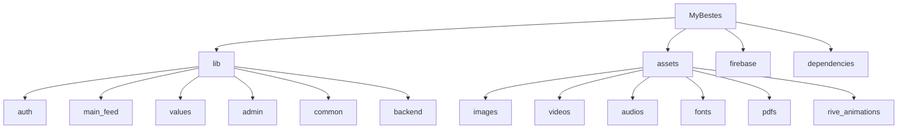

## 2. Core Features & Modules

### 2.1 Authentication System
- **Components**:
  - Login/Register forms
  - Social auth integration
  - Password reset
  - Profile management

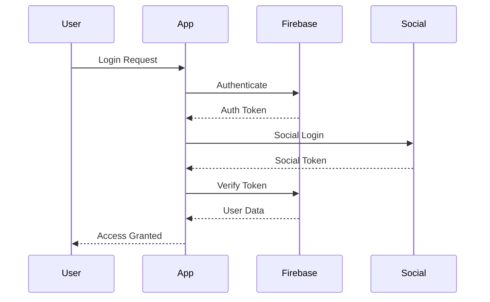

### 2.2 Main Feed
- **Components**:
  - Feed items
  - Content cards
  - Interactive elements
  - User engagement widgets

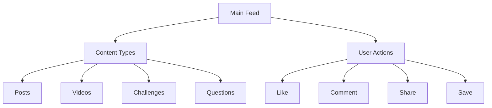

### 2.3 Values System
- **Components**:
  - Weight tracking
  - Sport activities
  - Mood monitoring
  - Sin tracking

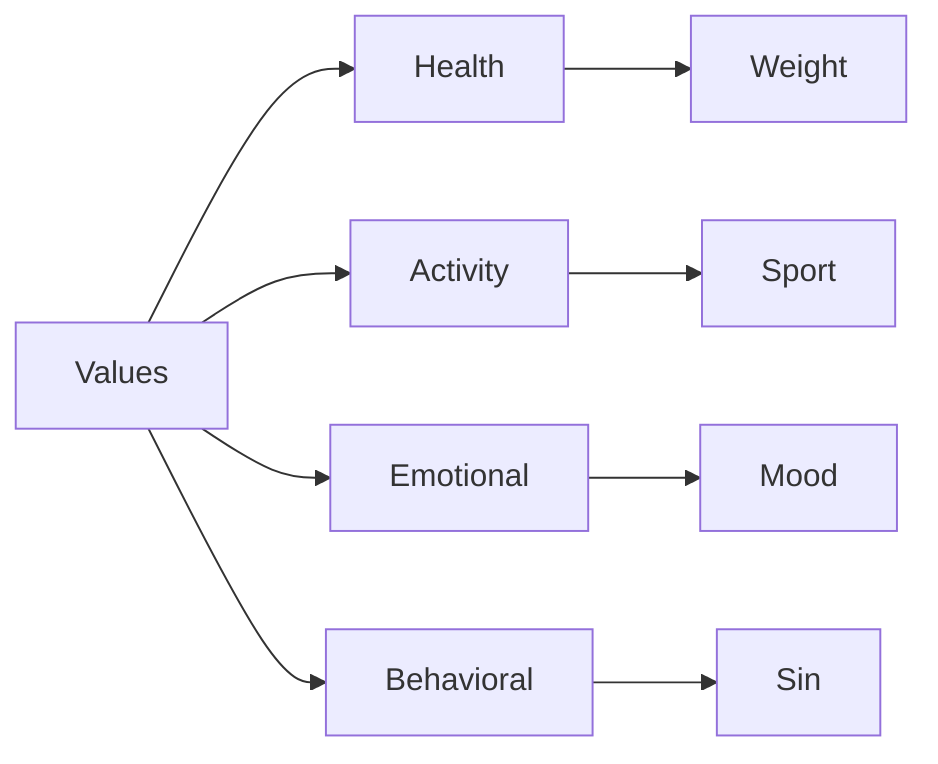

## 3. Firebase Schema

### 3.1 Collections Structure
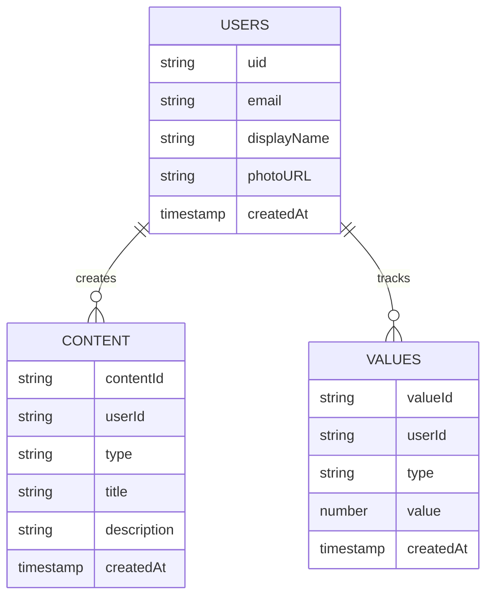

## 4. Navigation Flow

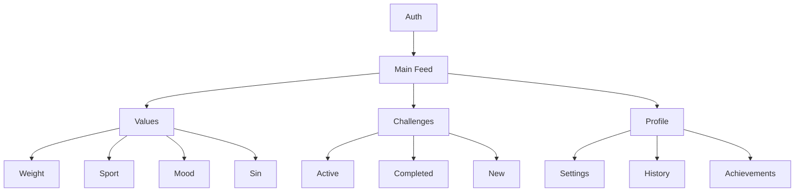

## 5. Component Architecture

### 5.1 Widget Hierarchy
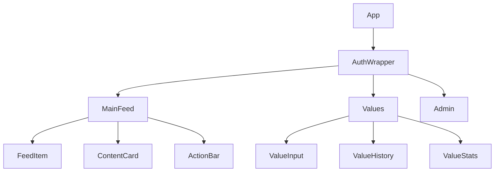

## 6. Dynamic Configurations

### 6.1 Feature Flags
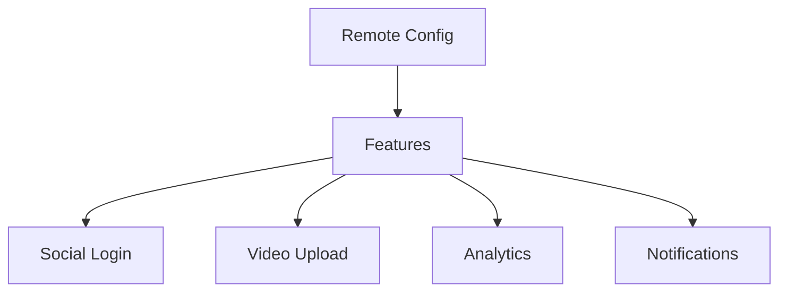

### 6.2 Content Rules
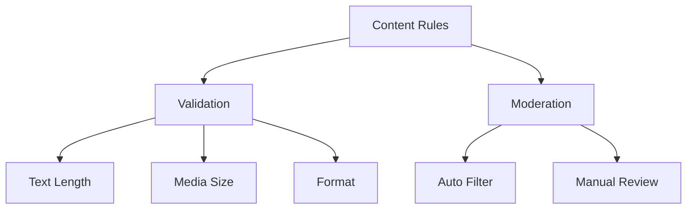

## 7. State Management

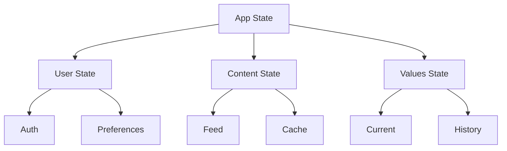

## 8. Asset Management

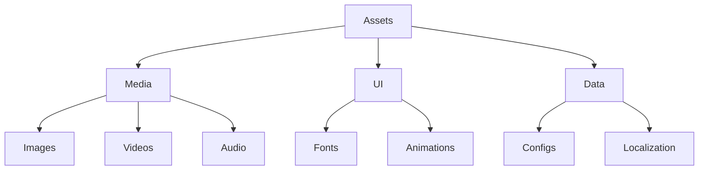

## 9. Security Implementation

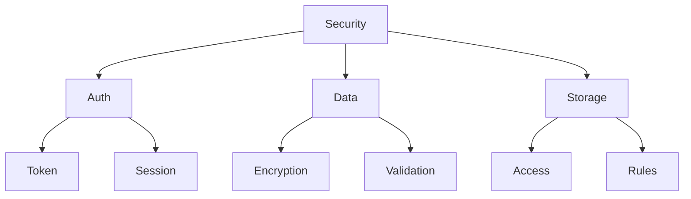

## 10. Error Handling

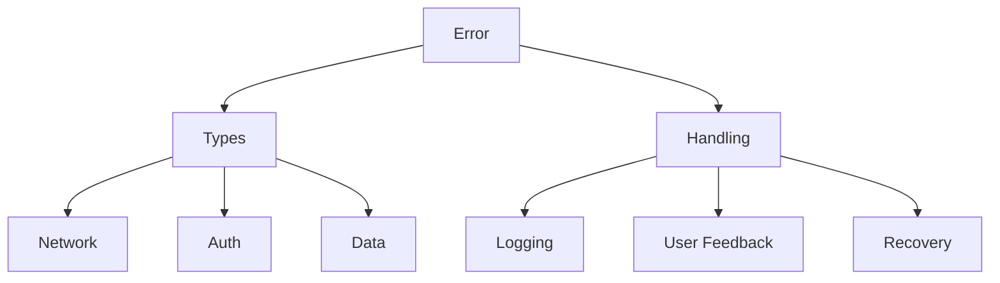

This architecture document provides a high-level overview of your project's structure and components. Each section can be expanded with more detailed implementation specifics as needed.
